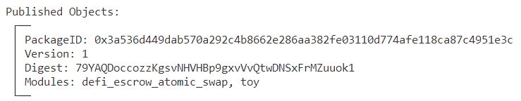
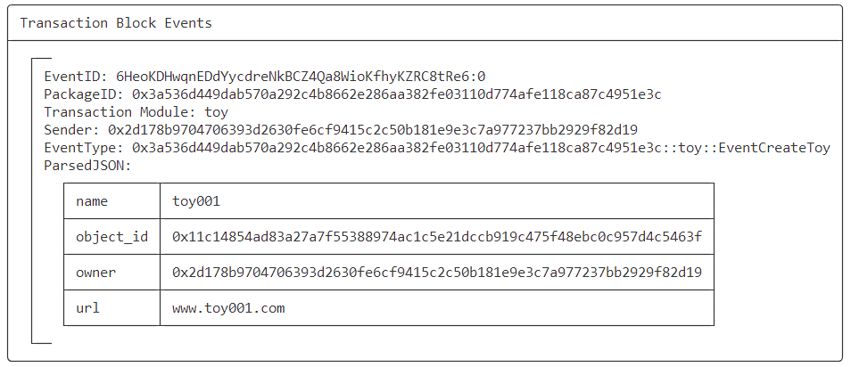
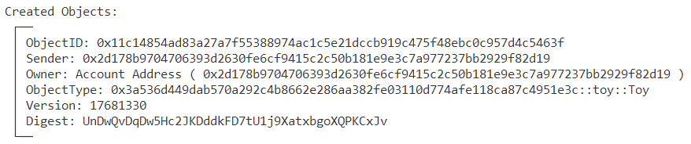
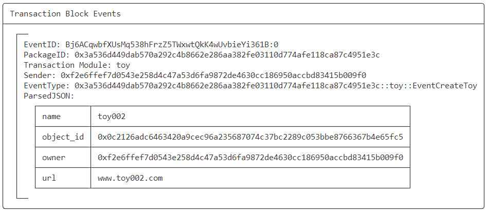
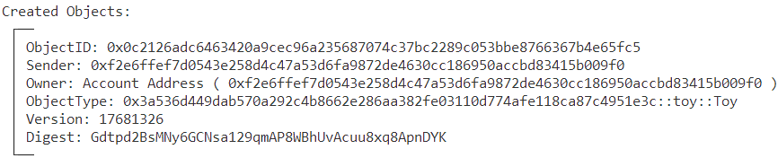
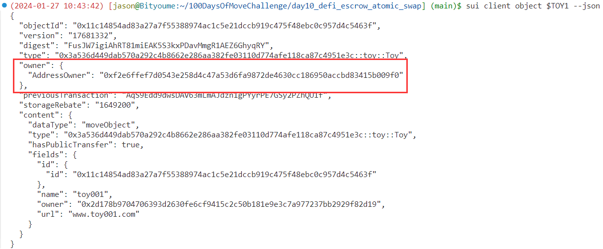
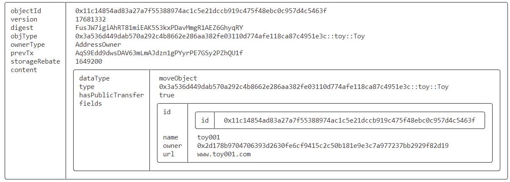
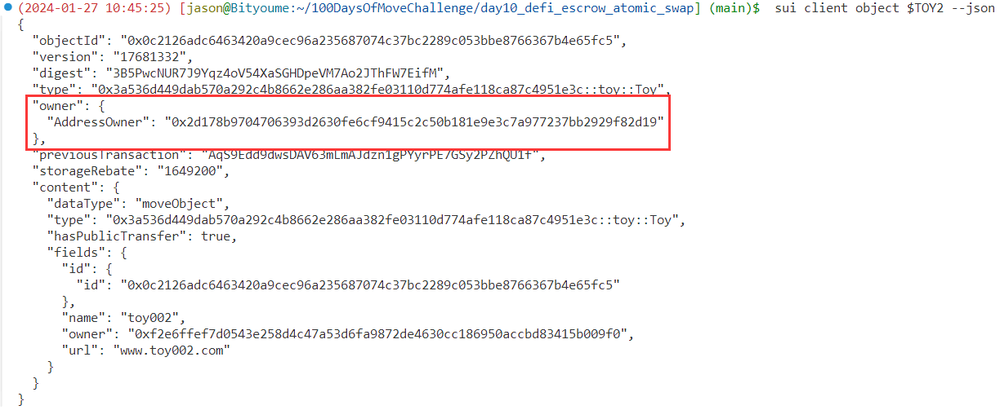
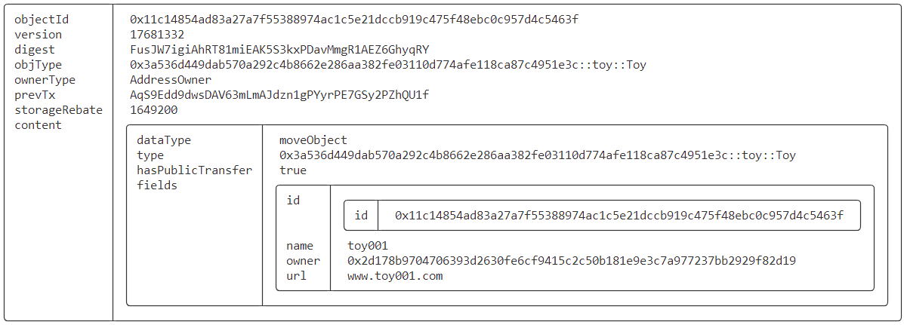

# SUI Move官方DEFI类——基于第三方托管原子交换合约实践（escrow）

## 1 合约编写

### 1.1 示例代码

> 来自：https://github.com/MystenLabs/sui/blob/main/sui_programmability/examples/defi/sources/escrow.move

```rust
// Copyright (c) Mysten Labs, Inc.
// SPDX-License-Identifier: Apache-2.0

/// An escrow for atomic swap of objects that trusts a third party for liveness, but not safety.
module defi::escrow {
    use sui::object::{Self, ID, UID};
    use sui::transfer;
    use sui::tx_context::{Self, TxContext};

    /// An object held in escrow
    struct EscrowedObj<T: key + store, phantom ExchangeForT: key + store> has key, store {
        id: UID,
        /// owner of the escrowed object
        sender: address,
        /// intended recipient of the escrowed object
        recipient: address,
        /// ID of the object `sender` wants in exchange
        // TODO: this is probably a bad idea if the object is mutable.
        // that can be fixed by asking for an additional approval
        // from `sender`, but let's keep it simple for now.
        exchange_for: ID,
        /// the escrowed object
        escrowed: T,
    }

    // Error codes
    /// The `sender` and `recipient` of the two escrowed objects do not match
    const EMismatchedSenderRecipient: u64 = 0;
    /// The `exchange_for` fields of the two escrowed objects do not match
    const EMismatchedExchangeObject: u64 = 1;

    /// Create an escrow for exchanging goods with
    /// `counterparty`, mediated by a `third_party`
    /// that is trusted for liveness
    public fun create<T: key + store, ExchangeForT: key + store>(
        recipient: address,
        third_party: address,
        exchange_for: ID,
        escrowed: T,
        ctx: &mut TxContext
    ) {
        let sender = tx_context::sender(ctx);
        let id = object::new(ctx);
        // escrow the object with the trusted third party
        transfer::public_transfer(
            EscrowedObj<T,ExchangeForT> {
                id, sender, recipient, exchange_for, escrowed
            },
            third_party
        );
    }

    /// Trusted third party can swap compatible objects
    public entry fun swap<T1: key + store, T2: key + store>(
        obj1: EscrowedObj<T1, T2>,
        obj2: EscrowedObj<T2, T1>,
    ) {
        let EscrowedObj {
            id: id1,
            sender: sender1,
            recipient: recipient1,
            exchange_for: exchange_for1,
            escrowed: escrowed1,
        } = obj1;
        let EscrowedObj {
            id: id2,
            sender: sender2,
            recipient: recipient2,
            exchange_for: exchange_for2,
            escrowed: escrowed2,
        } = obj2;
        object::delete(id1);
        object::delete(id2);
        // check sender/recipient compatibility
        assert!(&sender1 == &recipient2, EMismatchedSenderRecipient);
        assert!(&sender2 == &recipient1, EMismatchedSenderRecipient);
        // check object ID compatibility
        assert!(object::id(&escrowed1) == exchange_for2, EMismatchedExchangeObject);
        assert!(object::id(&escrowed2) == exchange_for1, EMismatchedExchangeObject);
        // everything matches. do the swap!
        transfer::public_transfer(escrowed1, sender2);
        transfer::public_transfer(escrowed2, sender1)
    }

    /// Trusted third party can always return an escrowed object to its original owner
    public entry fun return_to_sender<T: key + store, ExchangeForT: key + store>(
        obj: EscrowedObj<T, ExchangeForT>,
    ) {
        let EscrowedObj {
            id, sender, recipient: _, exchange_for: _, escrowed
        } = obj;
        object::delete(id);
        transfer::public_transfer(escrowed, sender)
    }
}
```

### 1.2 交换对象

> 编写一个玩具类合约，创建两个玩具对象，在这两个玩具对象间进行交换

```rust
module day10::toy {
    use sui::object::{Self, ID, UID};
    use sui::transfer;
    use sui::tx_context::{Self, TxContext};
    use std::string;
    use sui::url::{Self, Url};
    use sui::event;

    struct Toy has key, store {
        id: UID,
        name: string::String, 
        owner: address,
        url: Url,
    }

    struct EventCreateToy has copy, drop {                                                                                                                                                                                                    
        object_id: ID,
        name: string::String,
        owner: address,
        url: Url,
    }   

    public entry fun createToy (
        name: vector<u8>,
        url: vector<u8>,
        ctx: &mut TxContext
    ) {    
        let sender = tx_context::sender(ctx);

        let url = url::new_unsafe_from_bytes(url);
        let toy = Toy {
            id: object::new(ctx),
            name: string::utf8(name),
            owner: sender,
            url,
        };        

        event::emit(EventCreateToy {
            object_id: object::id(&toy),
            name: toy.name,
            owner: sender,
            url,
        });       

        transfer::public_transfer(toy, sender);
    }    
}
```

## 2 前置准备

### 2.1 总览

| 别名  | 地址                                                         | 角色      |
| ----- | ------------------------------------------------------------ | --------- |
| Alice | `0x2d178b9704706393d2630fe6cf9415c2c50b181e9e3c7a977237bb2929f82d19` | 拥有玩具1 |
| Bob   | `0xf2e6ffef7d0543e258d4c47a53d6fa9872de4630cc186950accbd83415b009f0` | 拥有玩具2 |
| Jason | `0x5c5882d73a6e5b6ea1743fb028eff5e0d7cc8b7ae123d27856c5fe666d91569a` | 第三方    |

- **添加到环境变量**

```bash
export ALICE=0x2d178b9704706393d2630fe6cf9415c2c50b181e9e3c7a977237bb2929f82d19
export BOB=0xf2e6ffef7d0543e258d4c47a53d6fa9872de4630cc186950accbd83415b009f0
export JASON=0x5c5882d73a6e5b6ea1743fb028eff5e0d7cc8b7ae123d27856c5fe666d91569a
```

## 3 合约部署

```bash
$ sui client publish --gas-budget 100000000
Transaction Digest: E3WXDmAR5XBfA7YdWJtQ3yiJ2gujpERPgdN8Rcju2w5y
```

- **将对象ID记录到环境变量，方便调用使用**

```bash
export PACKAGE_ID=0x3a536d449dab570a292c4b8662e286aa382fe03110d774afe118ca87c4951e3c
```



## 4 合约交互

### 4.1 Alice创建玩具1

> 切换到Alice

```bash
export NAME=toy001
export URL=www.toy001.com
sui client call --function createToy --package $PACKAGE_ID --module toy --args $NAME $URL --gas-budget 10000000
```



- **记录创建对象ID**

```bash
# PACKAGE_ID::toy::Toy
export TOY1=0x11c14854ad83a27a7f55388974ac1c5e21dccb919c475f48ebc0c957d4c5463f
export TOY_TYPE=$PACKAGE_ID::toy::Toy
```



### 4.2 Bob创建玩具2

> 切换到Bob

```bash
export NAME=toy002
export URL=www.toy002.com
sui client call --function createToy --package $PACKAGE_ID --module toy --args $NAME $URL --gas-budget 10000000
```



- **记录创建对象ID**

```bash
# PACKAGE_ID::toy::Toy
export TOY2=0x0c2126adc6463420a9cec96a235687074c37bc2289c053bbe8766367b4e65fc5
```



### 4.3 Alice将玩具1托管到第三方

> 切换到Alice

```bash
sui client call --function create --package $PACKAGE_ID --module defi_escrow_atomic_swap --type-args $TOY_TYPE $TOY_TYPE --args $BOB $JASON $TOY2 $TOY1 --gas-budget 10000000
Transaction Digest: FKeM8oTSFMbboF9VpJ2C66UoXmn6ds2tDYNXMvGc1C1K
```

- **记录创建对象ID**

```bash
# PACKAGE_ID::defi_escrow_atomic_swap::EscrowedObj<PACKAGE_ID::toy::Toy, PACKAGE_ID::toy::Toy>
export ALICE_ESCROWED_OBJ=0x3bf9620c8f653360790d4f8c25b054ce9142e211a05bbc97c46c121524c78914
```

- **查看托管对象**

```json
$ sui client object $ALICE_ESCROWED_OBJ --json
{
  "objectId": "0x3bf9620c8f653360790d4f8c25b054ce9142e211a05bbc97c46c121524c78914",
  "version": "17681331",
  "digest": "AUCrx2q8fffcwJXLLiqx5EktQBcNKNSoLAvr8yi369Jo",
  "type": "0x3a536d449dab570a292c4b8662e286aa382fe03110d774afe118ca87c4951e3c::defi_escrow_atomic_swap::EscrowedObj<0x3a536d449dab570a292c4b8662e286aa382fe03110d774afe118ca87c4951e3c::toy::Toy, 0x3a536d449dab570a292c4b8662e286aa382fe03110d774afe118ca87c4951e3c::toy::Toy>",
  "owner": {
    "AddressOwner": "0x5c5882d73a6e5b6ea1743fb028eff5e0d7cc8b7ae123d27856c5fe666d91569a"
  },
  "previousTransaction": "FKeM8oTSFMbboF9VpJ2C66UoXmn6ds2tDYNXMvGc1C1K",
  "storageRebate": "3473200",
  "content": {
    "dataType": "moveObject",
    "type": "0x3a536d449dab570a292c4b8662e286aa382fe03110d774afe118ca87c4951e3c::defi_escrow_atomic_swap::EscrowedObj<0x3a536d449dab570a292c4b8662e286aa382fe03110d774afe118ca87c4951e3c::toy::Toy, 0x3a536d449dab570a292c4b8662e286aa382fe03110d774afe118ca87c4951e3c::toy::Toy>",
    "hasPublicTransfer": true,
    "fields": {
      "escrowed": {
        "type": "0x3a536d449dab570a292c4b8662e286aa382fe03110d774afe118ca87c4951e3c::toy::Toy",
        "fields": {
          "id": {
            "id": "0x11c14854ad83a27a7f55388974ac1c5e21dccb919c475f48ebc0c957d4c5463f"
          },
          "name": "toy001",
          "owner": "0x2d178b9704706393d2630fe6cf9415c2c50b181e9e3c7a977237bb2929f82d19",
          "url": "www.toy001.com"
        }
      },
      "exchange_for": "0x0c2126adc6463420a9cec96a235687074c37bc2289c053bbe8766367b4e65fc5",
      "id": {
        "id": "0x3bf9620c8f653360790d4f8c25b054ce9142e211a05bbc97c46c121524c78914"
      },
      "recipient": "0xf2e6ffef7d0543e258d4c47a53d6fa9872de4630cc186950accbd83415b009f0",
      "sender": "0x2d178b9704706393d2630fe6cf9415c2c50b181e9e3c7a977237bb2929f82d19"
    }
  }
}
```

### 4.4 Bob将玩具2托管到第三方

> 切换到Bob

```bash
sui client call --function create --package $PACKAGE_ID --module defi_escrow_atomic_swap --type-args $TOY_TYPE $TOY_TYPE --args $ALICE $JASON $TOY1 $TOY2 --gas-budget 10000000
Transaction Digest: 5XQjLJQAJzLv1EnYNszwYNYcUkB2sDYZmMDrsGbPX8Ca
```

- **记录创建对象ID**

```bash
# PACKAGE_ID::defi_escrow_atomic_swap::EscrowedObj<PACKAGE_ID::toy::Toy, PACKAGE_ID::toy::Toy>
export BOB_ESCROWED_OBJ=0x6748c82dc2a403765844113d49b0b4d54b21e93f3bc31e04ad2304fd74c689d9
```

- **查看托管对象**

```json
$ sui client object $BOB_ESCROWED_OBJ --json
{
  "objectId": "0x6748c82dc2a403765844113d49b0b4d54b21e93f3bc31e04ad2304fd74c689d9",
  "version": "17681327",
  "digest": "BKK8yJPVMCpMMWMxiuUHMY7RPFbBhexLz4TxUxEYMWh4",
  "type": "0x3a536d449dab570a292c4b8662e286aa382fe03110d774afe118ca87c4951e3c::defi_escrow_atomic_swap::EscrowedObj<0x3a536d449dab570a292c4b8662e286aa382fe03110d774afe118ca87c4951e3c::toy::Toy, 0x3a536d449dab570a292c4b8662e286aa382fe03110d774afe118ca87c4951e3c::toy::Toy>",
  "owner": {
    "AddressOwner": "0x5c5882d73a6e5b6ea1743fb028eff5e0d7cc8b7ae123d27856c5fe666d91569a"
  },
  "previousTransaction": "5XQjLJQAJzLv1EnYNszwYNYcUkB2sDYZmMDrsGbPX8Ca",
  "storageRebate": "3473200",
  "content": {
    "dataType": "moveObject",
    "type": "0x3a536d449dab570a292c4b8662e286aa382fe03110d774afe118ca87c4951e3c::defi_escrow_atomic_swap::EscrowedObj<0x3a536d449dab570a292c4b8662e286aa382fe03110d774afe118ca87c4951e3c::toy::Toy, 0x3a536d449dab570a292c4b8662e286aa382fe03110d774afe118ca87c4951e3c::toy::Toy>",
    "hasPublicTransfer": true,
    "fields": {
      "escrowed": {
        "type": "0x3a536d449dab570a292c4b8662e286aa382fe03110d774afe118ca87c4951e3c::toy::Toy",
        "fields": {
          "id": {
            "id": "0x0c2126adc6463420a9cec96a235687074c37bc2289c053bbe8766367b4e65fc5"
          },
          "name": "toy002",
          "owner": "0xf2e6ffef7d0543e258d4c47a53d6fa9872de4630cc186950accbd83415b009f0",
          "url": "www.toy002.com"
        }
      },
      "exchange_for": "0x11c14854ad83a27a7f55388974ac1c5e21dccb919c475f48ebc0c957d4c5463f",
      "id": {
        "id": "0x6748c82dc2a403765844113d49b0b4d54b21e93f3bc31e04ad2304fd74c689d9"
      },
      "recipient": "0x2d178b9704706393d2630fe6cf9415c2c50b181e9e3c7a977237bb2929f82d19",
      "sender": "0xf2e6ffef7d0543e258d4c47a53d6fa9872de4630cc186950accbd83415b009f0"
    }
  }
}
```

### 4.5 第三方进行交换

> 切换到第三方Jason账户

```bash
sui client call --function swap --package $PACKAGE_ID --module defi_escrow_atomic_swap --type-args $TOY_TYPE $TOY_TYPE --args $ALICE_ESCROWED_OBJ $BOB_ESCROWED_OBJ --gas-budget 10000000
Transaction Digest: AqS9Edd9dwsDAV63mLmAJdzn1gPYyrPE7GSy2PZhQU1f
```

### 4.6 查看当前玩具归属

- **查看玩具1，已经归属Bob地址**

```json
$ sui client object $TOY1 --json
{
  "objectId": "0x11c14854ad83a27a7f55388974ac1c5e21dccb919c475f48ebc0c957d4c5463f",
  "version": "17681332",
  "digest": "FusJW7igiAhRT81miEAK5S3kxPDavMmgR1AEZ6GhyqRY",
  "type": "0x3a536d449dab570a292c4b8662e286aa382fe03110d774afe118ca87c4951e3c::toy::Toy",
  "owner": {
    "AddressOwner": "0xf2e6ffef7d0543e258d4c47a53d6fa9872de4630cc186950accbd83415b009f0"
  },
  "previousTransaction": "AqS9Edd9dwsDAV63mLmAJdzn1gPYyrPE7GSy2PZhQU1f",
  "storageRebate": "1649200",
  "content": {
    "dataType": "moveObject",
    "type": "0x3a536d449dab570a292c4b8662e286aa382fe03110d774afe118ca87c4951e3c::toy::Toy",
    "hasPublicTransfer": true,
    "fields": {
      "id": {
        "id": "0x11c14854ad83a27a7f55388974ac1c5e21dccb919c475f48ebc0c957d4c5463f"
      },
      "name": "toy001",
      "owner": "0x2d178b9704706393d2630fe6cf9415c2c50b181e9e3c7a977237bb2929f82d19",
      "url": "www.toy001.com"
    }
  }
}
```





- **查看玩具2，已经归属Alice地址**

```json
$ sui client object $TOY2 --json
{
  "objectId": "0x0c2126adc6463420a9cec96a235687074c37bc2289c053bbe8766367b4e65fc5",
  "version": "17681332",
  "digest": "3B5PwcNUR7J9Yqz4oV54XaSGHDpeVM7Ao2JThFW7EifM",
  "type": "0x3a536d449dab570a292c4b8662e286aa382fe03110d774afe118ca87c4951e3c::toy::Toy",
  "owner": {
    "AddressOwner": "0x2d178b9704706393d2630fe6cf9415c2c50b181e9e3c7a977237bb2929f82d19"
  },
  "previousTransaction": "AqS9Edd9dwsDAV63mLmAJdzn1gPYyrPE7GSy2PZhQU1f",
  "storageRebate": "1649200",
  "content": {
    "dataType": "moveObject",
    "type": "0x3a536d449dab570a292c4b8662e286aa382fe03110d774afe118ca87c4951e3c::toy::Toy",
    "hasPublicTransfer": true,
    "fields": {
      "id": {
        "id": "0x0c2126adc6463420a9cec96a235687074c37bc2289c053bbe8766367b4e65fc5"
      },
      "name": "toy002",
      "owner": "0xf2e6ffef7d0543e258d4c47a53d6fa9872de4630cc186950accbd83415b009f0",
      "url": "www.toy002.com"
    }
  }
}
```




