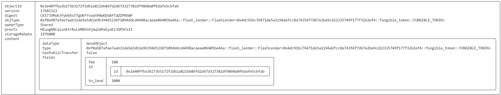
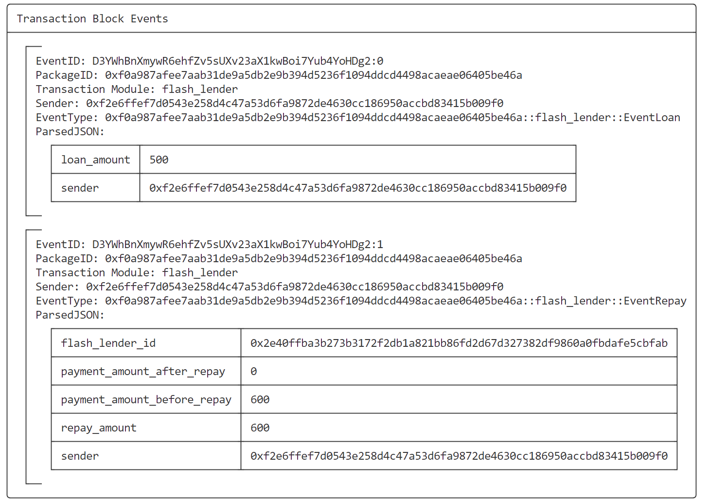
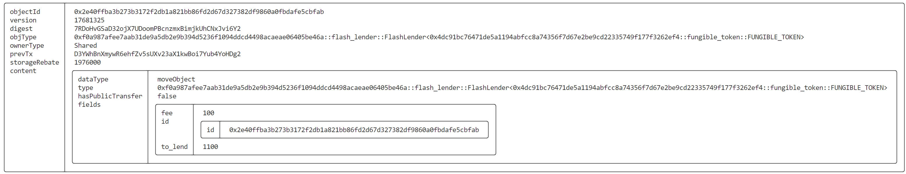
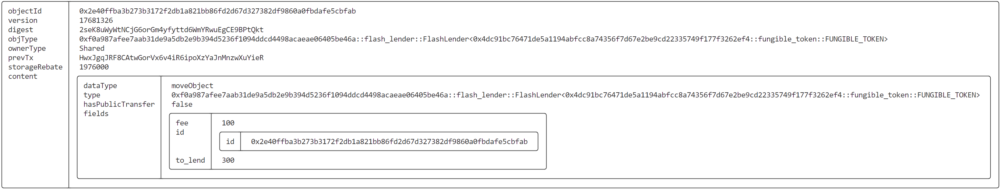

# SUI Move官方DEFI类——闪电贷合约实践（flash_lender）

## 1 合约编写

### 1.1 示例代码

> 本文合约代码示例来自：https://github.com/MystenLabs/sui/blob/main/sui_programmability/examples/defi/sources/flash_lender.move

```rust
// Copyright (c) Mysten Labs, Inc.
// SPDX-License-Identifier: Apache-2.0

/// A flash loan that works for any Coin type
module defi::flash_lender {
    use sui::balance::{Self, Balance};
    use sui::coin::{Self, Coin};
    use sui::object::{Self, ID, UID};
    use sui::transfer;
    use sui::tx_context::{Self, TxContext};

    /// A shared object offering flash loans to any buyer willing to pay `fee`.
    struct FlashLender<phantom T> has key {
        id: UID,
        /// Coins available to be lent to prospective borrowers
        to_lend: Balance<T>,
        /// Number of `Coin<T>`'s that will be charged for the loan.
        /// In practice, this would probably be a percentage, but
        /// we use a flat fee here for simplicity.
        fee: u64,
    }

    /// A "hot potato" struct recording the number of `Coin<T>`'s that
    /// were borrowed. Because this struct does not have the `key` or
    /// `store` ability, it cannot be transferred or otherwise placed in
    /// persistent storage. Because it does not have the `drop` ability,
    /// it cannot be discarded. Thus, the only way to get rid of this
    /// struct is to call `repay` sometime during the transaction that created it,
    /// which is exactly what we want from a flash loan.
    struct Receipt<phantom T> {
        /// ID of the flash lender object the debt holder borrowed from
        flash_lender_id: ID,
        /// Total amount of funds the borrower must repay: amount borrowed + the fee
        repay_amount: u64
    }

    /// An object conveying the privilege to withdraw funds from and deposit funds to the
    /// `FlashLender` instance with ID `flash_lender_id`. Initially granted to the creator
    /// of the `FlashLender`, and only one `AdminCap` per lender exists.
    struct AdminCap has key, store {
        id: UID,
        flash_lender_id: ID,
    }

    /// Attempted to borrow more than the `FlashLender` has.
    /// Try borrowing a smaller amount.
    const ELoanTooLarge: u64 = 0;

    /// Tried to repay an amount other than `repay_amount` (i.e., the amount borrowed + the fee).
    /// Try repaying the proper amount.
    const EInvalidRepaymentAmount: u64 = 1;

    /// Attempted to repay a `FlashLender` that was not the source of this particular debt.
    /// Try repaying the correct lender.
    const ERepayToWrongLender: u64 = 2;

    /// Attempted to perform an admin-only operation without valid permissions
    /// Try using the correct `AdminCap`
    const EAdminOnly: u64 = 3;

    /// Attempted to withdraw more than the `FlashLender` has.
    /// Try withdrawing a smaller amount.
    const EWithdrawTooLarge: u64 = 4;

    // === Creating a flash lender ===

    /// Create a shared `FlashLender` object that makes `to_lend` available for borrowing.
    /// Any borrower will need to repay the borrowed amount and `fee` by the end of the
    /// current transaction.
    public fun new<T>(to_lend: Balance<T>, fee: u64, ctx: &mut TxContext): AdminCap {
        let id = object::new(ctx);
        let flash_lender_id = object::uid_to_inner(&id);
        let flash_lender = FlashLender { id, to_lend, fee };
        // make the `FlashLender` a shared object so anyone can request loans
        transfer::share_object(flash_lender);

        // give the creator admin permissions
        AdminCap { id: object::new(ctx), flash_lender_id }
    }

    /// Same as `new`, but transfer `AdminCap` to the transaction sender
    public entry fun create<T>(to_lend: Coin<T>, fee: u64, ctx: &mut TxContext) {
        let balance = coin::into_balance(to_lend);
        let admin_cap = new(balance, fee, ctx);

        transfer::public_transfer(admin_cap, tx_context::sender(ctx))
    }

    // === Core functionality: requesting a loan and repaying it ===

    /// Request a loan of `amount` from `lender`. The returned `Receipt<T>` "hot potato" ensures
    /// that the borrower will call `repay(lender, ...)` later on in this tx.
    /// Aborts if `amount` is greater that the amount that `lender` has available for lending.
    public fun loan<T>(
        self: &mut FlashLender<T>, amount: u64, ctx: &mut TxContext
    ): (Coin<T>, Receipt<T>) {
        let to_lend = &mut self.to_lend;
        assert!(balance::value(to_lend) >= amount, ELoanTooLarge);
        let loan = coin::take(to_lend, amount, ctx);
        let repay_amount = amount + self.fee;
        let receipt = Receipt { flash_lender_id: object::id(self), repay_amount };

        (loan, receipt)
    }

    /// Repay the loan recorded by `receipt` to `lender` with `payment`.
    /// Aborts if the repayment amount is incorrect or `lender` is not the `FlashLender`
    /// that issued the original loan.
    public fun repay<T>(self: &mut FlashLender<T>, payment: Coin<T>, receipt: Receipt<T>) {
        let Receipt { flash_lender_id, repay_amount } = receipt;
        assert!(object::id(self) == flash_lender_id, ERepayToWrongLender);
        assert!(coin::value(&payment) == repay_amount, EInvalidRepaymentAmount);

        coin::put(&mut self.to_lend, payment)
    }

    // === Admin-only functionality ===

    /// Allow admin for `self` to withdraw funds.
    public fun withdraw<T>(
        self: &mut FlashLender<T>,
        admin_cap: &AdminCap,
        amount: u64,
        ctx: &mut TxContext
    ): Coin<T> {
        // only the holder of the `AdminCap` for `self` can withdraw funds
        check_admin(self, admin_cap);

        let to_lend = &mut self.to_lend;
        assert!(balance::value(to_lend) >= amount, EWithdrawTooLarge);
        coin::take(to_lend, amount, ctx)
    }

    /// Allow admin to add more funds to `self`
    public entry fun deposit<T>(
        self: &mut FlashLender<T>, admin_cap: &AdminCap, coin: Coin<T>
    ) {
        // only the holder of the `AdminCap` for `self` can deposit funds
        check_admin(self, admin_cap);
        coin::put(&mut self.to_lend, coin);
    }

    /// Allow admin to update the fee for `self`
    public entry fun update_fee<T>(
        self: &mut FlashLender<T>, admin_cap: &AdminCap, new_fee: u64
    ) {
        // only the holder of the `AdminCap` for `self` can update the fee
        check_admin(self, admin_cap);

        self.fee = new_fee
    }

    fun check_admin<T>(self: &FlashLender<T>, admin_cap: &AdminCap) {
        assert!(object::borrow_id(self) == &admin_cap.flash_lender_id, EAdminOnly);
    }

    // === Reads ===

    /// Return the current fee for `self`
    public fun fee<T>(self: &FlashLender<T>): u64 {
        self.fee
    }

    /// Return the maximum amount available for borrowing
    public fun max_loan<T>(self: &FlashLender<T>): u64 {
        balance::value(&self.to_lend)
    }

    /// Return the amount that the holder of `self` must repay
    public fun repay_amount<T>(self: &Receipt<T>): u64 {
        self.repay_amount
    }

    /// Return the amount that the holder of `self` must repay
    public fun flash_lender_id<T>(self: &Receipt<T>): ID {
        self.flash_lender_id
    }

    // === ADD BY RZEXIN ===
    // ...
    // 见 1.2 新增代码
    // ...
}
```

### 1.2 新增代码

```rust
    use sui::event;

    struct EventLoan has copy, drop {
        sender: address,
        loan_amount: u64
    }

    struct EventRepay has copy, drop {
        sender: address,
        flash_lender_id: ID,
        repay_amount: u64,
        payment_amount_before_repay: u64,
        payment_amount_after_repay: u64,
    }

    public fun repay_new<T>(self: &mut FlashLender<T>, payment: &mut Coin<T>, receipt: Receipt<T>, ctx: &mut TxContext) {

        let Receipt { flash_lender_id, repay_amount } = receipt;
        assert!(object::id(self) == flash_lender_id, ERepayToWrongLender);

        let payment_amount = coin::value(payment);
        assert!(payment_amount  >= repay_amount, EInvalidRepaymentAmount);

        let paid = coin::split(payment, repay_amount, ctx);

        coin::put(&mut self.to_lend, paid);

        let sender = tx_context::sender(ctx);
        event::emit(EventRepay{
            sender: sender,
            flash_lender_id: flash_lender_id,
            repay_amount: repay_amount,
            payment_amount_before_repay: payment_amount,
            payment_amount_after_repay: coin::value(payment)
        });
    }

    public entry fun loan_and_repay<T>(self: &mut FlashLender<T>, amount: u64, 
        payment: &mut Coin<T>, ctx: &mut TxContext) {

        let (coin, receipt) = loan(self, amount, ctx);

        let sender = tx_context::sender(ctx);

        coin::join(payment, coin);

        event::emit(EventLoan{
            sender: sender,
            loan_amount: amount
        });

        repay_new(self, payment, receipt, ctx);
    }

    public entry fun withdraw_funds<T>(self: &mut FlashLender<T>,
        admin_cap: &AdminCap, amount: u64, ctx: &mut TxContext) {

        let coin = withdraw(self, admin_cap, amount, ctx);

        let sender = tx_context::sender(ctx);
        transfer::public_transfer(coin, sender);
    }
```

## 2 前置准备

### 2.1 总览

| 别名  | 地址                                                         | 角色           | 拥有代币RZX数 |
| ----- | ------------------------------------------------------------ | -------------- | ------------- |
| Alice | `0x2d178b9704706393d2630fe6cf9415c2c50b181e9e3c7a977237bb2929f82d19` | 管理员、放贷人 | 1000          |
| Bob   | `0xf2e6ffef7d0543e258d4c47a53d6fa9872de4630cc186950accbd83415b009f0` | 贷款人         | 100           |

### 2.2 代币铸造

- **Alice**

```bash
export AMOUNT=1000
export ALICE=0x2d178b9704706393d2630fe6cf9415c2c50b181e9e3c7a977237bb2929f82d19

sui client call --function mint --package $PACKAGE_ID --module fungible_token --args $TREASURY_CAP $AMOUNT $ALICE --gas-budget 10000000
```

- **Bob**

```bash
export AMOUNT=100
export BOB=0xf2e6ffef7d0543e258d4c47a53d6fa9872de4630cc186950accbd83415b009f0
sui client call --function mint --package $PACKAGE_ID --module fungible_token --args $TREASURY_CAP $AMOUNT $ALICE --gas-budget 10000000
```

- **记录COIN**

```bash
export COIN_ALICE=0x9fc7277e4de47a043078c09b1cd9f0eecbbd1f54d2214187cd4f569fc81c0e59
export COIN_BOB=0x35fc41a40db7c880e139b03ed08e3ac5af850e1852fea68cf7740e16c67efa5f

export COIN_PACKAGE_ID=0x4dc91bc76471de5a1194abfcc8a74356f7d67e2be9cd22335749f177f3262ef4
export COIN_TYPE=$COIN_PACKAGE_ID::fungible_token::FUNGIBLE_TOKEN
```

## 3 合约部署

```bash
$ sui client publish --gas-budget 100000000
```

- **将对象ID记录到环境变量，方便调用使用**

```bash
export PACKAGE_ID=0xf0a987afee7aab31de9a5db2e9b394d5236f1094ddcd4498acaeae06405be46a
```

## 4 合约交互

### 4.1 Alice创建闪电贷

```bash
export FEE=100
sui client call --function create --package $PACKAGE_ID --module flash_lender --type-args $COIN_TYPE --args $COIN_ALICE $FEE --gas-budget 10000000
```

- **将创建的对象ID记录到环境变量**

```bash
# PACKAGE_ID::flash_lender::FlashLender<COIN_PACKAGE_ID::fungible_token::FUNGIBLE_TOKEN> 
export FLASH_LENDER=0x2e40ffba3b273b3172f2db1a821bb86fd2d67d327382df9860a0fbdafe5cbfab

# PACKAGE_ID::flash_lender::AdminCap
export ADMIN_CAP=0x93b68a5f6292878efa008c2f82074855e9e0318a0a85d632842941b8d2bb245c
```

- **查看闪电贷对象**

```json
$ sui client object $FLASH_LENDER --json
{
  "objectId": "0x2e40ffba3b273b3172f2db1a821bb86fd2d67d327382df9860a0fbdafe5cbfab",
  "version": "17681323",
  "digest": "CKS7JVMob3fyb6Xs5TgdKFYvadnP8wKDdAfTqDZPREWP",
  "type": "0xf0a987afee7aab31de9a5db2e9b394d5236f1094ddcd4498acaeae06405be46a::flash_lender::FlashLender<0x4dc91bc76471de5a1194abfcc8a74356f7d67e2be9cd22335749f177f3262ef4::fungible_token::FUNGIBLE_TOKEN>",
  "owner": {
    "Shared": {
      "initial_shared_version": 17681323
    }
  },
  "previousTransaction": "HEuogNNCqisnKtrRuLbM8thXjmqSdPeEyoK1JGPhFz15",
  "storageRebate": "1976000",
  "content": {
    "dataType": "moveObject",
    "type": "0xf0a987afee7aab31de9a5db2e9b394d5236f1094ddcd4498acaeae06405be46a::flash_lender::FlashLender<0x4dc91bc76471de5a1194abfcc8a74356f7d67e2be9cd22335749f177f3262ef4::fungible_token::FUNGIBLE_TOKEN>",
    "hasPublicTransfer": false,
    "fields": {
      "fee": "100",
      "id": {
        "id": "0x2e40ffba3b273b3172f2db1a821bb86fd2d67d327382df9860a0fbdafe5cbfab"
      },
      "to_lend": "1000"
    }
  }
}
```



### 4.2 Bob进行闪电贷

- **切换到Bob地址**

```bash
sui client switch --address bob
Active address switched to 0xf2e6ffef7d0543e258d4c47a53d6fa9872de4630cc186950accbd83415b009f0
```

- **进行闪电贷并支付利息**

```bash
export AMOUNT=500
sui client call --function loan_and_repay --package $PACKAGE_ID --module flash_lender --type-args $COIN_TYPE --args $FLASH_LENDER $AMOUNT $COIN_BOB --gas-budget 10000000
```

- **查看事件**



- **查看当前闪电贷对象**

> 可见增长了100，即为收到的利息。

```json
$ sui client object $FLASH_LENDER --json
{
  "objectId": "0x2e40ffba3b273b3172f2db1a821bb86fd2d67d327382df9860a0fbdafe5cbfab",
  "version": "17681325",
  "digest": "7RDoHvGSaD32ojX7UDoomPBcnzmxBimjkUhCNxJvi6Y2",
  "type": "0xf0a987afee7aab31de9a5db2e9b394d5236f1094ddcd4498acaeae06405be46a::flash_lender::FlashLender<0x4dc91bc76471de5a1194abfcc8a74356f7d67e2be9cd22335749f177f3262ef4::fungible_token::FUNGIBLE_TOKEN>",
  "owner": {
    "Shared": {
      "initial_shared_version": 17681323
    }
  },
  "previousTransaction": "D3YWhBnXmywR6ehfZv5sUXv23aX1kwBoi7Yub4YoHDg2",
  "storageRebate": "1976000",
  "content": {
    "dataType": "moveObject",
    "type": "0xf0a987afee7aab31de9a5db2e9b394d5236f1094ddcd4498acaeae06405be46a::flash_lender::FlashLender<0x4dc91bc76471de5a1194abfcc8a74356f7d67e2be9cd22335749f177f3262ef4::fungible_token::FUNGIBLE_TOKEN>",
    "hasPublicTransfer": false,
    "fields": {
      "fee": "100",
      "id": {
        "id": "0x2e40ffba3b273b3172f2db1a821bb86fd2d67d327382df9860a0fbdafe5cbfab"
      },
      "to_lend": "1100"
    }
  }
}
```



### 4.3 Alice从闪电贷中取款

```bash
sui client switch --address alice
Active address switched to 0x2d178b9704706393d2630fe6cf9415c2c50b181e9e3c7a977237bb2929f82d19

export AMOUNT=800
sui client call --function withdraw_funds --package $PACKAGE_ID --module flash_lender --type-args $COIN_TYPE --args $FLASH_LENDER $ADMIN_CAP $AMOUNT --gas-budget 10000000
Transaction Digest: HwxJgqJRF8CAtwGorVx6v4iR6ipoXzYaJnMnzwXuYieR
```

- **查看当前闪电贷对象**

> 总金额1100，提取800后，剩余300，符合预期。

```json
$ sui client object $FLASH_LENDER --json
{
  "objectId": "0x2e40ffba3b273b3172f2db1a821bb86fd2d67d327382df9860a0fbdafe5cbfab",
  "version": "17681326",
  "digest": "2seK8uWyWtNCjG6orGm4yfyttd6WmYRwuEgCE9BPtQkt",
  "type": "0xf0a987afee7aab31de9a5db2e9b394d5236f1094ddcd4498acaeae06405be46a::flash_lender::FlashLender<0x4dc91bc76471de5a1194abfcc8a74356f7d67e2be9cd22335749f177f3262ef4::fungible_token::FUNGIBLE_TOKEN>",
  "owner": {
    "Shared": {
      "initial_shared_version": 17681323
    }
  },
  "previousTransaction": "HwxJgqJRF8CAtwGorVx6v4iR6ipoXzYaJnMnzwXuYieR",
  "storageRebate": "1976000",
  "content": {
    "dataType": "moveObject",
    "type": "0xf0a987afee7aab31de9a5db2e9b394d5236f1094ddcd4498acaeae06405be46a::flash_lender::FlashLender<0x4dc91bc76471de5a1194abfcc8a74356f7d67e2be9cd22335749f177f3262ef4::fungible_token::FUNGIBLE_TOKEN>",
    "hasPublicTransfer": false,
    "fields": {
      "fee": "100",
      "id": {
        "id": "0x2e40ffba3b273b3172f2db1a821bb86fd2d67d327382df9860a0fbdafe5cbfab"
      },
      "to_lend": "300"
    }
  }
}
```


