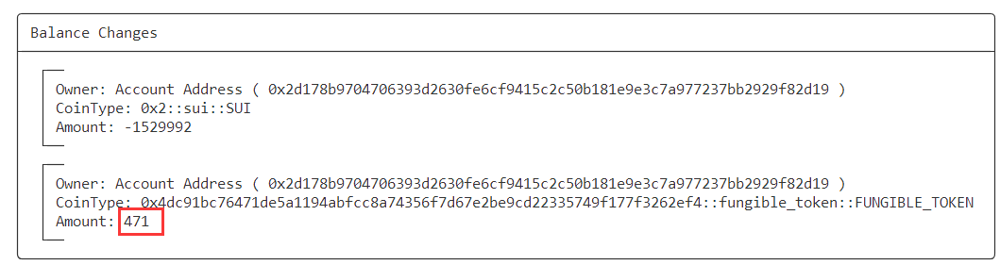
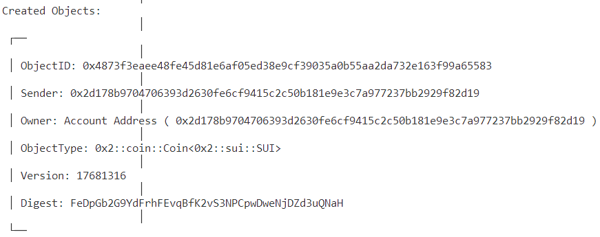
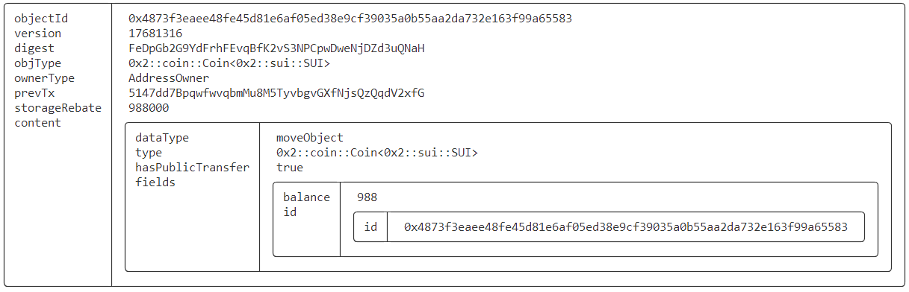

# SUI Move官方DEFI类——流动性池合约实践（liquidity_pool）

> 本文合约代码示例来自：https://github.com/MystenLabs/sui/blob/main/sui_programmability/examples/defi/sources/pool.move

## 1 合约编写

```rust
module day08::my_pool {

  use sui::coin::Coin;
  use sui::sui::SUI;
  use sui::transfer;
  use sui::tx_context::{Self, TxContext};

  struct RZX has drop {}

  entry fun create_pool<T>(
    token: Coin<T>,
    sui: Coin<SUI>,
    fee_percent: u64,
    ctx: &mut TxContext
  ) {
    transfer::public_transfer(
        day08::pool::create_pool(RZX {}, token, sui, fee_percent, ctx),
        tx_context::sender(ctx)
    )
  }
}
```

## 2 前置准备

### 2.1 准备Token

代币使用day06创建的10000枚RZX代币：

```bash
$ export COIN_FOR_ALICE=0x323294e5292809fe85ce53d054e22efc52cefe54a0289111920b1779a1e1e331
$ export COIN_TYPE=0x4dc91bc76471de5a1194abfcc8a74356f7d67e2be9cd22335749f177f3262ef4::fungible_token::FUNGIBLE_TOKEN

$ sui client object $COIN_FOR_ALICE --json
{
  "objectId": "0x323294e5292809fe85ce53d054e22efc52cefe54a0289111920b1779a1e1e331",
  "version": "17681299",
  "digest": "28FQSGjN75G7FPfqJ9JbhDrttwegqrgx1wv4cGf4LffN",
  "type": "0x2::coin::Coin<0x4dc91bc76471de5a1194abfcc8a74356f7d67e2be9cd22335749f177f3262ef4::fungible_token::FUNGIBLE_TOKEN>",
  "owner": {
    "AddressOwner": "0x2d178b9704706393d2630fe6cf9415c2c50b181e9e3c7a977237bb2929f82d19"
  },
  "previousTransaction": "7sY2Dgub5USHjYTTUM8QdrYqNMLZqM6Rd6R3BquirqnA",
  "storageRebate": "1474400",
  "content": {
    "dataType": "moveObject",
    "type": "0x2::coin::Coin<0x4dc91bc76471de5a1194abfcc8a74356f7d67e2be9cd22335749f177f3262ef4::fungible_token::FUNGIBLE_TOKEN>",
    "hasPublicTransfer": true,
    "fields": {
      "balance": "10000",
      "id": {
        "id": "0x323294e5292809fe85ce53d054e22efc52cefe54a0289111920b1779a1e1e331"
      }
    }
  }
}
```

### 2.2 准备SUI

同样准备10000枚SUI的object：

```bash
$ export COIN_SUI=0x679ce56599d39e35990a79dfb2c6fedc531f34a49f4c47a8f7b354439368026d

$ sui client object $COIN_SUI --json
{
  "objectId": "0x679ce56599d39e35990a79dfb2c6fedc531f34a49f4c47a8f7b354439368026d",
  "version": "17681297",
  "digest": "FTmLnK6VdTSGofpVN3hMLjfhoJR6vCe1eAm5sxhyuVjC",
  "type": "0x2::coin::Coin<0x2::sui::SUI>",
  "owner": {
    "AddressOwner": "0x2d178b9704706393d2630fe6cf9415c2c50b181e9e3c7a977237bb2929f82d19"
  },
  "previousTransaction": "J4J9XQcd3yYmcsZcTQ3CVg2CjGXzsS9cdaERfErzfzf1",
  "storageRebate": "988000",
  "content": {
    "dataType": "moveObject",
    "type": "0x2::coin::Coin<0x2::sui::SUI>",
    "hasPublicTransfer": true,
    "fields": {
      "balance": "10000",
      "id": {
        "id": "0x679ce56599d39e35990a79dfb2c6fedc531f34a49f4c47a8f7b354439368026d"
      }
    }
  }
}
```

## 3 合约部署

```bash
$ sui client publish --gas-budget 100000000
Transaction Digest: 3WNPusun2tvb5MV1PxJExXhcc3Lyc4129fspLcgMUjSm
```

- **将对象ID记录到环境变量，方便调用使用**

```bash
export PACKAGE_ID=0x7eb97f58ccc6804979d7a1ddc310195ac13d2382606dc063b81fa46725b95ea0
```

## 4 合约交互

### 4.1 创建流动池

```bash
sui client call --function create_pool --package $PACKAGE_ID --module my_pool --type-args $COIN_TYPE --args $COIN_FOR_ALICE $COIN_SUI 100 --gas-budget 10000000
Transaction Digest: 5k36UbnSMV8tKDvX9VaGKuQYmz1oX5urhb1sZoLY8a7x
```

- **将对象ID记录到环境变量**

```bash
# 0x2::coin::Coin<PACKAGE_ID::pool::LSP<PACKAGE_ID::my_pool::RZX, COIN_PACKAGE_ID::fungible_token::FUNGIBLE_TOKEN>>
export LSP=0x7f5898758ee6b1280784a1c1b8eebff20d1a16e387bd5b2da307d1f06820cffe

# PACKAGE_ID::pool::Pool<PACKAGE_ID::my_pool::RZX, COIN_PACKAGE_ID::fungible_token::FUNGIBLE_TOKEN>
export POOL=0x9e6ddf483fd7f5a9fb9c49158dd30ef7bcf1f758e15a00c2dbd9c2c07c15a6de
```

- **LSP对象查看**

```json
$ sui client object $LSP --json
{
  "objectId": "0x7f5898758ee6b1280784a1c1b8eebff20d1a16e387bd5b2da307d1f06820cffe",
  "version": "17681305",
  "digest": "HvySvi5xJfcBdoBa1NEvoeCLLmHxknK5BYMrNKxaF2eq",
  "type": "0x2::coin::Coin<0x7eb97f58ccc6804979d7a1ddc310195ac13d2382606dc063b81fa46725b95ea0::pool::LSP<0x7eb97f58ccc6804979d7a1ddc310195ac13d2382606dc063b81fa46725b95ea0::my_pool::RZX, 0x4dc91bc76471de5a1194abfcc8a74356f7d67e2be9cd22335749f177f3262ef4::fungible_token::FUNGIBLE_TOKEN>>",
  "owner": {
    "AddressOwner": "0x2d178b9704706393d2630fe6cf9415c2c50b181e9e3c7a977237bb2929f82d19"
  },
  "previousTransaction": "5k36UbnSMV8tKDvX9VaGKuQYmz1oX5urhb1sZoLY8a7x",
  "storageRebate": "2150800",
  "content": {
    "dataType": "moveObject",
    "type": "0x2::coin::Coin<0x7eb97f58ccc6804979d7a1ddc310195ac13d2382606dc063b81fa46725b95ea0::pool::LSP<0x7eb97f58ccc6804979d7a1ddc310195ac13d2382606dc063b81fa46725b95ea0::my_pool::RZX, 0x4dc91bc76471de5a1194abfcc8a74356f7d67e2be9cd22335749f177f3262ef4::fungible_token::FUNGIBLE_TOKEN>>",
    "hasPublicTransfer": true,
    "fields": {
      "balance": "10000",
      "id": {
        "id": "0x7f5898758ee6b1280784a1c1b8eebff20d1a16e387bd5b2da307d1f06820cffe"
      }
    }
  }
}
```

- **POOL对象查看**

```json
$ sui client object $POOL --json
{
  "objectId": "0x9e6ddf483fd7f5a9fb9c49158dd30ef7bcf1f758e15a00c2dbd9c2c07c15a6de",
  "version": "17681305",
  "digest": "2vJeCn5vn9XruUWWn6Jeo6QhVj9VHvjsgzULKwzzLMxs",
  "type": "0x7eb97f58ccc6804979d7a1ddc310195ac13d2382606dc063b81fa46725b95ea0::pool::Pool<0x7eb97f58ccc6804979d7a1ddc310195ac13d2382606dc063b81fa46725b95ea0::my_pool::RZX, 0x4dc91bc76471de5a1194abfcc8a74356f7d67e2be9cd22335749f177f3262ef4::fungible_token::FUNGIBLE_TOKEN>",
  "owner": {
    "Shared": {
      "initial_shared_version": 17681305
    }
  },
  "previousTransaction": "5k36UbnSMV8tKDvX9VaGKuQYmz1oX5urhb1sZoLY8a7x",
  "storageRebate": "2333200",
  "content": {
    "dataType": "moveObject",
    "type": "0x7eb97f58ccc6804979d7a1ddc310195ac13d2382606dc063b81fa46725b95ea0::pool::Pool<0x7eb97f58ccc6804979d7a1ddc310195ac13d2382606dc063b81fa46725b95ea0::my_pool::RZX, 0x4dc91bc76471de5a1194abfcc8a74356f7d67e2be9cd22335749f177f3262ef4::fungible_token::FUNGIBLE_TOKEN>",
    "hasPublicTransfer": false,
    "fields": {
      "fee_percent": "100",
      "id": {
        "id": "0x9e6ddf483fd7f5a9fb9c49158dd30ef7bcf1f758e15a00c2dbd9c2c07c15a6de"
      },
      "lsp_supply": {
        "type": "0x2::balance::Supply<0x7eb97f58ccc6804979d7a1ddc310195ac13d2382606dc063b81fa46725b95ea0::pool::LSP<0x7eb97f58ccc6804979d7a1ddc310195ac13d2382606dc063b81fa46725b95ea0::my_pool::RZX, 0x4dc91bc76471de5a1194abfcc8a74356f7d67e2be9cd22335749f177f3262ef4::fungible_token::FUNGIBLE_TOKEN>>",
        "fields": {
          "value": "10000"
        }
      },
      "sui": "10000",
      "token": "10000"
    }
  }
}
```

### 4.2 添加流动性

> 铸造500 RZX，并添加流动性

```bash
export AMOUNT=500
export ALICE=0x2d178b9704706393d2630fe6cf9415c2c50b181e9e3c7a977237bb2929f82d19
sui client call --function mint --package $PACKAGE_ID --module fungible_token --args $TREASURY_CAP $AMOUNT $ALICE --gas-budget 10000000
Transaction Digest: HRem1R2aXVVJgQjj64rCc3XSQnZnQ4KaX7ZDfTWyo8Mi

export COIN_FOR_ALICE2=0x9df07539587e0f774ada2c5df14ced77f8475281e580b14fdc7defa7e8f7de76
export COIN_SUI2=0x8f6bdfb1a02a9b29e96bcdc14a5e9314d9f5bf962e8822b1310ea5f9c40fa3f3
export POOL_TYPE=0x7eb97f58ccc6804979d7a1ddc310195ac13d2382606dc063b81fa46725b95ea0::my_pool::RZX
export TOKEN_TYPE=0x4dc91bc76471de5a1194abfcc8a74356f7d67e2be9cd22335749f177f3262ef4::fungible_token::FUNGIBLE_TOKEN

sui client call --function add_liquidity_ --package $PACKAGE_ID --module pool --type-args $POOL_TYPE $TOKEN_TYPE --args $POOL $COIN_SUI2 $COIN_FOR_ALICE2 --gas-budget 10000000
Transaction Digest: 2DHS5WRuFgFbPwh38F4j8nYrLFx3X76HhWqiCXfUTntm
```

> 注：遇到如下错误是因为参数写反，先SUI再Token，跟创建刚好相反:(
>
> ```bash
> Error executing transaction: Failure {
>  error: "CommandArgumentError { arg_idx: 1, kind: TypeMismatch } in command 0",
> }
> ```

- **将对象ID记录到环境变量**

```bash
# 0x2::coin::Coin<PACKAGE_ID::pool::LSP<PACKAGE_ID::my_pool::RZX, COIN_PACKAGE_ID::fungible_token::FUNGIBLE_TOKEN>> 
export LSP2=0xe481e0fa8571548aae58efb9958a5c7863d54b26cbdaafb6028478ba45a7f610
```

- **查看池子**

```json
$ sui client object $POOL --json
{
  "objectId": "0x9e6ddf483fd7f5a9fb9c49158dd30ef7bcf1f758e15a00c2dbd9c2c07c15a6de",
  "version": "17681312",
  "digest": "2NW3TfeAkSGwSwr9EjUhWEQsoh3aieXQADbbMFFJMXXK",
  "type": "0x7eb97f58ccc6804979d7a1ddc310195ac13d2382606dc063b81fa46725b95ea0::pool::Pool<0x7eb97f58ccc6804979d7a1ddc310195ac13d2382606dc063b81fa46725b95ea0::my_pool::RZX, 0x4dc91bc76471de5a1194abfcc8a74356f7d67e2be9cd22335749f177f3262ef4::fungible_token::FUNGIBLE_TOKEN>",
  "owner": {
    "Shared": {
      "initial_shared_version": 17681305
    }
  },
  "previousTransaction": "2DHS5WRuFgFbPwh38F4j8nYrLFx3X76HhWqiCXfUTntm",
  "storageRebate": "2333200",
  "content": {
    "dataType": "moveObject",
    "type": "0x7eb97f58ccc6804979d7a1ddc310195ac13d2382606dc063b81fa46725b95ea0::pool::Pool<0x7eb97f58ccc6804979d7a1ddc310195ac13d2382606dc063b81fa46725b95ea0::my_pool::RZX, 0x4dc91bc76471de5a1194abfcc8a74356f7d67e2be9cd22335749f177f3262ef4::fungible_token::FUNGIBLE_TOKEN>",
    "hasPublicTransfer": false,
    "fields": {
      "fee_percent": "100",
      "id": {
        "id": "0x9e6ddf483fd7f5a9fb9c49158dd30ef7bcf1f758e15a00c2dbd9c2c07c15a6de"
      },
      "lsp_supply": {
        "type": "0x2::balance::Supply<0x7eb97f58ccc6804979d7a1ddc310195ac13d2382606dc063b81fa46725b95ea0::pool::LSP<0x7eb97f58ccc6804979d7a1ddc310195ac13d2382606dc063b81fa46725b95ea0::my_pool::RZX, 0x4dc91bc76471de5a1194abfcc8a74356f7d67e2be9cd22335749f177f3262ef4::fungible_token::FUNGIBLE_TOKEN>>",
        "fields": {
          "value": "10500"
        }
      },
      "sui": "10500",
      "token": "10500"
    }
  }
}
```

### 4.3 移除流动性

```bash
sui client call --function remove_liquidity_ --package $PACKAGE_ID --module pool --type-args $POOL_TYPE $TOKEN_TYPE --args $POOL $LSP2 --gas-budget 10000000
Transaction Digest: 8Q7Yt2eqgQ6WDb2TBWcSko6YPP2ABpsEzdEr8cPFvspt
```

- **查看池子**

```json
$ sui client object $POOL --json
{
  "objectId": "0x9e6ddf483fd7f5a9fb9c49158dd30ef7bcf1f758e15a00c2dbd9c2c07c15a6de",
  "version": "17681313",
  "digest": "3b7uoiANDnuyvMW7PAvJeMpem1QmGjbMU6jkS5PoLXrB",
  "type": "0x7eb97f58ccc6804979d7a1ddc310195ac13d2382606dc063b81fa46725b95ea0::pool::Pool<0x7eb97f58ccc6804979d7a1ddc310195ac13d2382606dc063b81fa46725b95ea0::my_pool::RZX, 0x4dc91bc76471de5a1194abfcc8a74356f7d67e2be9cd22335749f177f3262ef4::fungible_token::FUNGIBLE_TOKEN>",
  "owner": {
    "Shared": {
      "initial_shared_version": 17681305
    }
  },
  "previousTransaction": "8Q7Yt2eqgQ6WDb2TBWcSko6YPP2ABpsEzdEr8cPFvspt",
  "storageRebate": "2333200",
  "content": {
    "dataType": "moveObject",
    "type": "0x7eb97f58ccc6804979d7a1ddc310195ac13d2382606dc063b81fa46725b95ea0::pool::Pool<0x7eb97f58ccc6804979d7a1ddc310195ac13d2382606dc063b81fa46725b95ea0::my_pool::RZX, 0x4dc91bc76471de5a1194abfcc8a74356f7d67e2be9cd22335749f177f3262ef4::fungible_token::FUNGIBLE_TOKEN>",
    "hasPublicTransfer": false,
    "fields": {
      "fee_percent": "100",
      "id": {
        "id": "0x9e6ddf483fd7f5a9fb9c49158dd30ef7bcf1f758e15a00c2dbd9c2c07c15a6de"
      },
      "lsp_supply": {
        "type": "0x2::balance::Supply<0x7eb97f58ccc6804979d7a1ddc310195ac13d2382606dc063b81fa46725b95ea0::pool::LSP<0x7eb97f58ccc6804979d7a1ddc310195ac13d2382606dc063b81fa46725b95ea0::my_pool::RZX, 0x4dc91bc76471de5a1194abfcc8a74356f7d67e2be9cd22335749f177f3262ef4::fungible_token::FUNGIBLE_TOKEN>>",
        "fields": {
          "value": "10000"
        }
      },
      "sui": "10000",
      "token": "10000"
    }
  }
}
```

### 4.4 将SUI兑换成Token

> ```bash
> $ export COIN_SUI=0x08157d1d5cb646f8ac895ca0743797a9386c5bd478b3de8358b36fcbb0546a55
> 
> $ sui client object $COIN_SUI --json
> {
> "objectId": "0x08157d1d5cb646f8ac895ca0743797a9386c5bd478b3de8358b36fcbb0546a55",
> "version": "17681313",
> "digest": "FJepptE85mrQMvW5ALtkGoSStkWGGZCDj1WiS6f8ZBwY",
> "type": "0x2::coin::Coin<0x2::sui::SUI>",
> "owner": {
>  "AddressOwner": "0x2d178b9704706393d2630fe6cf9415c2c50b181e9e3c7a977237bb2929f82d19"
> },
> "previousTransaction": "8Q7Yt2eqgQ6WDb2TBWcSko6YPP2ABpsEzdEr8cPFvspt",
> "storageRebate": "988000",
> "content": {
>  "dataType": "moveObject",
>  "type": "0x2::coin::Coin<0x2::sui::SUI>",
>  "hasPublicTransfer": true,
>  "fields": {
>    "balance": "500",
>    "id": {
>      "id": "0x08157d1d5cb646f8ac895ca0743797a9386c5bd478b3de8358b36fcbb0546a55"
>    }
>  }
> }
> }
> ```

```bash
sui client call --function swap_sui_ --package $PACKAGE_ID --module pool --type-args $POOL_TYPE $TOKEN_TYPE --args $POOL $COIN_SUI --gas-budget 10000000
Transaction Digest: Fsaa37Er9C2ytkN5HUaoJmWLTZokT4aeMSZn5ttV5Vw6
```

- **扣除手续费后得到471枚代币**



- **当前池子情况**

```json
$ sui client object $POOL --json
{
  "objectId": "0x9e6ddf483fd7f5a9fb9c49158dd30ef7bcf1f758e15a00c2dbd9c2c07c15a6de",
  "version": "17681314",
  "digest": "6hPvDxRDBvbERoRS3awEiTvCSCKL4YBCUEpXFP5szf3J",
  "type": "0x7eb97f58ccc6804979d7a1ddc310195ac13d2382606dc063b81fa46725b95ea0::pool::Pool<0x7eb97f58ccc6804979d7a1ddc310195ac13d2382606dc063b81fa46725b95ea0::my_pool::RZX, 0x4dc91bc76471de5a1194abfcc8a74356f7d67e2be9cd22335749f177f3262ef4::fungible_token::FUNGIBLE_TOKEN>",
  "owner": {
    "Shared": {
      "initial_shared_version": 17681305
    }
  },
  "previousTransaction": "Fsaa37Er9C2ytkN5HUaoJmWLTZokT4aeMSZn5ttV5Vw6",
  "storageRebate": "2333200",
  "content": {
    "dataType": "moveObject",
    "type": "0x7eb97f58ccc6804979d7a1ddc310195ac13d2382606dc063b81fa46725b95ea0::pool::Pool<0x7eb97f58ccc6804979d7a1ddc310195ac13d2382606dc063b81fa46725b95ea0::my_pool::RZX, 0x4dc91bc76471de5a1194abfcc8a74356f7d67e2be9cd22335749f177f3262ef4::fungible_token::FUNGIBLE_TOKEN>",
    "hasPublicTransfer": false,
    "fields": {
      "fee_percent": "100",
      "id": {
        "id": "0x9e6ddf483fd7f5a9fb9c49158dd30ef7bcf1f758e15a00c2dbd9c2c07c15a6de"
      },
      "lsp_supply": {
        "type": "0x2::balance::Supply<0x7eb97f58ccc6804979d7a1ddc310195ac13d2382606dc063b81fa46725b95ea0::pool::LSP<0x7eb97f58ccc6804979d7a1ddc310195ac13d2382606dc063b81fa46725b95ea0::my_pool::RZX, 0x4dc91bc76471de5a1194abfcc8a74356f7d67e2be9cd22335749f177f3262ef4::fungible_token::FUNGIBLE_TOKEN>>",
        "fields": {
          "value": "10000"
        }
      },
      "sui": "10500",
      "token": "9529"
    }
  }
}
```

### 4.5 将Token兑换成SUI

> ```bash
> export AMOUNT=1000
> export ALICE=0x2d178b9704706393d2630fe6cf9415c2c50b181e9e3c7a977237bb2929f82d19
> 
> sui client call --function mint --package $PACKAGE_ID --module fungible_token --args $TREASURY_CAP $AMOUNT $ALICE --gas-budget 10000000
> Transaction Digest: 6TrSs7qQN5P6Df8mgX1R7Hq5DANrq2NQHhuXmXn2prEh
> 
> export COIN_RZX=0x8a9bd1c92c84b460dc9aa00905a14c42618baec3573cc52cb38950f35474c463
> ```

```bash
sui client call --function swap_token_ --package $PACKAGE_ID --module pool --type-args $POOL_TYPE $TOKEN_TYPE --args $POOL $COIN_RZX --gas-budget 10000000
Transaction Digest: 5147dd7BpqwfwvqbmMu8M5TyvbgvGXfNjsQzQqdV2xfG
```

- **创建SUI对象，获得988 SUI**




