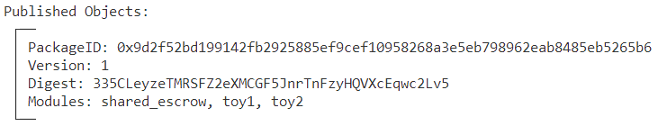
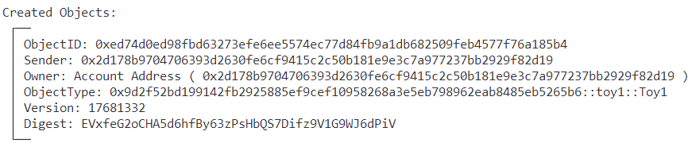
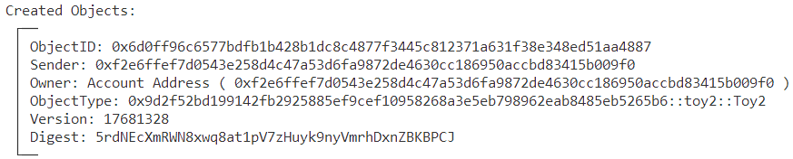
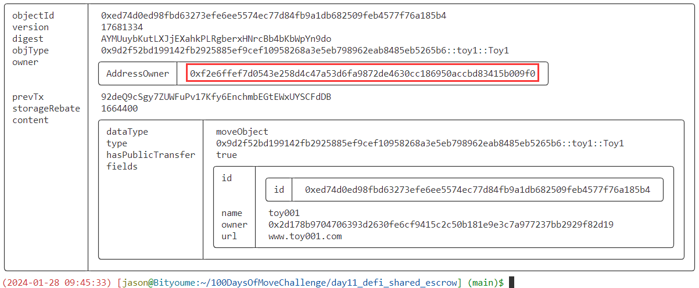
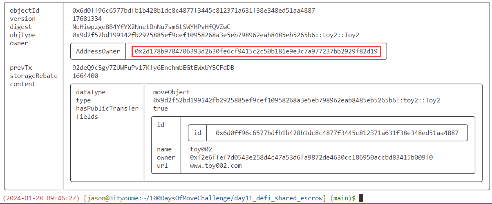
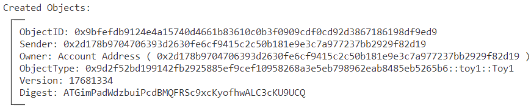
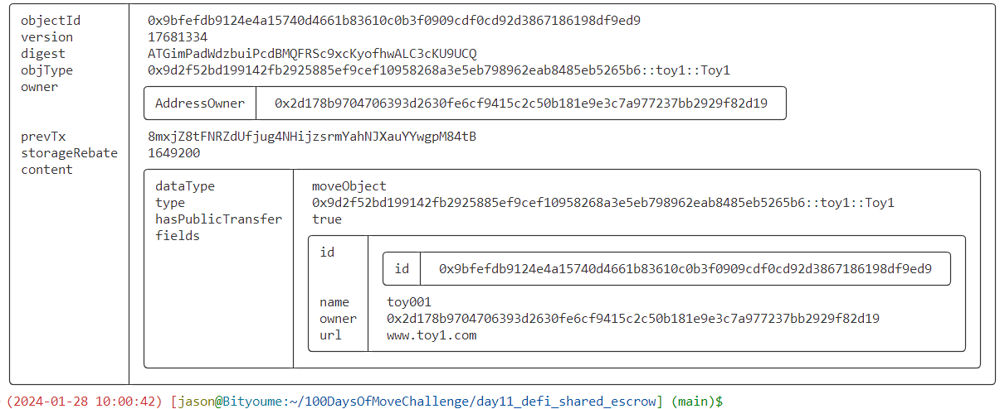
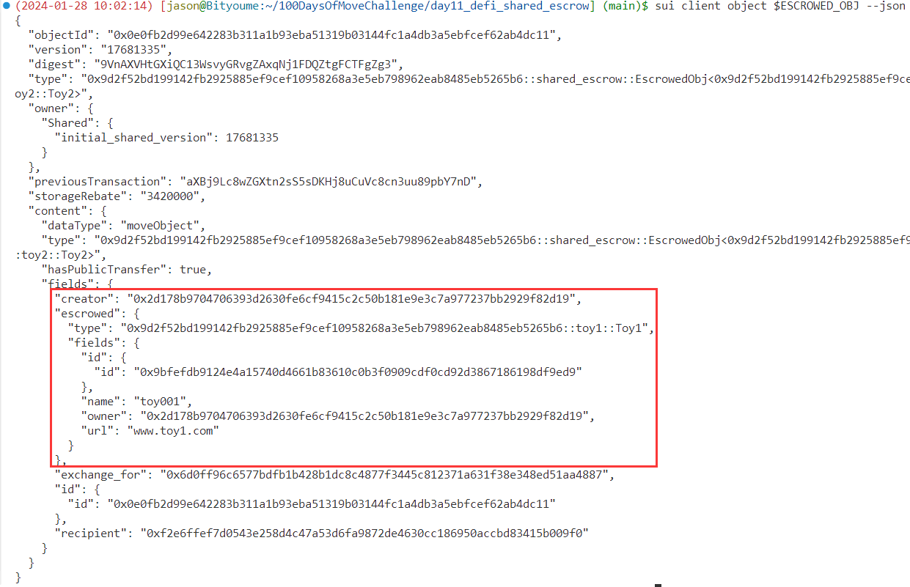
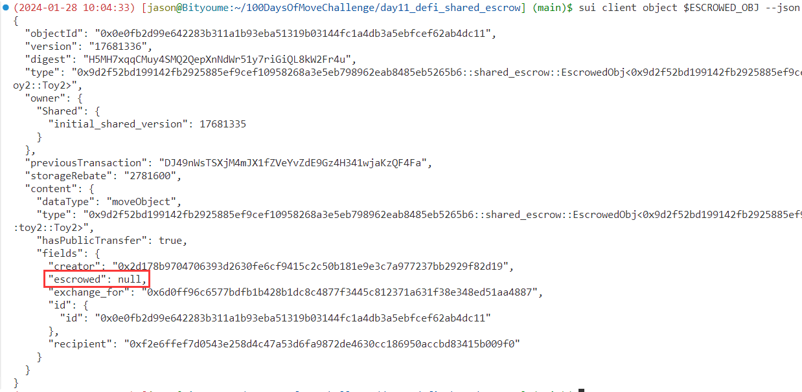
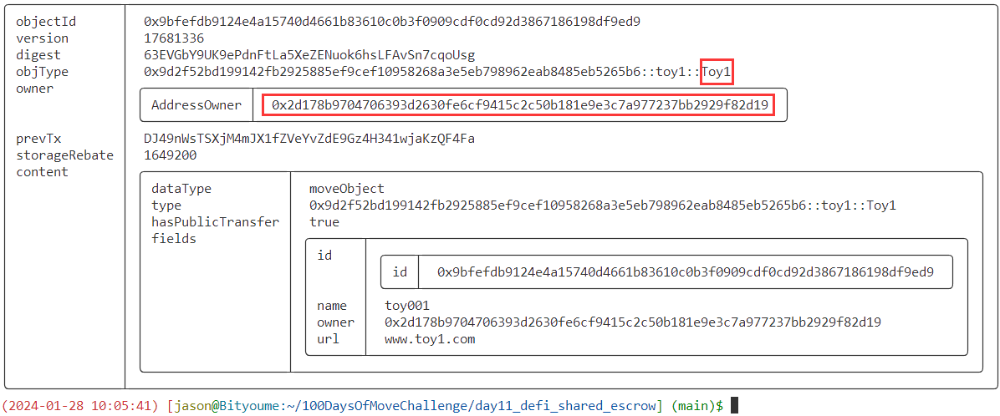

# SUI Move 官方DEFI类——共享托管原子交换合约实践（shared_escrow）

## 1 合约说明

### 1.1 官方合约示例代码

https://github.com/MystenLabs/sui/blob/main/sui_programmability/examples/defi/sources/shared_escrow.move

```rust
// Copyright (c) Mysten Labs, Inc.
// SPDX-License-Identifier: Apache-2.0

/// An escrow for atomic swap of objects without a trusted third party
module defi::shared_escrow {
    use std::option::{Self, Option};

    use sui::object::{Self, ID, UID};
    use sui::transfer;
    use sui::tx_context::{Self, TxContext};

    /// An object held in escrow
    struct EscrowedObj<T: key + store, phantom ExchangeForT: key + store> has key, store {
        id: UID,
        /// owner of the escrowed object
        creator: address,
        /// intended recipient of the escrowed object
        recipient: address,
        /// ID of the object `creator` wants in exchange
        exchange_for: ID,
        /// the escrowed object
        escrowed: Option<T>,
    }

    // Error codes
    /// An attempt to cancel escrow by a different user than the owner
    const EWrongOwner: u64 = 0;
    /// Exchange by a different user than the `recipient` of the escrowed object
    const EWrongRecipient: u64 = 1;
    /// Exchange with a different item than the `exchange_for` field
    const EWrongExchangeObject: u64 = 2;
    /// The escrow has already been exchanged or cancelled
    const EAlreadyExchangedOrCancelled: u64 = 3;

    /// Create an escrow for exchanging goods with counterparty
    public fun create<T: key + store, ExchangeForT: key + store>(
        recipient: address,
        exchange_for: ID,
        escrowed_item: T,
        ctx: &mut TxContext
    ) {
        let creator = tx_context::sender(ctx);
        let id = object::new(ctx);
        let escrowed = option::some(escrowed_item);
        transfer::public_share_object(
            EscrowedObj<T,ExchangeForT> {
                id, creator, recipient, exchange_for, escrowed
            }
        );
    }

    /// The `recipient` of the escrow can exchange `obj` with the escrowed item
    public entry fun exchange<T: key + store, ExchangeForT: key + store>(
        obj: ExchangeForT,
        escrow: &mut EscrowedObj<T, ExchangeForT>,
        ctx: &TxContext
    ) {
        assert!(option::is_some(&escrow.escrowed), EAlreadyExchangedOrCancelled);
        let escrowed_item = option::extract<T>(&mut escrow.escrowed);
        assert!(&tx_context::sender(ctx) == &escrow.recipient, EWrongRecipient);
        assert!(object::borrow_id(&obj) == &escrow.exchange_for, EWrongExchangeObject);
        // everything matches. do the swap!
        transfer::public_transfer(escrowed_item, tx_context::sender(ctx));
        transfer::public_transfer(obj, escrow.creator);
    }

    /// The `creator` can cancel the escrow and get back the escrowed item
    public entry fun cancel<T: key + store, ExchangeForT: key + store>(
        escrow: &mut EscrowedObj<T, ExchangeForT>,
        ctx: &TxContext
    ) {
        assert!(&tx_context::sender(ctx) == &escrow.creator, EWrongOwner);
        assert!(option::is_some(&escrow.escrowed), EAlreadyExchangedOrCancelled);
        transfer::public_transfer(option::extract<T>(&mut escrow.escrowed), escrow.creator);
    }
}
```

### 1.2 功能说明

- 本合约实现了不需要通过可信的第三方实现两个Object原子互换的功能
- 提供了三个对外接口：
    - `create`：创建与交易对手交换物品的共享对象（`share object`）托管
    - `exchange`：托管物品指定的接收者，可以调用该接口，使用自己所持有的物品，与托管对象中的物品进行互换
    - `cancel`：托管对象的创建者可以调用该接口取消托管，取回托管对象

### 1.3 交换对象示例代码

#### （1）Toy1

```rust
module day11::toy1 {
    use sui::object::{Self, ID, UID};
    use sui::transfer;
    use sui::tx_context::{Self, TxContext};
    use std::string;
    use sui::url::{Self, Url};
    use sui::event;

    struct Toy1 has key, store {
        id: UID,
        name: string::String, 
        owner: address,
        url: Url,
    }

    struct EventCreateToy1 has copy, drop {                                                                                                                                                                                                    
        object_id: ID,
        name: string::String,
        owner: address,
        url: Url,
    }   

    public entry fun create (
        name: vector<u8>,
        url: vector<u8>,
        ctx: &mut TxContext
    ) {    
        let sender = tx_context::sender(ctx);

        let url = url::new_unsafe_from_bytes(url);
        let toy = Toy1 {
            id: object::new(ctx),
            name: string::utf8(name),
            owner: sender,
            url,
        };        

        event::emit(EventCreateToy1 {
            object_id: object::id(&toy),
            name: toy.name,
            owner: sender,
            url,
        });       

        transfer::public_transfer(toy, sender);
    }    
}
```

#### （2）Toy2

代码同上，只是将`Toy1`改为`Toy2`。

## 2 前置准备

### 2.1 帐号准备及角色分配

| 别名  | 地址                                                         | 角色                           |
| ----- | ------------------------------------------------------------ | ------------------------------ |
| Alice | `0x2d178b9704706393d2630fe6cf9415c2c50b181e9e3c7a977237bb2929f82d19` | 拥有`Toy1`、创建托管、取消托管 |
| Bob   | `0xf2e6ffef7d0543e258d4c47a53d6fa9872de4630cc186950accbd83415b009f0` | 拥有`Toy2`、触发交换           |

- **将地址添加到环境变量**

```bash
export ALICE=0x2d178b9704706393d2630fe6cf9415c2c50b181e9e3c7a977237bb2929f82d19
export BOB=0xf2e6ffef7d0543e258d4c47a53d6fa9872de4630cc186950accbd83415b009f0
```

## 3 合约部署

```bash
$ sui client publish --gas-budget 100000000
Transaction Digest: BZY3axaSPe2rHzNdNzHEjteKmYKb4GxGdvAgLKqHUZj1
```

- **命令输出关键信息截图**



- **将PackageID记录到环境变量，方便后续调用使用**

```bash
export PACKAGE_ID=0x9d2f52bd199142fb2925885ef9cef10958268a3e5eb798962eab8485eb5265b6
```

## 4 合约交互

### 4.1 Alice创建Toy1

> 切换到Alice

```bash
export NAME=toy001
export URL=www.toy001.com
sui client call --function create --package $PACKAGE_ID --module toy1 --args $NAME $URL --gas-budget 10000000
```

- **命令输出关键信息截图**



- **记录Toy1对象ID和Toy1对象类型到环境变量**

```bash
export TOY1=0xed74d0ed98fbd63273efe6ee5574ec77d84fb9a1db682509feb4577f76a185b4
export TOY1_TYPE=$PACKAGE_ID::toy1::Toy1
```

### 4.2 Bob创建Toy2

> 切换到Bob

```bash
export NAME=toy002
export URL=www.toy002.com
sui client call --function create --package $PACKAGE_ID --module toy2 --args $NAME $URL --gas-budget 10000000
```

- **命令输出关键信息截图**



- **记录Toy1对象ID和Toy1对象类型到环境变量**

```bash
export TOY2=0x6d0ff96c6577bdfb1b428b1dc8c4877f3445c812371a631f38e348ed51aa4887
export TOY2_TYPE=$PACKAGE_ID::toy2::Toy2
```

### 4.3 Alice创建托管对象

> 切换到Alice

```bash
sui client call --function create --package $PACKAGE_ID --module shared_escrow --type-args $TOY1_TYPE $TOY2_TYPE --args $BOB $TOY2 $TOY1 --gas-budget 10000000
Transaction Digest: 5XGiKZtCwBFs55X82yLc331bhc3AotHBYzbhSsHj9EhA
```

- 泛型类型参数说明
    - `T`：指定托管物品的类型
    - `ExchangeForT`：指定欲交换对象的类型

- 参数说明
    - `recipient`：指定托管对象欲交换的接收方
    - `exchange_for`：指定要交换对象的ID
    - `escrowed_item`：指定要托管的对象

- **记录创建的托管共享对象到环境变量**

```bash
# ObjectType: PACKAGE_ID::shared_escrow::EscrowedObj<PACKAGE_ID::toy1::Toy1, v::toy2::Toy2>
export ESCROWED_OBJ=0x8f771e425ac63d30fadda8f866f8d85902921c2da7dd4566a466488ad34aab90
```

### 4.4 Bob发起托管物品互换

> 切换到Bob

```bash
sui client call --function exchange --package $PACKAGE_ID --module shared_escrow --type-args $TOY1_TYPE $TOY2_TYPE --args $TOY2 $ESCROWED_OBJ --gas-budget 10000000
Transaction Digest: 92deQ9cSgy7ZUWFuPv17Kfy6EnchmbEGtEWxUYSCFdDB
```

- 泛型类型参数说明
    - `T`：指定托管物品的类型
    - `ExchangeForT`：指定欲交换对象的类型

- 参数说明
    - `obj`：Bob持有的用于互换的物品
    - `escrow`：共享托管对象

### 4.5 查看当前物品归属

**（1）可见Toy1已经归属Bob，符合预期**



**（2）可见Toy2已经归属Alice，符合预期**



### 4.6 取消托管

> 若Alice创建托管后，不想进行互换了，还可以取消托管。

（1）Alice再次创建Toy

> 切换到Alice

```bash
export NAME=toy001
export URL=www.toy1.com
sui client call --function create --package $PACKAGE_ID --module toy1 --args $NAME $URL --gas-budget 10000000
```

- **命令输出关键信息截图**



- **记录Toy1对象ID和Toy1对象类型到环境变量**

```bash
export TOY1=0x9bfefdb9124e4a15740d4661b83610c0b3f0909cdf0cd92d3867186198df9ed9
export TOY1_TYPE=$PACKAGE_ID::toy1::Toy1
```

- **确认Toy1已经归属Alice**



**（2）Alice再次进行托管**

```bash
sui client call --function create --package $PACKAGE_ID --module shared_escrow --type-args $TOY1_TYPE $TOY2_TYPE --args $BOB $TOY2 $TOY1 --gas-budget 10000000
```

- **记录创建的托管共享对象到环境变量**

```bash
# ObjectType: PACKAGE_ID::shared_escrow::EscrowedObj<PACKAGE_ID::toy1::Toy1, v::toy2::Toy2>
export ESCROWED_OBJ=0x0e0fb2d99e642283b311a1b93eba51319b03144fc1a4db3a5ebfcef62ab4dc11
```

**（3）查看托管对象确认Toy1已经被托管**



- **托管后，再次查看Toy1对象会报错**

```bash
$ sui client object $TOY1
Internal error, cannot read the object: Object has been deleted object_id: 0x9bfefdb9124e4a15740d4661b83610c0b3f0909cdf0cd92d3867186198df9ed9 at version: SequenceNumber(17681335) in digest o#6ws1bVyu3F8wGy1fPHhrc2v8UyWiGbRAAuek8SwikKPD
```

**（4）Alice取消托管**

> 取消托管接口只有一个参数，即托管对象

```bash
sui client call --function cancel --package $PACKAGE_ID --module shared_escrow --type-args $TOY1_TYPE $TOY2_TYPE --args $ESCROWED_OBJ --gas-budget 10000000
Transaction Digest: DJ49nWsTSXjM4mJX1fZVeYvZdE9Gz4H341wjaKzQF4Fa
```

**（5）当Alice取消托管后，托管对象已经被清空**



**（6）再次查看Toy1对象，已经原路返回Alice帐号**


