# SUI Move官方示例合约实践——FT类：篮子代币（basket）

*rzexin 2024.01.30*

## 1 合约说明

### 1.1 功能介绍

- 本合约是一个由一篮子代币合成的同质化代币合约，本示例中一篮子代币是由`SUI`和`MANAGED`代币`1:1`组成，但这种方法适用于创建任意资产和比例的篮子。
- 提供了2个写入接口
    - `mint`：铸造篮子代币，通过存入特定比例的资产（本示例合约中就是`1:1`的`SUI`和`MANAGED`代币），铸造篮子代币`Coin<BASKET>`
    - `burn`：销毁篮子代币，销毁后将获得存入的特定比例资产
- 提供了3个读取接口
    - `total_supply`：获取篮子代币总发行量
    - `sui_supply`：获取储备到篮子中的`SUI`的总量
    - `managed_supply`：获取储备到篮子中的`MANAGED`代币总量

### 1.2 官方合约示例代码

https://github.com/MystenLabs/sui/blob/main/sui_programmability/examples/fungible_tokens/sources/basket.move

```rust
// Copyright (c) Mysten Labs, Inc.
// SPDX-License-Identifier: Apache-2.0

/// A synthetic fungible token backed by a basket of other tokens.
/// Here, we use a basket that is 1:1 SUI and MANAGED,
/// but this approach would work for a basket with arbitrary assets/ratios.
/// E.g., [SDR](https://www.imf.org/en/About/Factsheets/Sheets/2016/08/01/14/51/Special-Drawing-Right-SDR)
/// could be implemented this way.
module fungible_tokens::basket {
    use fungible_tokens::managed::MANAGED;
    use sui::coin::{Self, Coin};
    use sui::balance::{Self, Balance, Supply};
    use sui::object::{Self, UID};
    use sui::sui::SUI;
    use sui::transfer;
    use sui::tx_context::TxContext;

    /// Name of the coin. By convention, this type has the same name as its parent module
    /// and has no fields. The full type of the coin defined by this module will be `COIN<BASKET>`.
    struct BASKET has drop { }

    /// Singleton shared object holding the reserve assets and the capability.
    struct Reserve has key {
        id: UID,
        /// capability allowing the reserve to mint and burn BASKET
        total_supply: Supply<BASKET>,
        /// SUI coins held in the reserve
        sui: Balance<SUI>,
        /// MANAGED coins held in the reserve
        managed: Balance<MANAGED>,
    }

    /// Needed to deposit a 1:1 ratio of SUI and MANAGED for minting, but deposited a different ratio
    const EBadDepositRatio: u64 = 0;

    #[allow(unused_function)]
    fun init(witness: BASKET, ctx: &mut TxContext) {
        // Get a treasury cap for the coin put it in the reserve
        let total_supply = balance::create_supply<BASKET>(witness);

        transfer::share_object(Reserve {
            id: object::new(ctx),
            total_supply,
            sui: balance::zero<SUI>(),
            managed: balance::zero<MANAGED>(),
        })
    }

    /// === Writes ===

    /// Mint BASKET coins by accepting an equal number of SUI and MANAGED coins
    public fun mint(
        reserve: &mut Reserve, sui: Coin<SUI>, managed: Coin<MANAGED>, ctx: &mut TxContext
    ): Coin<BASKET> {
        let num_sui = coin::value(&sui);
        assert!(num_sui == coin::value(&managed), EBadDepositRatio);

        coin::put(&mut reserve.sui, sui);
        coin::put(&mut reserve.managed, managed);

        let minted_balance = balance::increase_supply(&mut reserve.total_supply, num_sui);

        coin::from_balance(minted_balance, ctx)
    }

    /// Burn BASKET coins and return the underlying reserve assets
    public fun burn(
        reserve: &mut Reserve, basket: Coin<BASKET>, ctx: &mut TxContext
    ): (Coin<SUI>, Coin<MANAGED>) {
        let num_basket = balance::decrease_supply(&mut reserve.total_supply, coin::into_balance(basket));
        let sui = coin::take(&mut reserve.sui, num_basket, ctx);
        let managed = coin::take(&mut reserve.managed, num_basket, ctx);

        (sui, managed)
    }

    // === Reads ===

    /// Return the number of `MANAGED` coins in circulation
    public fun total_supply(reserve: &Reserve): u64 {
        balance::supply_value(&reserve.total_supply)
    }

    /// Return the number of SUI in the reserve
    public fun sui_supply(reserve: &Reserve): u64 {
        balance::value(&reserve.sui)
    }

    /// Return the number of MANAGED in the reserve
    public fun managed_supply(reserve: &Reserve): u64 {
        balance::value(&reserve.managed)
    }

    #[test_only]
    public fun init_for_testing(ctx: &mut TxContext) {
        init(BASKET {}, ctx)
    }
}
```

### 1.3 编写`mint`和`burn`对外合约接口

```rust
module day13::my_basket {
    use day13::rzx_token::RZX_TOKEN;
    use day13::basket::{Self, Reserve, BASKET};
    use sui::coin::Coin;
    use sui::transfer;
    use sui::event;
    use sui::sui::SUI;
    use sui::tx_context::{Self, TxContext};

    struct EventBasketMint has copy, drop {
        recipient: address,
        total_supply: u64,
        sui_supply: u64,
        managed_supply: u64
    }

    struct EventBasketBurn has copy, drop {
        recipient: address,
        total_supply: u64,
        sui_supply: u64,
        managed_supply: u64
    }

    public entry fun mint(reserve: &mut Reserve, sui: Coin<SUI>, 
        managed: Coin<RZX_TOKEN>, ctx: &mut TxContext) {

        let coin_basket = basket::mint(reserve, sui, managed, ctx);

        let sender = tx_context::sender(ctx);
        transfer::public_transfer(coin_basket, sender);

        event::emit(EventBasketMint{
            recipient: sender,
            total_supply: basket::total_supply(reserve),
            sui_supply: basket::sui_supply(reserve),
            managed_supply: basket::managed_supply(reserve)
        });
    }

    public entry fun burn(reserve: &mut Reserve, basket: Coin<BASKET>, ctx: &mut TxContext) {
        let (sui, managed) = basket::burn(reserve, basket, ctx);
        let sender = tx_context::sender(ctx);
        transfer::public_transfer(sui, sender);
        transfer::public_transfer(managed, sender);

        event::emit(EventBasketBurn{
            recipient: sender,
            total_supply: basket::total_supply(reserve),
            sui_supply: basket::sui_supply(reserve),
            managed_supply: basket::managed_supply(reserve)
        });
    }
}
```

### 1.4 代币资产示例代码

> 创建同质化代币RZX

```rust
module day13::rzx_token {
    use std::option;
    use sui::coin::{Self, Coin, TreasuryCap};
    use sui::transfer;
    use sui::tx_context::{Self, TxContext};

    struct RZX_TOKEN has drop {}

    #[allow(unused_function)]
    fun init(witness: RZX_TOKEN, ctx: &mut TxContext) {
        let (treasury_cap, metadata) = 
            coin::create_currency<RZX_TOKEN>(witness, 2, b"RZX-sym", b"RZX-name", 
            b"RZX-desp", option::none(), ctx);

        transfer::public_freeze_object(metadata);
        transfer::public_transfer(treasury_cap, tx_context::sender(ctx))
    }

    public fun mint(
        treasury_cap: &mut TreasuryCap<RZX_TOKEN>, amount: u64, recipient: address, ctx: &mut TxContext
    ) {
        coin::mint_and_transfer(treasury_cap, amount, recipient, ctx)
    }

    public fun burn(treasury_cap: &mut TreasuryCap<RZX_TOKEN>, coin: Coin<RZX_TOKEN>) {
        coin::burn(treasury_cap, coin);
    }
}
```

## 2 前置准备

### 2.1 帐号准备及角色分配

| 别名  | 地址                                                         | 角色           |
| ----- | ------------------------------------------------------------ | -------------- |
| Jason | `0x5c5882d73a6e5b6ea1743fb028eff5e0d7cc8b7ae123d27856c5fe666d91569a` | 篮子代币创建者 |
| Alice | `0x2d178b9704706393d2630fe6cf9415c2c50b181e9e3c7a977237bb2929f82d19` | 篮子代币使用者 |
| Bob   | `0xf2e6ffef7d0543e258d4c47a53d6fa9872de4630cc186950accbd83415b009f0` | 篮子代币使用者 |

- **将地址添加到环境变量**

```bash
export JASON=0x5c5882d73a6e5b6ea1743fb028eff5e0d7cc8b7ae123d27856c5fe666d91569a
export ALICE=0x2d178b9704706393d2630fe6cf9415c2c50b181e9e3c7a977237bb2929f82d19
export BOB=0xf2e6ffef7d0543e258d4c47a53d6fa9872de4630cc186950accbd83415b009f0
```

### 2.2 为Alice帐户准备100 SUI

> 可以采用转账或分拆代币的方式，这里采用转账的方式。

> 切换到Jason，从Jason帐户给Alice帐户转账100 SUI

```bash
$ sui client  transfer-sui --to $ALICE --sui-coin-object-id $COIN --amount 100 --gas-budget 100000000
```

- **记录SUI COIN ID**

```bash
export COIN_SUI=0x3948b38d6ecc64597d571926547034e5fa576a4c494f6b9d4aab9f2e9a8e597f
```

- **查看SUI COIN ID**

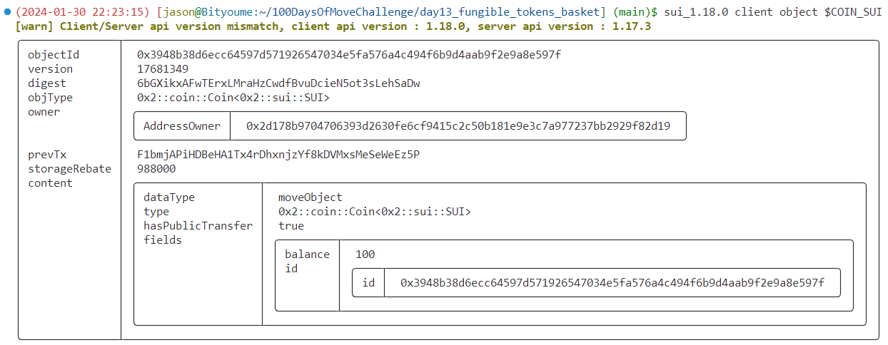

## 3 合约部署

> 切换到Jason账号

```bash
$ sui client publish --gas-budget 100000000
Transaction Digest: 6uUX5NeHfEv7VnFgdtZecJeBeMRkFjuwuY95ZLWkF9zH
```

- **命令输出关键信息截图**

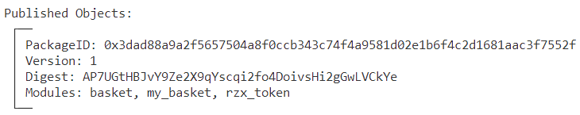

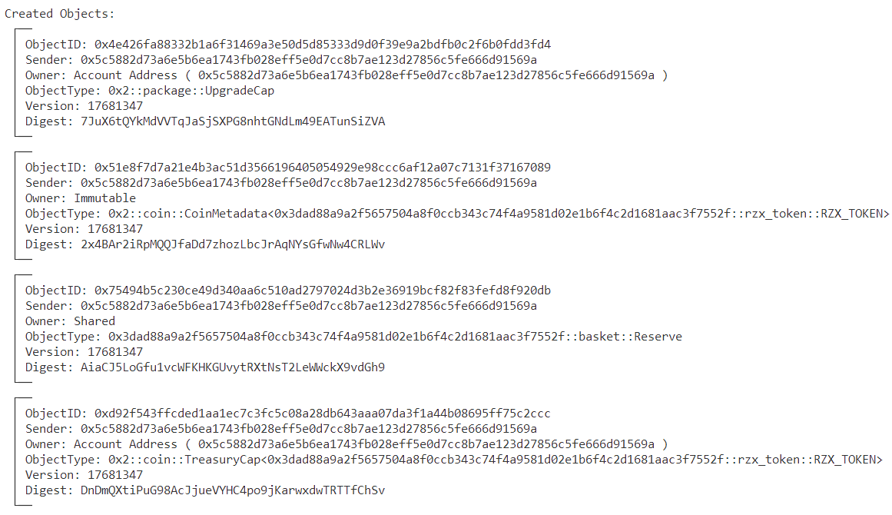

- **将PackageID记录到环境变量，方便后续调用使用**

```bash
export PACKAGE_ID=0x3dad88a9a2f5657504a8f0ccb343c74f4a9581d02e1b6f4c2d1681aac3f7552f

# PACKAGE_ID::basket::Reserve
export RESERVE=0x75494b5c230ce49d340aa6c510ad2797024d3b2e36919bcf82f83fefd8f920db

# 0x2::coin::CoinMetadata<PACKAGE_ID::rzx_token::RZX_TOKEN>
export COIN_META_DATA=0x51e8f7d7a21e4b3ac51d3566196405054929e98ccc6af12a07c7131f37167089

# 0x2::coin::TreasuryCap<PACKAGE_ID::rzx_token::RZX_TOKEN>
export TREASURY_CAP=0xd92f543ffcded1aa1ec7c3fc5c08a28db643aaa07da3f1a44b08695ff75c2ccc

export COIN_TYPE=$PACKAGE_ID::rzx_token::RZX_TOKEN
```

- **查看当前Reserve对象**

```bash
sui client object $RESERVE
```

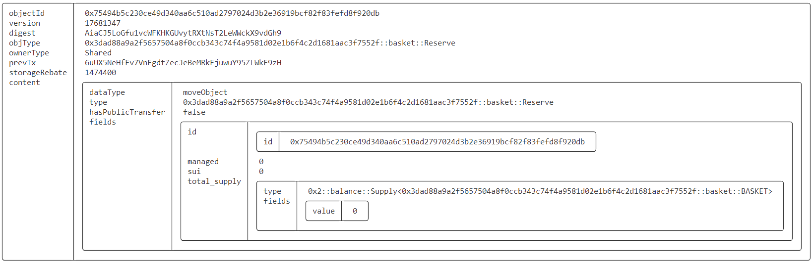

## 4 合约交互

### 4.1 为Alice铸造100 RZX

> 切换到Jason

```bash
sui client call --function mint --package $PACKAGE_ID --module rzx_token --args $TREASURY_CAP 100 $ALICE --gas-budget 10000000
```

- **命令输出关键信息截图**

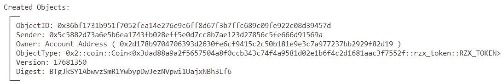

- **记录RZX COIN ID到环境变量**

```bash
export COIN_RZX=0x36bf1731b951f7052fea14e276c9c6ff8d67f3b7ffc689c09fe922c08d39457d
```

- **查看RZX COIN ID**

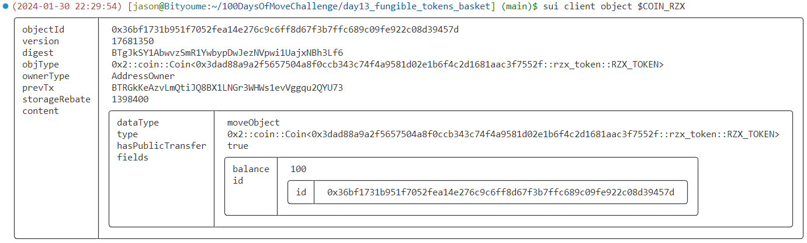

### 4.2 铸造篮子代币

> 切换到Alice，存入100 SUI + 100 RZX，铸造100枚篮子代币

```bash
sui client call --function mint --package $PACKAGE_ID --module my_basket --args $RESERVE $COIN_SUI $COIN_RZX --gas-budget 10000000
```

- **命令输出关键信息截图**

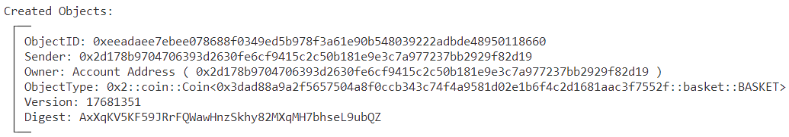

- **抛出事件**

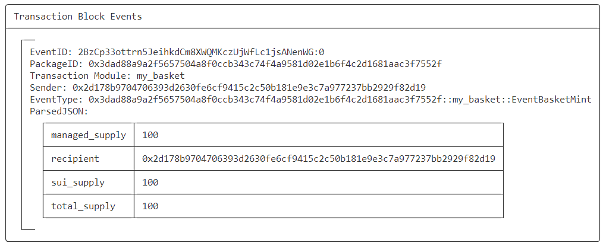

- **记录创建的篮子代币对象ID到环境变量**

```bash
# 0x2::coin::Coin<PACKAGE_ID::basket::BASKET>
export BASKET=0xeeadaee7ebee078688f0349ed5b978f3a61e90b548039222adbde48950118660
```

- **查看篮子代币对象**

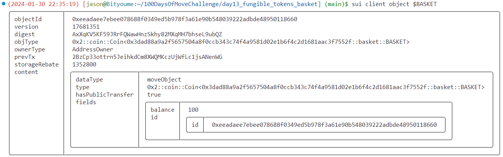

- **查看当前Reserve对象**

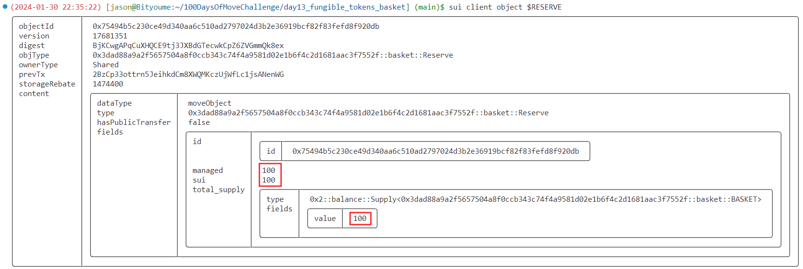

### 4.3 销毁篮子代币

> 切换到Alice，销毁篮子代币，将会收到存储的100 SUI + 100 RZX

```bash
sui client call --function burn --package $PACKAGE_ID --module my_basket --args $RESERVE $BASKET --gas-budget 10000000
```

- **命令输出关键信息截图**

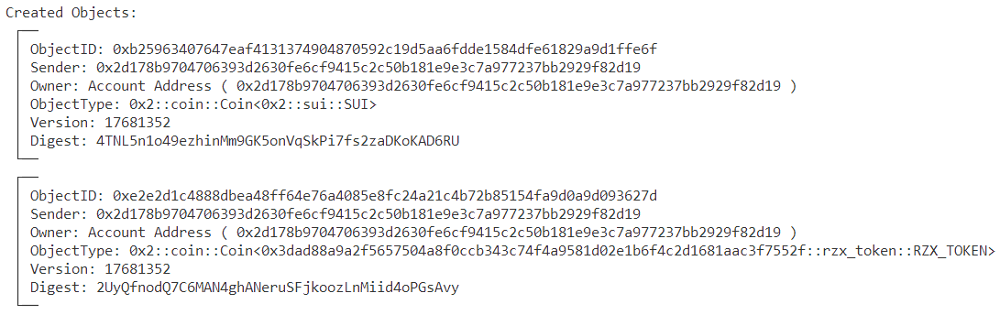

- **收到退回的资产**

```bash
$ sui client object 0xe2e2d1c4888dbea48ff64e76a4085e8fc24a21c4b72b85154fa9d0a9d093627d
```

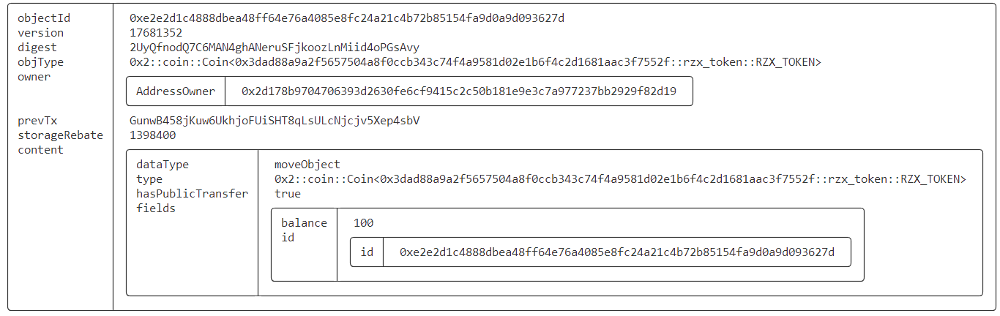

```bash
$ sui client object 0xb25963407647eaf4131374904870592c19d5aa6fdde1584dfe61829a9d1ffe6f
```

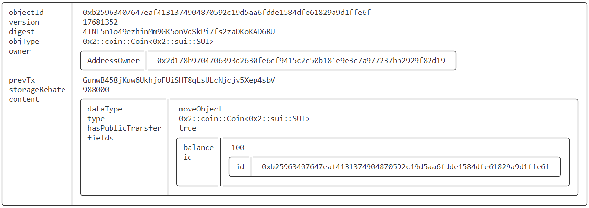

