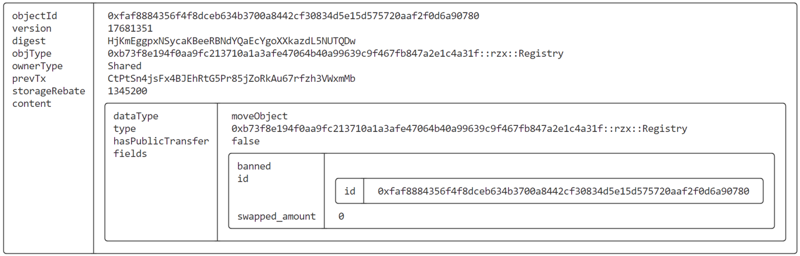
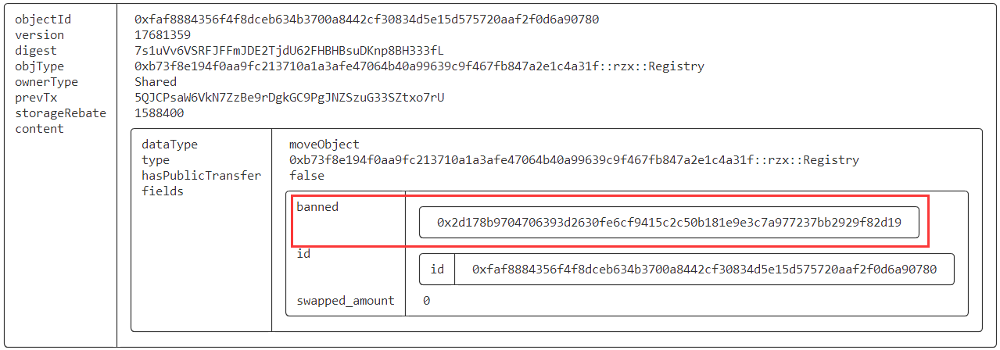

# SUI Move官方示例合约实践——FT类：监管币（regulated_coin）

*rzexin 2024.02.15*

## 1 合约说明

### 1.1 功能介绍

- 本合约是一个监管币合约。
- 管理员可以**创建（`init`）**监管币，进行监管币的**铸造（`mint`）**和**销毁（`burn`）**，**启用（`create`）**和**禁用（`ban`）**监管币的用户。
- 监管币的持有者可以进行监管币的**转移`transfer`**（前提是需要都是监管币的用户且未被禁用），**接收转移`accept_transfer`**（通过该方法才能将转移对象的余额累加到自己拥有的监管币上），**监管币与普通币之间的兑换（take/put_back）**。

### 1.2 官方合约示例代码

https://github.com/MystenLabs/sui/blob/main/sui_programmability/examples/fungible_tokens/sources/regulated_coin.move

> 合约较长，这里仅介绍一下对外的方法

#### （1）管理员铸造和销毁监管币

```rust
    /// Mint more Abc. Requires AbcTreasuryCap for authorization, so can only be done by admins.
    public entry fun mint(treasury: &mut AbcTreasuryCap, owned: &mut RCoin<Abc>, value: u64) {
        balance::join(borrow_mut(owned), balance::increase_supply(&mut treasury.supply, value));
    }

    /// Burn `value` amount of `RCoin<Abc>`. Requires AbcTreasuryCap for authorization, so can only be done by admins.
    ///
    /// TODO: Make AbcTreasuryCap a part of Balance module instead of Coin.
    public entry fun burn(treasury: &mut AbcTreasuryCap, owned: &mut RCoin<Abc>, value: u64) {
        balance::decrease_supply(
            &mut treasury.supply,
            balance::split(borrow_mut(owned), value)
        );
    }
```

#### （2）管理员创建和禁用监管币用户

```rust
    /// Create an empty `RCoin<Abc>` instance for account `for`. AbcTreasuryCap is passed for
    /// authentication purposes - only admin can create new accounts.
    public entry fun create(_: &AbcTreasuryCap, for: address, ctx: &mut TxContext) {
        transfer::public_transfer(zero(for, ctx), for)
    }

    /// Ban some address and forbid making any transactions from or to this address.
    /// Only owner of the AbcTreasuryCap can perform this action.
    public entry fun ban(_cap: &AbcTreasuryCap, registry: &mut Registry, to_ban: address) {
        vector::push_back(&mut registry.banned, to_ban)
    }
```

#### （3）监管币的持有者转移和接收转移监管币

```rust
    /// Transfer entrypoint - create a restricted `Transfer` instance and transfer it to the
    /// `to` account for being accepted later.
    /// Fails if sender is not an creator of the `RegulatedCoin` or if any of the parties is in
    /// the ban list in Registry.
    public entry fun transfer(r: &Registry, coin: &mut RCoin<Abc>, value: u64, to: address, ctx: &mut TxContext) {
        let sender = tx_context::sender(ctx);

        assert!(rcoin::creator(coin) == sender, ENotOwner);
        assert!(vector::contains(&r.banned, &to) == false, EAddressBanned);
        assert!(vector::contains(&r.banned, &sender) == false, EAddressBanned);

        transfer::transfer(Transfer {
            to,
            id: object::new(ctx),
            balance: balance::split(borrow_mut(coin), value),
        }, to)
    }

    /// Accept an incoming transfer by joining an incoming balance with an owned one.
    ///
    /// Fails if:
    /// 1. the `RegulatedCoin<Abc>.creator` does not match `Transfer.to`;
    /// 2. the address of the creator/recipient is banned;
    public entry fun accept_transfer(r: &Registry, coin: &mut RCoin<Abc>, transfer: Transfer) {
        let Transfer { id, balance, to } = transfer;

        assert!(rcoin::creator(coin) == to, ENotOwner);
        assert!(vector::contains(&r.banned, &to) == false, EAddressBanned);

        balance::join(borrow_mut(coin), balance);
        object::delete(id)
    }
```

#### （4）监管币和普通币之间的兑换

```rust
    /// Take `value` amount of `RegulatedCoin` and make it freely transferable by wrapping it into
    /// a `Coin`. Update `Registry` to keep track of the swapped amount.
    ///
    /// Fails if:
    /// 1. `RegulatedCoin<Abc>.creator` was banned;
    /// 2. `RegulatedCoin<Abc>` is not owned by the tx sender;
    public entry fun take(r: &mut Registry, coin: &mut RCoin<Abc>, value: u64, ctx: &mut TxContext) {
        let sender = tx_context::sender(ctx);

        assert!(rcoin::creator(coin) == sender, ENotOwner);
        assert!(vector::contains(&r.banned, &sender) == false, EAddressBanned);

        // Update swapped amount for Registry to keep track of non-regulated amounts.
        r.swapped_amount = r.swapped_amount + value;

        transfer::public_transfer(coin::take(borrow_mut(coin), value, ctx), sender);
    }

    /// Take `Coin` and put to the `RegulatedCoin`'s balance.
    ///
    /// Fails if:
    /// 1. `RegulatedCoin<Abc>.creator` was banned;
    /// 2. `RegulatedCoin<Abc>` is not owned by the tx sender;
    public entry fun put_back(r: &mut Registry, rc_coin: &mut RCoin<Abc>, coin: Coin<Abc>, ctx: &TxContext) {
        let balance = coin::into_balance(coin);
        let sender = tx_context::sender(ctx);

        assert!(rcoin::creator(rc_coin) == sender, ENotOwner);
        assert!(vector::contains(&r.banned, &sender) == false, EAddressBanned);

        // Update swapped amount as in `swap_regulated`.
        r.swapped_amount = r.swapped_amount - balance::value(&balance);

        balance::join(borrow_mut(rc_coin), balance);
    }
```

## 2 前置准备

### 2.1 帐号准备及角色分配

| 别名  | 地址                                                         | 角色         |
| ----- | ------------------------------------------------------------ | ------------ |
| Jason | `0x5c5882d73a6e5b6ea1743fb028eff5e0d7cc8b7ae123d27856c5fe666d91569a` | 监管币管理员 |
| Alice | `0x2d178b9704706393d2630fe6cf9415c2c50b181e9e3c7a977237bb2929f82d19` | 监管币持有者 |
| Bob   | `0xf2e6ffef7d0543e258d4c47a53d6fa9872de4630cc186950accbd83415b009f0` | 监管币持有者 |

- **将地址添加到环境变量**

```bash
export JASON=0x5c5882d73a6e5b6ea1743fb028eff5e0d7cc8b7ae123d27856c5fe666d91569a
export ALICE=0x2d178b9704706393d2630fe6cf9415c2c50b181e9e3c7a977237bb2929f82d19
export BOB=0xf2e6ffef7d0543e258d4c47a53d6fa9872de4630cc186950accbd83415b009f0
```

## 3 合约部署

> 切换到Jason账号

```bash
$ sui client publish --gas-budget 100000000
Transaction Digest: CtPtSn4jsFx4BJEhRtG5Pr85jZoRkAu67rfzh3VWxmMb
```

- **命令输出关键信息截图**


- **将PackageID记录到环境变量，方便后续调用使用**

```bash
export PACKAGE_ID=0xb73f8e194f0aa9fc213710a1a3afe47064b40a99639c9f467fb847a2e1c4a31f

# PACKAGE_ID::regulated_coin::RegulatedCoin<PACKAGE_ID::rzx::Rzx> 
export REGULATED_COIN=0xae9dc85912fdd8ea9bf3ede7194a29fcaca6ff4b931f11981be6941ed0d0160b

# PACKAGE_ID::rzx::Registry 
export REGISTRY=0xfaf8884356f4f8dceb634b3700a8442cf30834d5e15d575720aaf2f0d6a90780

# PACKAGE_ID::rzx::RzxTreasuryCap
export TREASURY_CAP=0x3198e85f9a82dad66f56a4e53b81d3d0bc6b9c9c9cf37bfa3983bcd4612542fd
```

- **查看当前Registry对象**

```bash
sui client object $REGISTRY
```



- **查看当前RegulatedCoin对象**

```bash
sui client object $REGULATED_COIN
```


## 4 合约交互

### 4.1 管理员创建监管币用户

> 切换到Jason，将Alice和Bob设置为监管币的使用者

```bash
sui client call --function create --package $PACKAGE_ID --module rzx --args $TREASURY_CAP $ALICE --gas-budget 10000000
sui client call --function create --package $PACKAGE_ID --module rzx --args $TREASURY_CAP $BOB --gas-budget 10000000
```

- **记录Regulated COIN ID到环境变量**

```bash
#PACKAGE_ID::regulated_coin::RegulatedCoin<PACKAGE_ID::rzx::Rzx>
export RCOIN_ALICE=0x80c9416f2d59598aa3aa9d7e49412d0686bd30d0395b6796c6a8ed08f08d5877
export RCOIN_BOB=0x36bf1731b951f7052fea14e276c9c6ff8d67f3b7ffc689c09fe922c08d39457d
```

### 4.2 管理员铸造监管币

> 管理员为自己铸造500枚监管币

```bash
sui client call --function mint --package $PACKAGE_ID --module rzx --args $TREASURY_CAP $REGULATED_COIN 500 --gas-budget 10000000
```

- **查看到自己监管币数量变化**

```bash
sui client object $REGULATED_COIN
```


### 4.3 监管币转移

> 管理员转移300枚监管币给Alice

```bash
sui client call --function transfer --package $PACKAGE_ID --module rzx --args $REGISTRY $REGULATED_COIN 300 $ALICE --gas-budget 10000000
```

- **创建了Transfer对象**

```bash
export TRANSFER=0x2ff4fe662a6079a87b228b88db3a2b926ee56c4c3ce05549479967ff55bccb94
```


- **查看Transfer对象**

> 可见有300枚监管币，接收地址是Alice的

```bash
sui client object $TRANSFER
```


### 4.4 接收监管币

> Alice可以进行监管币的接收，切换到Alice

- **接收前**

```bash
sui client object $RCOIN_ALICE
```


- **执行接收命令**

```bash
sui client call --function accept_transfer --package $PACKAGE_ID --module rzx --args $REGISTRY $RCOIN_ALICE $TRANSFER --gas-budget 10000000
```

- **接收后**

> 接收监管币厚，可见Alice拥有300枚监管币的数量


### 4.5 提取监管币

> Alice可以提取指定数量的监管币

- **提取200枚监管币**

```bash
sui client call --function take --package $PACKAGE_ID --module rzx --args $REGISTRY $RCOIN_ALICE 200 --gas-budget 10000000
```


```bash
export COIN_ALICE=0xa6d0d96ce3a94d2f45f8c99567dc74e1e743fcdaa44cd8999762bb09cbfc4898
```

- **查看提取得到的普通币200枚**

```bash
sui client object $COIN_ALICE
```


- **查看当前Alice的监管币余额**

> 已经提取了200枚，还剩100枚

```bash
sui client object $RCOIN_ALICE
```


### 4.6 存回监管币

> Alice可以将已经提取的监管币进行存回

- **Alice存回监管币，当前合约接口只能全部存回，不能部分存回（==可优化==）**

```bash
sui client call --function put_back --package $PACKAGE_ID --module rzx --args $REGISTRY $RCOIN_ALICE $COIN_ALICE --gas-budget 10000000
```

- **存回后无法再查看到普通币，因为已经被销毁**

```bash
$ sui client object $COIN_ALICE
Internal error, cannot read the object: Object has been deleted object_id: 0xa6d0d96ce3a94d2f45f8c99567dc74e1e743fcdaa44cd8999762bb09cbfc4898 at version: SequenceNumber(17681358) in digest o#7gyGAp71YXQRoxmFBaHxofQXAipvgHyBKPyxmdSJxyvz
```

- **查看当前Alice的监管币余额，已经恢复为最初的300枚**

```bash
sui client object $RCOIN_ALICE
```


### 4.7 禁用监管币用户

> 管理员可以禁用监管币用户，禁用后监管币用户将无法进行任何操作，包括：监管币转移、接收、提取、存回。切换到Jason用户执行下面命令，禁用Alice地址。（==禁用后无法恢复，可优化==）

```bash
sui client call --function ban --package $PACKAGE_ID --module rzx --args $TREASURY_CAP $REGISTRY $ALICE --gas-budget 10000000
```

- **查看Registry对象，可以看到禁用的地址**

```bash
sui client object $REGISTRY
```



- **Alice用户再次提取监管币等操作，都将会报错**

> 切换到Alice

```bash
sui client call --function take --package $PACKAGE_ID --module rzx --args $REGISTRY $RCOIN_ALICE 200 --gas-budget 10000000
Error executing transaction: Failure {
    error: "MoveAbort(MoveLocation { module: ModuleId { address: b73f8e194f0aa9fc213710a1a3afe47064b40a99639c9f467fb847a2e1c4a31f, name: Identifier(\"rzx\") }, function: 9, instruction: 34, function_name: Some(\"take\") }, 2) in command 0",
}
```

### 4.8 销毁监管币

> 管理员可以进行监管币的销毁

- **查看当前监管币**

```bash
sui client object $REGULATED_COIN
```


- **销毁150枚**

```bash
sui client call --function burn --package $PACKAGE_ID --module rzx --args $TREASURY_CAP $REGULATED_COIN 150 --gas-budget 10000000
Transaction Digest: 4bZTfL1EecESwo782ep9DX7jqm6mNpcmNp8L5h47tE9a
```

- **查看销毁后监管币余额，只剩50枚，符合预期**


