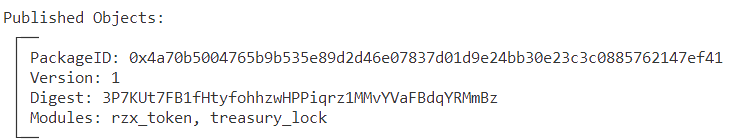
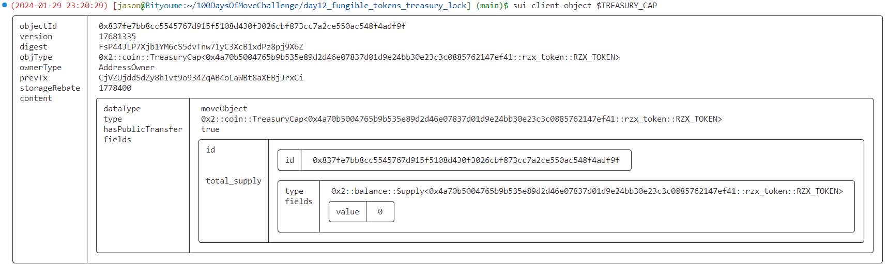
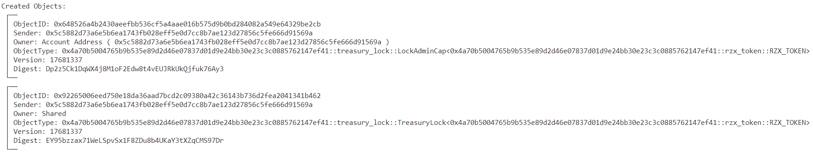
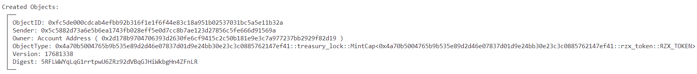
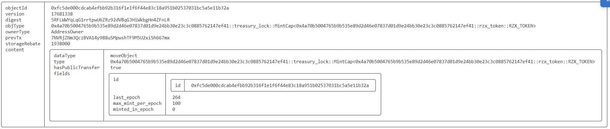
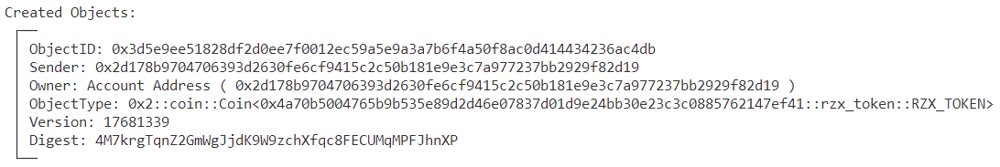
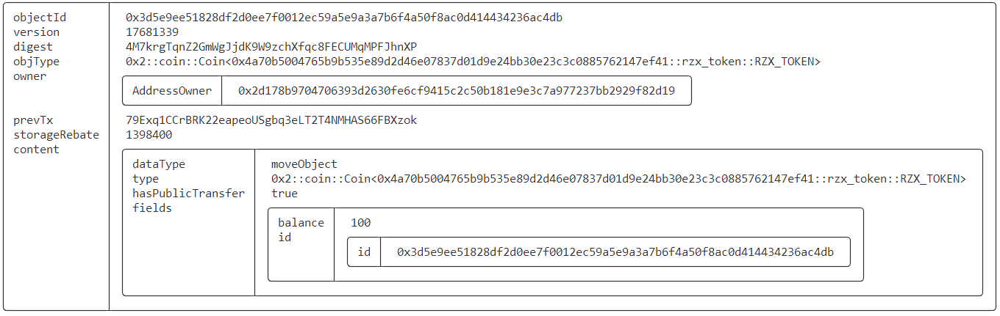
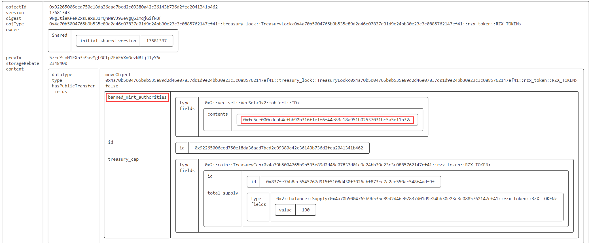
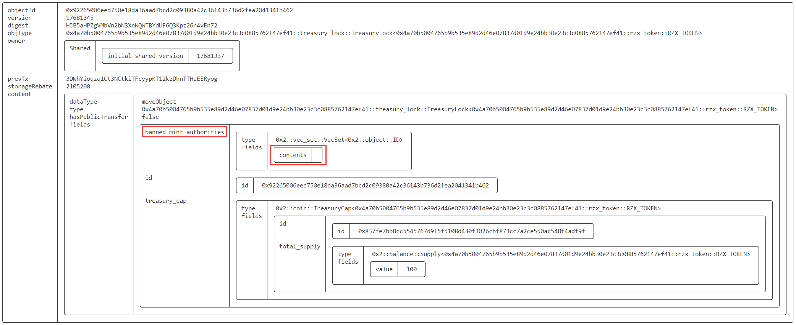

# SUI Move官方示例合约实践——FT类：资产金库锁（treasury_lock）

*rzexin 2024.01.29*

## 1 合约说明

### 1.1 功能介绍

- 本合约是一个资产金库锁合约，它封装并锁定了资产的`TreasuryCap`，让白名单用户（拥有`MintCap`）在每个世代都能铸造不超过指定最大数量的代币。
- 提供了三个对外接口：
    - `new_lock_`：创建资产金库锁，即：封装`TreasuryCap`并创建资产金库锁`TreasuryLock`，并将`LockAdminCap`转发给创建创建者，同时也是`TreasuryCap`的所有者
    - `create_and_transfer_mint_cap`：创建白名单用户，并指定该用户每个世代可以铸造的最大代币数量，即：`LockAdminCap`所有者为白名单用户分配`MintCap`
    - `ban_mint_cap_id_`：禁用`MintCap`，禁用后该`MintCap`的持有者将无法再次从资产金库铸造代币
    - `unban_mint_cap_id_`：解除`MintCap`禁用，解除后该`MintCap`的持有者将能继续从资产金库铸造代币
    - `mint_and_transfer`：`MintCap`持有者从资产金库中为指定用户铸造代币

### 1.2 官方合约示例代码

https://github.com/MystenLabs/sui/blob/main/sui_programmability/examples/fungible_tokens/sources/treasury_lock.move

```rust
// Copyright (c) Mysten Labs, Inc.
// SPDX-License-Identifier: Apache-2.0

/// WARNING: Like all files in the examples section, this code is unaudited
/// and should NOT be running in production. Using the code unaudited could potentially
/// result in lost of funds from hacks, and leakage of transaction amounts.

/// An example implementation of a 'treasury lock'. It encapsulates the TreasuryCap
/// of a Coin so that additional whitelisted parties (bearers of the `MintCap`)
/// can mint new Coins up to a pre-defined per epoch limit. This can be used e.g.
/// to create a faucet.
module fungible_tokens::treasury_lock {
    use sui::object::{Self, UID, ID};
    use sui::coin::{Self, TreasuryCap};
    use sui::balance::{Balance};
    use sui::tx_context::{Self, TxContext};
    use sui::transfer;
    use sui::vec_set::{Self, VecSet};

    /// This mint capability instance is banned.
    const EMintCapBanned: u64 = 0;
    /// Requested mint amount exceeds the per epoch mint limit.
    const EMintAmountTooLarge: u64 = 1;

    /// Encapsulates the `TreasuryCap` and stores the list of banned mint authorities.
    struct TreasuryLock<phantom T> has key {
        id: UID,
        treasury_cap: TreasuryCap<T>,
        banned_mint_authorities: VecSet<ID>
    }

    /// Admin capability for `TreasuryLock`. Bearer has the power to create, ban,
    /// and unban mint capabilities (`MintCap`)
    struct LockAdminCap<phantom T> has key, store {
        id: UID
    }

    /// Capability allowing the bearer to mint new Coins up to a pre-defined per epoch limit.
    struct MintCap<phantom T> has key, store {
        id: UID,
        max_mint_per_epoch: u64,
        last_epoch: u64,
        minted_in_epoch: u64
    }

    /// Create a new `TreasuryLock` for `TreasuryCap`.
    public fun new_lock<T>(
        cap: TreasuryCap<T>, ctx: &mut TxContext
    ): LockAdminCap<T> {
        let lock = TreasuryLock {
            id: object::new(ctx),
            treasury_cap: cap,
            banned_mint_authorities: vec_set::empty<ID>()
        };
        transfer::share_object(lock);

        LockAdminCap<T> {
            id: object::new(ctx),
        }
    }

    /// Entry function. Creates a new `TreasuryLock` for `TreasuryCap`. Invokes `new_lock`.
    public entry fun new_lock_<T>(cap: TreasuryCap<T>, ctx: &mut TxContext) {
        transfer::public_transfer(
            new_lock(cap, ctx),
            tx_context::sender(ctx)
        )
    }

    /// Create a new mint capability whose bearer will be allowed to mint
    /// `max_mint_per_epoch` coins per epoch.
    public fun create_mint_cap<T>(
        _cap: &LockAdminCap<T>, max_mint_per_epoch: u64, ctx: &mut TxContext
    ): MintCap<T> {
        MintCap<T>{
            id: object::new(ctx),
            max_mint_per_epoch,
            last_epoch: tx_context::epoch(ctx),
            minted_in_epoch: 0
        }
    }

    /// Entry function. Creates a new mint capability whose bearer will be allowed
    /// to mint `max_mint_per_epoch` coins per epoch. Sends it to `recipient`.
    public fun create_and_transfer_mint_cap<T>(
        cap: &LockAdminCap<T>, max_mint_per_epoch: u64, recipient: address, ctx: &mut TxContext
    ) {
        transfer::public_transfer(
            create_mint_cap(cap, max_mint_per_epoch, ctx),
            recipient
        )
    }

    /// Ban a `MintCap`.
    public fun ban_mint_cap_id<T>(
        _cap: &LockAdminCap<T>, lock: &mut TreasuryLock<T>, id: ID
    ) {
        vec_set::insert(&mut lock.banned_mint_authorities, id)
    }

    /// Entry function. Bans a `MintCap`.
    public entry fun ban_mint_cap_id_<T>(
        cap: &LockAdminCap<T>, lock: &mut TreasuryLock<T>, id: ID
    ) {
        ban_mint_cap_id(cap, lock, id);
    }

    /// Unban a previously banned `MintCap`.
    public fun unban_mint_cap_id<T>(
        _cap: &LockAdminCap<T>, lock: &mut TreasuryLock<T>, id: ID
    ) {
        vec_set::remove(&mut lock.banned_mint_authorities, &id)
    }

    /// Entry function. Unbans a previously banned `MintCap`.
    public entry fun unban_mint_cap_id_<T>(
        cap: &LockAdminCap<T>, lock: &mut TreasuryLock<T>, id: ID
    ) {
        unban_mint_cap_id(cap, lock, id);
    }

    /// Borrow the `TreasuryCap` to use directly.
    public fun treasury_cap_mut<T>(
        _cap: &LockAdminCap<T>, lock: &mut TreasuryLock<T>
    ): &mut TreasuryCap<T> {
        &mut lock.treasury_cap
    }

    /// Mint a `Balance` from a `TreasuryLock` providing a `MintCap`.
    public fun mint_balance<T>(
        lock: &mut TreasuryLock<T>, cap: &mut MintCap<T>, amount: u64, ctx: &mut TxContext
    ): Balance<T> {
        assert!(
            !vec_set::contains(&lock.banned_mint_authorities, object::uid_as_inner(&cap.id)),
            EMintCapBanned
        );

        let epoch = tx_context::epoch(ctx);
        if (cap.last_epoch != epoch) {
            cap.last_epoch = epoch;
            cap.minted_in_epoch = 0;
        };
        assert!(
            cap.minted_in_epoch + amount <= cap.max_mint_per_epoch,
            EMintAmountTooLarge
        );

        cap.minted_in_epoch = cap.minted_in_epoch + amount;
        coin::mint_balance(&mut lock.treasury_cap, amount)
    }

    /// Entry function. Mint a `Coin` from a `TreasuryLock` providing a `MintCap`
    /// and transfer it to recipient.
    public entry fun mint_and_transfer<T>(
        lock: &mut TreasuryLock<T>,
        cap: &mut MintCap<T>,
        amount: u64,
        recipient: address,
        ctx: &mut TxContext
    ) {
        let balance = mint_balance(lock, cap, amount, ctx);
        transfer::public_transfer(
            coin::from_balance(balance, ctx),
            recipient
        )
    }
}
```

### 1.3 代币资产示例代码

> 创建同质化代币RZX

```rust
module day12::rzx_token {
    use std::option;
    use sui::coin::Self;
    use sui::transfer;
    use sui::tx_context::{Self, TxContext};

    struct RZX_TOKEN has drop {}

    #[allow(unused_function)]
    fun init(witness: RZX_TOKEN, ctx: &mut TxContext) {
        let (treasury_cap, metadata) = 
            coin::create_currency<RZX_TOKEN>(witness, 2, b"RZX-sym", b"RZX-name", 
            b"RZX-desp", option::none(), ctx);

        transfer::public_freeze_object(metadata);
        transfer::public_transfer(treasury_cap, tx_context::sender(ctx))
    }
}
```

## 2 前置准备

### 2.1 帐号准备及角色分配

| 别名  | 地址                                                         | 角色                     |
| ----- | ------------------------------------------------------------ | ------------------------ |
| Jason | `0x5c5882d73a6e5b6ea1743fb028eff5e0d7cc8b7ae123d27856c5fe666d91569a` | 金库资产锁创建者、管理员 |
| Alice | `0x2d178b9704706393d2630fe6cf9415c2c50b181e9e3c7a977237bb2929f82d19` | 白名单用户、资产接收者   |
| Bob   | `0xf2e6ffef7d0543e258d4c47a53d6fa9872de4630cc186950accbd83415b009f0` | 资产接收者               |

- **将地址添加到环境变量**

```bash
export JASON=0x5c5882d73a6e5b6ea1743fb028eff5e0d7cc8b7ae123d27856c5fe666d91569a
export ALICE=0x2d178b9704706393d2630fe6cf9415c2c50b181e9e3c7a977237bb2929f82d19
export BOB=0xf2e6ffef7d0543e258d4c47a53d6fa9872de4630cc186950accbd83415b009f0
```

## 3 合约部署

> 切换到Jason账号

```bash
$ sui client publish --gas-budget 100000000
Transaction Digest: CjVZUjddSdZy8h1vt9o934ZqAB4oLaWBt8aXEBjJrxCi
```

- **命令输出关键信息截图**



- **将PackageID记录到环境变量，方便后续调用使用**

```bash
export PACKAGE_ID=0x4a70b5004765b9b535e89d2d46e07837d01d9e24bb30e23c3c0885762147ef41

# 0x2::coin::CoinMetadata<PACKAGE_ID::rzx_token::RZX_TOKEN>
export COIN_META_DATA=0x62646b16fbe5f6f456d3f1d6e83c9bc566d7038ccbdeafcc2b4d36075f0ab18b

# 0x2::coin::TreasuryCap<PACKAGE_ID::rzx_token::RZX_TOKEN>
export TREASURY_CAP=0x837fe7bb8cc5545767d915f5108d430f3026cbf873cc7a2ce550ac548f4adf9f

export COIN_TYPE=$PACKAGE_ID::rzx_token::RZX_TOKEN
```

- **查看当前Treasury代币初始数量为0**



## 4 合约交互

### 4.1 创建资产金库锁

> 切换到Jason

```bash
sui client call --function new_lock_ --package $PACKAGE_ID --module treasury_lock --type-args $COIN_TYPE --args $TREASURY_CAP --gas-budget 10000000
```

- **命令输出关键信息截图**



- **记录创建的对象ID到环境变量**

```bash
# PACKAGE_ID::treasury_lock::LockAdminCap<PACKAGE_ID::rzx_token::RZX_TOKEN>
export LOCK_ADMIN_CAP=0x648526a4b2430aeefbb536cf5a4aae016b575d9b0bd284082a549e64329be2cb

# PACKAGE_ID::treasury_lock::TreasuryLock<PACKAGE_ID::rzx_token::RZX_TOKEN>
export TREASURY_LOCK=0x92265006eed750e18da36aad7bcd2c09380a42c36143b736d2fea2041341b462
```

### 4.2 为Alice颁发MintCap，每个世代只允许铸造100枚代币

```bash
export MAX_MINT_PER_EPOCH=100
sui client call --function create_and_transfer_mint_cap --package $PACKAGE_ID --module treasury_lock --type-args $COIN_TYPE --args $LOCK_ADMIN_CAP $MAX_MINT_PER_EPOCH $ALICE --gas-budget 10000000
```

- **命令输出关键信息截图**



- **记录创建的对象ID到环境变量**

```bash
# PACKAGE_ID::treasury_lock::MintCap<PACKAGE_ID::rzx_token::RZX_TOKEN>
export MINT_CAP=0xfc5de000cdcab4efbb92b316f1e1f6f44e83c18a951b02537031bc5a5e11b32a
```

- **查看MintCap对象**



### 4.3 Alice为自己从金库中铸造代币

> 切换到Alice

```bash
export AMOUNT=100
sui client call --function mint_and_transfer --package $PACKAGE_ID --module treasury_lock --type-args $COIN_TYPE --args $TREASURY_LOCK $MINT_CAP $AMOUNT $ALICE --gas-budget 10000000
```

- **命令输出关键信息截图**



- **记录创建的托管共享对象到环境变量**

```bash
# 0x2::coin::Coin<PACKAGE_ID::rzx_token::RZX_TOKEN>
export COIN_ALICE=0x3d5e9ee51828df2d0ee7f0012ec59a5e9a3a7b6f4a50f8ac0d414434236ac4db
```

- **Alice已经为自己铸造100枚代币**



- **超额铸造将会报错**

```bash
Error executing transaction: Failure {
    error: "MoveAbort(MoveLocation { module: ModuleId { address: 4a70b5004765b9b535e89d2d46e07837d01d9e24bb30e23c3c0885762147ef41, name: Identifier(\"treasury_lock\") }, function: 9, instruction: 51, function_name: Some(\"mint_balance\") }, 1) in command 0",
}
```

### 4.4 禁用MintCap

> 切换到Jason，禁用颁发给Alice的MintCap，禁用后，Alice将无法铸造代币

```bash
sui client call --function ban_mint_cap_id_ --package $PACKAGE_ID --module treasury_lock --type-args $COIN_TYPE --args $LOCK_ADMIN_CAP $TREASURY_LOCK $MINT_CAP --gas-budget 10000000
```

- **禁用后，在TreasuryLock对象的禁用列表中可以查看到该禁用的MintCap**



- **当Alice再次去Mint时，将会报错**

```bash
Error executing transaction: Failure {
    error: "MoveAbort(MoveLocation { module: ModuleId { address: 4a70b5004765b9b535e89d2d46e07837d01d9e24bb30e23c3c0885762147ef41, name: Identifier(\"treasury_lock\") }, function: 9, instruction: 16, function_name: Some(\"mint_balance\") }, 0) in command 0",
}
```

### 4.5 解除禁用MintCap

> 切换到Jason，解除禁用，恢复颁发给Alice的MintCap，解除后Alice将可以继续从资产金库锁中铸造代币

```bash
sui client call --function unban_mint_cap_id_ --package $PACKAGE_ID --module treasury_lock --type-args $COIN_TYPE --args $LOCK_ADMIN_CAP $TREASURY_LOCK $MINT_CAP --gas-budget 10000000
```

- **命令成功执行后，再次查看TreasuryLock，可见ID从MintCap禁用列表中移除**



