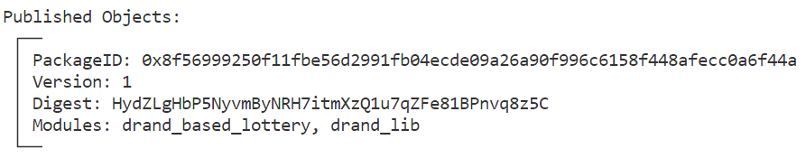
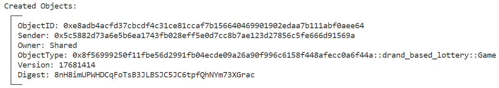
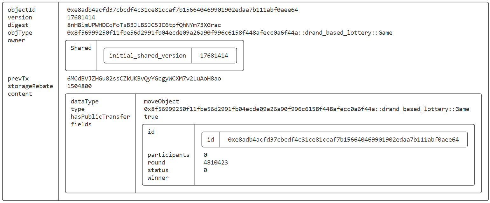
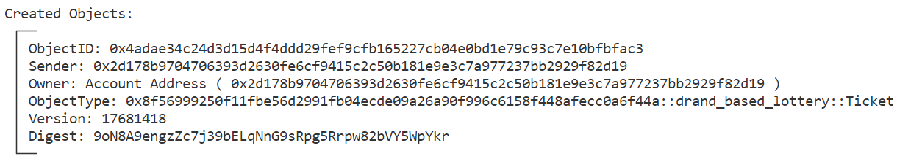
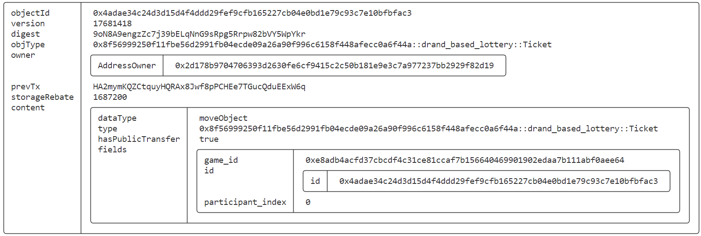
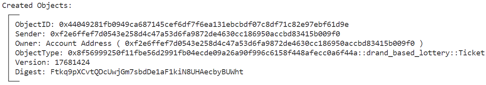
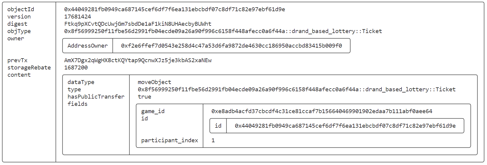
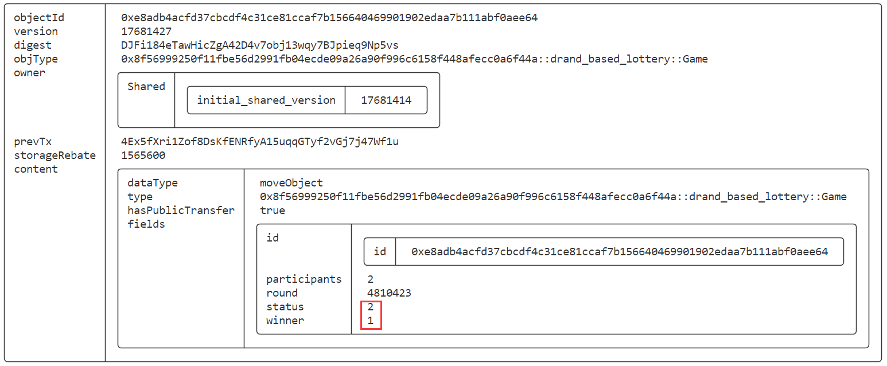
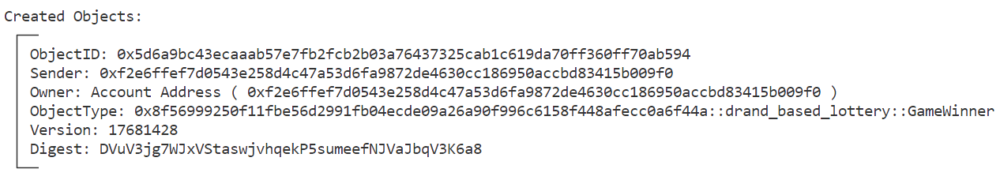
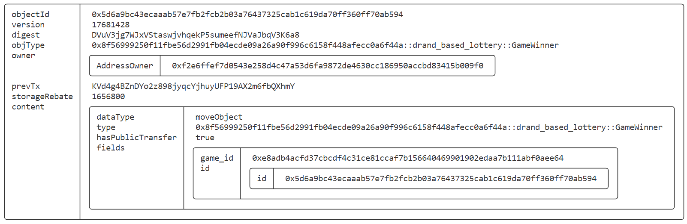

# SUI Move官方游戏类——基于drand的抽奖游戏合约实践（drand_based_lottery）

*rzexin 2024.02.07*

## 1 合约说明

### 1.1 功能介绍

- 本合约是基于`drand`随机数的抽奖游戏合约。[drand](https://drand.love/)是分布式随机数信标，提供可验证、不可预测和无偏的随机数即服务。（**Distributed randomness beacon. Verifiable, unpredictable and unbiased random numbers as a service.**）

    > `drand`所在的`quicknet chain`每3秒产生一个可验证的随机32字节，任何人都可以检查给定的32字节是否确实是drand的第i个输出。故可以使用`drand`作为随机性来源实现需要不可偏倚且不可预测的随机性的链上游戏。即：每次游戏需要随机性时，它从`drand`接收下一个32字节（作为交易的一部分或从现有对象中读取），并相应地进行操作。然而，在某些情况下，这种简单的流程可能不安全，因为区块链不知道`drand`的最新轮次，因此可能依赖已经公开的随机性。）

- 任何人可以 **创建（`create`）** 抽奖游戏，并指定开奖轮次`N`。

- 任何人也能通过提供`N-20`轮次（即：N轮次前1分钟）的`drand`随机数来 **终止（`close`）** 游戏，使其不再接受新参与者，即：开奖前的一分钟可以终止新用户参与。

    > 只要有人及时关闭游戏（或者至少在N轮次之前），我们就有保证获胜者是由不可预测且不可偏倚的随机性选出的。否则，有人可能会等到N轮次的随机性公开，看看是否可以赢得游戏，如果可以，加入游戏并推动其完成。因此，诚实的用户被鼓励及时关闭游戏。

- 只要抽奖游戏正常运行，任何人都可以**参与（`participate`）**，并获得奖票`Ticket`对象

- 任何人都可以通过提供第N轮次的drand随机数签名来**完成（`complete`）**游戏，并宣布胜利者

- 获胜者通过持有的`Ticket`进行**兑奖（`redeem`）**

### 1.2 官方合约示例代码

https://github.com/MystenLabs/sui/blob/main/sui_programmability/examples/games/sources/drand_based_lottery.move

#### （1）创建抽奖游戏（`create`）

- 该接口会创建抽奖游戏共享对象，有一个参数`round`，表示开奖的轮次数

```rust
    /// Create a shared-object Game.
    public entry fun create(round: u64, ctx: &mut TxContext) {
        let game = Game {
            id: object::new(ctx),
            round,
            status: IN_PROGRESS,
            participants: 0,
            winner: option::none(),
        };
        transfer::public_share_object(game);
    }

```

#### （2）终止游戏（`close`）

- 任何人都可以通过提供`N-20`轮次（即：N轮次前1分钟）的`drand`随机数来终止游戏，使其不再接受新参与者

    **注：示例合约代码是`N-2`，这里是之前老的网络（`30s`一轮），但当前使用的已是快速网络（`3s`一轮），为了保持之前逻辑，相应把这里改成`N-20`，意为在开奖前的1分钟，便可以终止游戏，来阻止新参与者的加入。**

- 签名的内容是：将`round`转成大端序后，进行`sha256`哈希，在验签函数（`verify_drand_signature`）中通过公钥`drand_pk`验证该哈希签名，若验签失败会抛出异常

```rust
    /// Anyone can close the game by providing the randomness of round-2.
    public entry fun close(game: &mut Game, drand_sig: vector<u8>) {
        assert!(game.status == IN_PROGRESS, EGameNotInProgress);
        verify_drand_signature(drand_sig, closing_round(game.round));
        game.status = CLOSED;
    }

    fun closing_round(round: u64): u64 {
        round - 20
    }

    /// Check a drand output.
    public fun verify_drand_signature(sig: vector<u8>, round: u64) {
        // Convert round to a byte array in big-endian order.
        let round_bytes: vector<u8> = vector[0, 0, 0, 0, 0, 0, 0, 0];
        let i = 7;
        while (i > 0) {
            let curr_byte = round % 0x100;
            let curr_element = vector::borrow_mut(&mut round_bytes, i);
            *curr_element = (curr_byte as u8);
            round = round >> 8;
            i = i - 1;
        };

        // Compute sha256(prev_sig, round_bytes).
        let digest = sha2_256(round_bytes);
        // Verify the signature on the hash.
        let drand_pk = DRAND_PK;
        assert!(bls12381::bls12381_min_sig_verify(&sig, &drand_pk, &digest), EInvalidProof);
    }
```

#### （3）参与抽奖（`participate`）

- 任何人均可参与抽个奖，并会得到一个`Ticket`对象，记录了**参与编号（`participant_index`）**

```rust
    /// Anyone can participate in the game and receive a ticket.
    public entry fun participate(game: &mut Game, ctx: &mut TxContext) {
        assert!(game.status == IN_PROGRESS, EGameNotInProgress);
        let ticket = Ticket {
            id: object::new(ctx),
            game_id: object::id(game),
            participant_index: game.participants,
        };
        game.participants = game.participants + 1;
        transfer::public_transfer(ticket, tx_context::sender(ctx));
    }
```

#### （4）开奖（complete）

- 任何人都可以进行开奖，只需要提供开奖轮次的随机数的签名
- 若验签通过，便会在所有参与者中抽取中奖者

```rust
    /// Anyone can complete the game by providing the randomness of round.
    public entry fun complete(game: &mut Game, drand_sig: vector<u8>) {
        assert!(game.status != COMPLETED, EGameAlreadyCompleted);
        verify_drand_signature(drand_sig, game.round);
        game.status = COMPLETED;
        // The randomness is derived from drand_sig by passing it through sha2_256 to make it uniform.
        let digest = derive_randomness(drand_sig);
        game.winner = option::some(safe_selection(game.participants, &digest));
    }
```

#### （5）兑奖（`redeem`）

- 中奖者可以使用自己的`Ticket`进行兑奖，获得`GameWinner`荣誉称号

```rust
    /// The winner can redeem its ticket.
    public entry fun redeem(ticket: &Ticket, game: &Game, ctx: &mut TxContext) {
        assert!(object::id(game) == ticket.game_id, EInvalidTicket);
        assert!(option::contains(&game.winner, &ticket.participant_index), EInvalidTicket);

        let winner = GameWinner {
            id: object::new(ctx),
            game_id: ticket.game_id,
        };
        transfer::public_transfer(winner, tx_context::sender(ctx));
    }
```

## 2 前置准备

### 2.1 帐号准备及角色分配

| 别名  | 地址                                                         | 角色       |
| ----- | ------------------------------------------------------------ | ---------- |
| Jason | `0x5c5882d73a6e5b6ea1743fb028eff5e0d7cc8b7ae123d27856c5fe666d91569a` | 游戏创建者 |
| Alice | `0x2d178b9704706393d2630fe6cf9415c2c50b181e9e3c7a977237bb2929f82d19` | 游戏参与者 |
| Bob   | `0xf2e6ffef7d0543e258d4c47a53d6fa9872de4630cc186950accbd83415b009f0` | 游戏参与者 |

- **将地址添加到环境变量**

```bash
export JASON=0x5c5882d73a6e5b6ea1743fb028eff5e0d7cc8b7ae123d27856c5fe666d91569a
export ALICE=0x2d178b9704706393d2630fe6cf9415c2c50b181e9e3c7a977237bb2929f82d19
export BOB=0xf2e6ffef7d0543e258d4c47a53d6fa9872de4630cc186950accbd83415b009f0
```

### 2.2 获取开奖轮次

#### （1）查看当前轮次

```json
curl -s https://drand.cloudflare.com/52db9ba70e0cc0f6eaf7803dd07447a1f5477735fd3f661792ba94600c84e971/public/latest | jq
{
  "round": 4810223,
  "randomness": "3a7bb41dc289dcce3b5f4c9ef1067b4861777f30a95a663e97cee46ec6cabc07",
  "signature": "a276c597d6525953db73c02713eac9409e847f5c696898d6f5827a41926ddface6133b0da770947a5f1151131a197142"
}
```

#### （2）获取开奖轮次

> 希望10分钟后开奖，计算开奖轮次

```bash
4810223 + 10 * 60 / 3 = 4810423
export ROUND=4810423
```

## 3 合约部署

> 切换到Jason账号

```bash
sui client publish --gas-budget 100000000
```

- **命令输出关键信息截图**



- **将关键的对象ID记录到环境变量，方便后续调用使用**

```bash
export PACKAGE_ID=0x8f56999250f11fbe56d2991fb04ecde09a26a90f996c6158f448afecc0a6f44a
```

## 4 合约交互

### 4.1 创建抽奖游戏（`create`）

> 切换到Jason

```bash
sui client call --function create --package $PACKAGE_ID --module drand_based_lottery --args $ROUND --gas-budget 10000000
```

- **获得游戏对象**



- **记录游戏对象ID**

```bash
# PACKAGE_ID::drand_based_lottery::Game
export GAME=0xe8adb4acfd37cbcdf4c31ce81ccaf7b156640469901902edaa7b111abf0aee64
```

- **查看游戏**

```bash
sui client object $GAME
```



### 4.2 Alice参与抽奖（`participate`）

> 切换到Alice

```bash
sui client call --function participate --package $PACKAGE_ID --module drand_based_lottery --args $GAME --gas-budget 10000000
```



- **记录Ticket对象**

```bash
export TICKET_ALICE=0x4adae34c24d3d15d4f4ddd29fef9cfb165227cb04e0bd1e79c93c7e10bfbfac3
```

- **查看Ticket对象**

```bash
sui client object $TICKET_ALICE
```



### 4.3 Bob参与抽奖（`participate`）

> 切换到Bob

```bash
sui client call --function participate --package $PACKAGE_ID --module drand_based_lottery --args $GAME --gas-budget 10000000
```



- **记录Ticket对象**

```bash
export TICKET_BOB=0x44049281fb0949ca687145cef6df7f6ea131ebcbdf07c8df71c82e97ebf61d9e
```

- **查看Ticket对象**

```bash
sui client object $TICKET_BOB
```



### 4.4 终止游戏（`close`）

#### （1）获取开奖前1分钟随机数签名

```bash
curl -s https://drand.cloudflare.com/52db9ba70e0cc0f6eaf7803dd07447a1f5477735fd3f661792ba94600c84e971/public/`expr $ROUND - 20` | jq
{
  "round": 4810403,
  "randomness": "05bb6056fa30ec0b08e32ee87615049a46a18cde2034286b72b0313d0e05d3b8",
  "signature": "8d6325568164ceb741f5a14802c18eb15e05929580fabd7e4969e7aa815432dd6422f7fbfa67db46d80abb552722235c"
}
```

#### （2）终止游戏

> 切换到Bob

```bash
export DRAND_SIG=0x8d6325568164ceb741f5a14802c18eb15e05929580fabd7e4969e7aa815432dd6422f7fbfa67db46d80abb552722235c
sui client call --function close --package $PACKAGE_ID --module drand_based_lottery --args $GAME $DRAND_SIG --gas-budget 10000000
```

- **查看当前GAME对象**

```bash
sui client object $GAME
```


#### （3）当有玩家再次加入，将报错

```bash
$ sui client call --function participate --package $PACKAGE_ID --module drand_based_lottery --args $GAME --gas-budget 10000000

Error executing transaction: Failure {
    error: "MoveAbort(MoveLocation { module: ModuleId { address: 8f56999250f11fbe56d2991fb04ecde09a26a90f996c6158f448afecc0a6f44a, name: Identifier(\"drand_based_lottery\") }, function: 3, instruction: 12, function_name: Some(\"participate\") }, 0) in command 0",
}
```

### 4.5 开奖（complete）

#### （1）获取开奖轮次随机数签名

```bash
curl -s https://drand.cloudflare.com/52db9ba70e0cc0f6eaf7803dd07447a1f5477735fd3f661792ba94600c84e971/public/$ROUND | jq
{
  "round": 4810423,
  "randomness": "11605d0a4b80663f8be4a1b30b8e12f73c84ec21c47f4bb4febc0fd7a916e795",
  "signature": "8f86d67345c5e296556c551757d7b28fb5d34b0c60377e63b56358f1db987fff604f0534ad968ae9bc75f1434d9f46f9"
}
```

#### （2）开奖

```bash
export DRAND_SIG=0x8f86d67345c5e296556c551757d7b28fb5d34b0c60377e63b56358f1db987fff604f0534ad968ae9bc75f1434d9f46f9
sui client call --function complete --package $PACKAGE_ID --module drand_based_lottery --args $GAME $DRAND_SIG --gas-budget 10000000
```

- **查看当前GAME对象**

```bash
sui client object $GAME
```



### 4.6 兑奖（`redeem`）

> 切换到中奖者Bob

```bash
sui client call --function redeem --package $PACKAGE_ID --module drand_based_lottery --args $TICKET_BOB $GAME --gas-budget 10000000
```

- **Bob赢得冠军对象**



- **查看冠军对象**

```bash
$ sui client object 0x5d6a9bc43ecaaab57e7fb2fcb2b03a76437325cab1c619da70ff360ff70ab594
```



