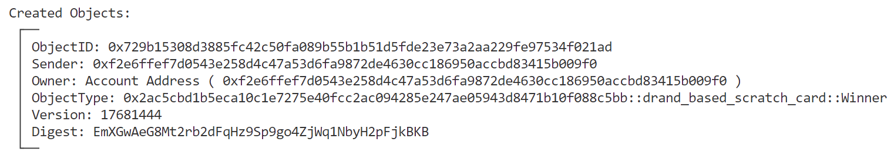

# SUI Move官方示例合约实践——游戏类：基于drand随机数的刮刮卡游戏（drand_based_scratch_card）

*rzexin 2024.02.15*

## 1 合约说明

### 1.1 功能介绍

- 本合约是基于`drand`随机数的 **刮刮卡** 游戏合约。[drand](https://drand.love/)是分布式随机数信标，提供可验证、不可预测和无偏的随机数即服务。（**Distributed randomness beacon. Verifiable, unpredictable and unbiased random numbers as a service.**）

    > `drand`所在的`quicknet chain`每3秒产生一个可验证的随机32字节，任何人都可以检查给定的32字节是否确实是drand的第i个输出。故可以使用`drand`作为随机性来源实现需要不可偏倚且不可预测的随机性的链上游戏。即：每次游戏需要随机性时，它从`drand`接收下一个32字节（作为交易的一部分或从现有对象中读取），并相应地进行操作。然而，在某些情况下，这种简单的流程可能不安全，因为区块链不知道`drand`的最新轮次，因此可能依赖已经公开的随机性。）

- 管理员可以 **创建（`create`）** 刮刮卡游戏，该接口会创建**不可变的游戏对象（`Game`）** 和一个 **共享的奖励对象（`Reward`）**

- 玩家可以 **购买刮刮卡（`buy_ticket`）** ，购买刮刮卡，只能在游戏创建的同一世代里购买，购买需要支付`reward/reward_factor`数量的`SUI`，支付代币会转给游戏创建者，游戏玩家会获得 **刮刮卡（`ticket`）**

- 游戏结束，玩家可以自行 **刮卡和开奖（`evaluate`）** ，若中奖，刮刮卡的持有人将会获得 **赢家对象（`Winner`）** ,并销毁刮刮卡对象（`Ticket`）

- 赢家对象（`Winner`）持有人可以去 **领奖（`take_reward`）** ，如果奖励未被领取，将会获得所有奖励`SUI`后，在销毁冠军对象（`Winner`），若奖励已经被其他中奖者领取，将只会销毁冠军对象（`Winner`），其他什么也不会发生：(

- 如果奖励在几个epoch内没有被提取，游戏管理员（创建者）可以 **赎回奖励（`redeem`）**

### 1.2 官方合约示例代码

#### 1.2.1 合约源码地址

https://github.com/MystenLabs/sui/blob/main/sui_programmability/examples/games/sources/drand_based_scratch_card.move

#### 1.2.2 数据结构说明

##### （1）游戏对象定义

- 游戏对象是一个**不可变对象**，包括购买刮刮卡时要使用的所有参数
- 参数有：
    - creator：游戏创建者
    - reward_amount：奖励`SUI`代币数量
    - reward_factor：奖励因子，`reward/reward_factor`为刮刮卡（`ticket`）价格
    - base_epoch：当前世代
    - base_drand_round：当前`drand`轮次

```rust
    /// Game represents a set of parameters of a single game.
    struct Game has key {
        id: UID,
        creator: address,
        reward_amount: u64,
        reward_factor: u64,
        base_epoch: u64,
        base_drand_round: u64,
    }
```

##### （2）奖励对象定义

- 奖励是一个**共享对象**，任何获胜者都可以提取，先到先得
- 如果在几个epoch内没有被提取，可以退还给游戏创建者。

```rust
    /// Reward that is attached to a specific game. Can be withdrawn once.
    struct Reward has key {
        id: UID,
        game_id: ID,
        balance: Balance<SUI>,
    }
```

##### （3）奖票对象定义

```rust
    /// Ticket represents a participant in a single game.
    /// Can be deconstructed only by the owner.
    struct Ticket has key, store {
        id: UID,
        game_id: ID,
    }
```

##### （4）冠军对象定义

```rust
    /// Winner represents a participant that won in a specific game.
    /// Can be consumed by the take_reward.
    struct Winner has key, store {
        id: UID,
        game_id: ID,
    }
```

#### 1.2.3 对外接口说明

##### （1）创建刮刮卡游戏（`create`）

- 该接口会创建**不可变的**游戏对象（`Game`）和一个**共享的**奖励对象（`Reward`）
- 奖励金额（`reward`）需要能够整除奖励因子（`reward_factor`）

```rust
    /// Create a new game with a given reward.
    ///
    /// The reward must be a positive balance, dividable by reward_factor. reward/reward_factor will be the ticket
    /// price. base_drand_round is the current drand round.
    public entry fun create(
        reward: Coin<SUI>,
        reward_factor: u64,
        base_drand_round: u64,
        ctx: &mut TxContext
    ) {
        let amount = coin::value(&reward);
        assert!(amount > 0 && amount % reward_factor == 0 , EInvalidReward);

        let game = Game {
            id: object::new(ctx),
            reward_amount: coin::value(&reward),
            creator: tx_context::sender(ctx),
            reward_factor,
            base_epoch: tx_context::epoch(ctx),
            base_drand_round,
        };
        
        let reward = Reward {
            id: object::new(ctx),
            game_id: object::id(&game),
            balance: coin::into_balance(reward),
        };
        
        transfer::freeze_object(game);
        transfer::share_object(reward);
    }
```

##### （2）购买刮刮卡（`buy_ticket`）

- 购买刮刮卡，只能在游戏创建的同一世代里购买
- 购买需要支付`reward/reward_factor`数量的`SUI`
- 支付代币会转给游戏创建者
- 游戏玩家会获得刮刮卡（`ticket`）

```rust
    /// Buy a ticket for a specific game, costing reward/reward_factor SUI. Can be called only during the epoch in which
    /// the game was created.
    /// Note that the reward might have been withdrawn already. It's the user's responsibility to verify that.
    public entry fun buy_ticket(coin: Coin<SUI>, game: &Game, ctx: &mut TxContext) {
        assert!(coin::value(&coin) * game.reward_factor == game.reward_amount, EInvalidDeposit);
        assert!(tx_context::epoch(ctx) == game.base_epoch, EInvalidEpoch);
        let ticket = Ticket {
            id: object::new(ctx),
            game_id: object::id(game),
        };
        transfer::public_transfer(coin, game.creator);
        transfer::public_transfer(ticket, tx_context::sender(ctx));
    }
```

##### （3）刮卡&开奖（`evaluate`）

- 游戏结束时间为游戏创建后的2天时间，以确保所有游戏玩家都能至少在参加游戏后的一个纪元进行开奖
- 传入游戏开始后`一个纪元+1小时`时间后的`drand`签名随机数
- 选出赢家的方法是：
    - 计算`drand_sig`的`sha2_256`哈希
    - 将上述哈希拼接上`ticket`字节码后，计算其`hmac_sha3_256`消息认证码
    - 使用上述消息认证码挑选出奖励因子序号
    - **注意：直接检查`(random_key % reward_factor) == (ticket id % reward_factor)`是不安全的，因为攻击者可以操控`ticket id`的值**
- 若中奖，刮刮卡的持有人将会获得赢家对象（`Winner`）,并销毁刮刮卡对象（`Ticket`）

```rust
    public entry fun evaluate(
        ticket: Ticket,
        game: &Game,
        drand_sig: vector<u8>,
        ctx: &mut TxContext
    ) {
        assert!(ticket.game_id == object::id(game), EInvalidTicket);
        drand_lib::verify_drand_signature(drand_sig, end_of_game_round(game.base_drand_round));
        // The randomness for the current ticket is derived by HMAC(drand randomness, ticket id).
        // A solution like checking if (drand randomness % reward_factor) == (ticket id % reward_factor) is not secure
        // as the adversary can control the values of ticket id. (For this particular game this attack is not
        // devastating, but for similar games it might be.)
        let random_key = drand_lib::derive_randomness(drand_sig);
        let randomness = hmac_sha3_256(&random_key, &object::id_to_bytes(&object::id(&ticket)));
        let is_winner = (drand_lib::safe_selection(game.reward_factor, &randomness) == 0);

        if (is_winner) {
            let winner = Winner {
                id: object::new(ctx),
                game_id: object::id(game),
            };
            transfer::public_transfer(winner, tx_context::sender(ctx));
        };
        // Delete the ticket.
        let Ticket { id, game_id:  _} = ticket;
        object::delete(id);
    }

    public fun end_of_game_round(round: u64): u64 {
        // Since users do not know when an epoch has began, they can only check if the game depends on a round that is
        // at least 24 hours from now. Since the creator does not know as well if its game is created in the beginning
        // or the end of the epoch, we define the end of the game to be 24h + 24h from when it started, +1h to be on
        // the safe side since epoch duration is not deterministic.
        round + 20 * 60 * (24 + 25)
    }
```

##### （4）领奖（take_reward）

- 赢家对象（`Winner`）持有人可以去领奖
- 如果奖励未被领取，将会获得所有奖励`SUI`后，在销毁冠军对象（`Winner`）
- 若奖励已经领取，将只会销毁冠军对象（`Winner`）

```rust
    public entry fun take_reward(winner: Winner, reward: &mut Reward, ctx: &mut TxContext) {
        assert!(winner.game_id == reward.game_id, EInvalidTicket);
        let full_balance = balance::value(&reward.balance);
        if (full_balance > 0) {
            transfer::public_transfer(coin::take(&mut reward.balance, full_balance, ctx), tx_context::sender(ctx));
        };
        let Winner { id, game_id:  _} = winner;
        object::delete(id);
    }
```

##### （5）赎回（`redeem`）

- 如果奖励在几个世代，游戏创建者可以赎回奖励

```rust
    /// Can be called in case the reward was not withdrawn, to return the coins to the creator.
    public entry fun redeem(reward: &mut Reward, game: &Game, ctx: &mut TxContext) {
        assert!(balance::value(&reward.balance) > 0, EInvalidReward);
        assert!(object::id(game) == reward.game_id, EInvalidGame);
        // Since we define the game to take 24h+25h, a game that is created in epoch x may be completed in epochs
        // x+2 or x+3.
        assert!(game.base_epoch + 3 < tx_context::epoch(ctx), ETooSoonToRedeem);
        let full_balance = balance::value(&reward.balance);
        transfer::public_transfer(coin::take(&mut reward.balance, full_balance, ctx), game.creator);
    }
```

## 2 前置准备

### 2.1 帐号准备及角色分配

| 别名  | 地址                                                         | 角色                       |
| ----- | ------------------------------------------------------------ | -------------------------- |
| Jason | `0x5c5882d73a6e5b6ea1743fb028eff5e0d7cc8b7ae123d27856c5fe666d91569a` | 游戏创建者：创建刮刮卡游戏 |
| Alice | `0x2d178b9704706393d2630fe6cf9415c2c50b181e9e3c7a977237bb2929f82d19` | 游戏参与者：购买刮刮卡     |
| Bob   | `0xf2e6ffef7d0543e258d4c47a53d6fa9872de4630cc186950accbd83415b009f0` | 游戏参与者：购买刮刮卡     |

- **将地址添加到环境变量**

```bash
export JASON=0x5c5882d73a6e5b6ea1743fb028eff5e0d7cc8b7ae123d27856c5fe666d91569a
export ALICE=0x2d178b9704706393d2630fe6cf9415c2c50b181e9e3c7a977237bb2929f82d19
export BOB=0xf2e6ffef7d0543e258d4c47a53d6fa9872de4630cc186950accbd83415b009f0
```

### 2.2 获取开奖轮次

#### （1）查看当前轮次

```json
curl -s https://drand.cloudflare.com/52db9ba70e0cc0f6eaf7803dd07447a1f5477735fd3f661792ba94600c84e971/public/latest | jq
{
  "round": 5061055,
  "randomness": "51412539d9d3ff693301e4e12b68d3e030ded71604c60857561d97d226d01553",
  "signature": "98a5d4633c62b9d573f6ca46055d19097c3a64224d8fc17062dd092824b20922ffe2be96f4f81318b9a8e74df9900b4e"
}

export BASE_ROUND=5061055
```

#### （2）获取游戏结束的开奖轮次

> 游戏结束的轮次为部署合约后的2天的轮次为开奖轮次，由于时间太长，实践阶段将其改小为合约部署后的10分钟

```bash
5061055 + 20 * 10 = 5061255
export END_ROUND=5061255
```

## 3 合约部署

> 切换到Jason账号

```bash
sui client publish --gas-budget 100000000
```

- **命令输出关键信息截图**


- **将关键的对象ID记录到环境变量，方便后续调用使用**

```bash
export PACKAGE_ID=0x2ac5cbd1b5eca10c1e7275e40fcc2ac094285e247ae05943d8471b10f088c5bb
```

## 4 合约交互

### 4.1 创建刮刮卡游戏（`create`）

> 切换到Jason

```bash
export REWARD_COIN=0x84da8da6e8e8cb5fa4d9bd8393f94cfd357d80ee783931f30cd034f07a51a369  # 100
export REWARD_FACTOR=2

sui client call --function create --package $PACKAGE_ID --module drand_based_scratch_card --args $REWARD_COIN $REWARD_FACTOR $BASE_ROUND --gas-budget 10000000
```

- **创建游戏对象和奖励对象**


- **记录游戏对象ID和奖励对象ID**

```bash
# PACKAGE_ID::drand_based_scratch_card::Game
export GAME=0x3c26c40da8875654a8f9cae9e75546991c2fa02af77ded03a5370853151496cd

# PACKAGE_ID::::drand_based_scratch_card::Reward
export REWARD=0xe5dd8b85ca6821d6a9d13b62d9eb05cbb68c8d0346bf0d5c9b55159cd3863e80
```

- **查看游戏**

```bash
sui client object $GAME
```


- **查看奖励对象**

```bash
sui client object $REWARD
```


### 4.2 Alice购买2张刮刮卡（`buy_ticket`）

> 切换到Alice
>
> 可以通过split命令准备好Alice购买刮刮卡所需的代币数量：
>
> ```bash
> sui client split-coin --coin-id $COIN --amounts 50 --gas-budget 10000000
> ```

```bash
export ALICE_COIN1=0xd7e29460a4cefa03c896bb1d944b32760559207577a96b5913f922718cfe2d5d # 50
sui client call --function buy_ticket --package $PACKAGE_ID --module drand_based_scratch_card --args $ALICE_COIN1 $GAME --gas-budget 10000000
```


```bash
export ALICE_COIN2=0x84f60e84ffb0d95dd155bdb710dbed12f04df55ea8cb99e57f64f855251bcccc # 50
sui client call --function buy_ticket --package $PACKAGE_ID --module drand_based_scratch_card --args $ALICE_COIN2 $GAME --gas-budget 10000000
```


- **记录Ticket对象**

```bash
export TICKET_ALICE1=0xeafedcb7d2b1708a25ce9d31a6c339f24c222c6d18764221339e1c30df81a5df
export TICKET_ALICE2=0x216ea8c4e2763e58e1624b103cce5a9667646adfdca08626d2a0a7688201d8d8
```

- **查看Ticket对象**

```bash
sui client object $TICKET_ALICE1
```


### 4.3 Bob购买1张刮刮卡（`buy_ticket`）

> 切换到Bob

```bash
export BOB_COIN=0xc073e29cfa5e4512b7625975f8f81f256aa7a928e024a00c826729aee3f9cf14 # 50

sui client call --function buy_ticket --package $PACKAGE_ID --module drand_based_scratch_card --args $BOB_COIN $GAME --gas-budget 10000000
```


- **记录Ticket对象**

```bash
export TICKET_BOB=0xb9bd1551775fab2f81c60a61d45d0404b200adf30ee5c087e1d2f3e80ff1fa27
```

- **查看Ticket对象**

```bash
sui client object $TICKET_BOB
```


### 4.4 刮卡&开奖（`evaluate`）

#### （1）获取游戏结束轮次的随机数签名

```bash
curl -s https://drand.cloudflare.com/52db9ba70e0cc0f6eaf7803dd07447a1f5477735fd3f661792ba94600c84e971/public/$END_ROUND  | jq
{
  "round": 5061255,
  "randomness": "869866bfa289042d0b63f300b22efed9163fd453ba395defeb12f6f1682c4387",
  "signature": "8b2a28613f736f2676ee0e63194b4767fc0c5d635231ff8424f989530d8624b965d283ba3f24f9db3f6567a3d481b161"
}
```

#### （2）Alice刮卡&开奖

> 任何Ticket的持有人都可以进行刮卡&开奖
>
> 切换到Alice

- **刮第一张卡，未中奖**

```bash
export DRAND_SIG=0x8b2a28613f736f2676ee0e63194b4767fc0c5d635231ff8424f989530d8624b965d283ba3f24f9db3f6567a3d481b161
sui client call --function evaluate --package $PACKAGE_ID --module drand_based_scratch_card --args $TICKET_ALICE1 $GAME $DRAND_SIG --gas-budget 10000000
```

- **刮第二张卡，中奖**

```bash
sui client call --function evaluate --package $PACKAGE_ID --module drand_based_scratch_card --args $TICKET_ALICE2 $GAME $DRAND_SIG --gas-budget 10000000
```


```bash
export WINNER_ALICE=0x3464c09617cf978f1c59682b68ec5cdfbf32b169d003244c78e594d50daf4f5b
```


#### （3）Bob刮卡&开奖

> 任何Ticket的持有人都可以进行刮卡&开奖
>
> 切换到Bob

```bash
export DRAND_SIG=0x8b2a28613f736f2676ee0e63194b4767fc0c5d635231ff8424f989530d8624b965d283ba3f24f9db3f6567a3d481b161
sui client call --function evaluate --package $PACKAGE_ID --module drand_based_scratch_card --args $TICKET_BOB $GAME $DRAND_SIG --gas-budget 10000000
```

- **中奖**



```bash
export WINNER_BOB=0x729b15308d3885fc42c50fa089b55b1b51d5fde23e73a2aa229fe97534f021ad
```


### 4.5 领奖（take_reward）

> 切换到中奖者Bob，去领奖

```bash
sui client call --function take_reward --package $PACKAGE_ID --module drand_based_scratch_card --args $WINNER_BOB $REWARD --gas-budget 10000000
```

- **Bob领奖，获得Reward中的所有代币**


```bash
$ sui client object 0xb83960c12070b57c44f157e0ea50833eed9bf2d8078aaa34f9c28d94457db2b2
```


- **Alice领奖，因为奖池已空，将无法获得任何奖励：(**

> 切换到Alice

```bash
sui client call --function take_reward --package $PACKAGE_ID --module drand_based_scratch_card --args $WINNER_ALICE $REWARD --gas-budget 10000000
```

接口成功调用，除了`Winner`对象被删除，什么也没有发生：

```bash
$ sui client object  $WINNER_ALICE

Internal error, cannot read the object: Object has been deleted object_id: 0x3464c09617cf978f1c59682b68ec5cdfbf32b169d003244c78e594d50daf4f5b at version: SequenceNumber(17681447) in digest o#7gyGAp71YXQRoxmFBaHxofQXAipvgHyBKPyxmdSJxyvz
```

### 4.6 赎回（`redeem`）

如果奖励在几个世代内没有被提取，游戏创建者可以赎回奖励。调用比较简单，略。

