# SUI Move官方示例合约实践——游戏类：英雄游戏（hero）

*rzexin 2024.02.01*

## 1 合约说明

### 1.1 功能介绍

- Hero合约是一个冒险类游戏合约，讲述了一个勇敢的 **英雄（`Hero `）** 用 **魔剑（`Sword`）** 杀死凶猛的 **野猪（`Boar`）**，并用 **血瓶（`Potion `）** 治疗自己的故事。
- 任何人都可以**创建（`new_game`）**新游戏，游戏的创建者即为当前游戏管理员。
- 游戏玩家可以付费去 **购买英雄（`acquire_hero`）**,该合约接口会创建 **剑（`create_sword`）** 及 **英雄（`create_hero`）**
- 游戏管理员可以为玩家 **发送血槽（`send_potion`）** 以及为玩家 **创建具有特定属性的野猪（`send_boar`）**
- 游戏玩家可以 **攻击野猪（`slay`）**来获得经验值，以及为自己进行 **补血（`heal`）**、 **配备新剑（`equip_sword`）**、 **解除装备（`remove_sword`）**

### 1.2 官方合约示例代码

https://github.com/MystenLabs/sui/blob/main/sui_programmability/examples/games/sources/hero.move

> 合约较长，这里仅介绍一下对外的方法

#### （1）任何人都可以创建（`new_game`）新游戏

- 游戏的创建者即为当前游戏管理员
- 该方法会创建一个不可变的`GameInfo`对象，所有玩家均能访问
- 并会创建一个`GameAdmin`发送给游戏创建者，用户后续为玩家 **发送血槽（`send_potion`）** 以及为玩家 **创建具有特定属性的野猪（`send_boar`）**时的权限验证

```rust
    /// Anyone can create run their own game, all game objects will be
    /// linked to this game.
    public entry fun new_game(ctx: &mut TxContext) {
        create(ctx);
    }

    /// Create a new game. Separated to bypass public entry vs init requirements.
    fun create(ctx: &mut TxContext) {
        let sender = tx_context::sender(ctx);
        let id = object::new(ctx);
        let game_id = object::uid_to_inner(&id);

        transfer::freeze_object(GameInfo {
            id,
            admin: sender,
        });

        transfer::transfer(
            GameAdmin {
                game_id,
                id: object::new(ctx),
                boars_created: 0,
                potions_created: 0,
            },
            sender
        )
    }
```

#### （2）游戏玩家可以付费去购买英雄（`acquire_hero`）

- 该合约接口会创建 **剑（`create_sword`）** 及 **英雄（`create_hero`）**
- 创建剑接口会检查购买金额是否足够，不够将会报错，如果足够购买金额将会转发的游戏管理员；剑还具备魔法加成，跟玩家支付的金额成正比，但有一个最大上限
- 创建英雄接口会将剑赋予给英雄，并赋予初始的 **生命值（hp）**

```rust
    public entry fun acquire_hero(
        game: &GameInfo, payment: Coin<SUI>, ctx: &mut TxContext
    ) {
        let sword = create_sword(game, payment, ctx);
        let hero = create_hero(game, sword, ctx);
        transfer::public_transfer(hero, tx_context::sender(ctx))
    }

    /// It all starts with the sword. Anyone can buy a sword, and proceeds go
    /// to the admin. Amount of magic in the sword depends on how much you pay
    /// for it.
    public fun create_sword(
        game: &GameInfo,
        payment: Coin<SUI>,
        ctx: &mut TxContext
    ): Sword {
        let value = coin::value(&payment);
        // ensure the user pays enough for the sword
        assert!(value >= MIN_SWORD_COST, EINSUFFICIENT_FUNDS);
        // pay the admin for this sword
        transfer::public_transfer(payment, game.admin);

        // magic of the sword is proportional to the amount you paid, up to
        // a max. one can only imbue a sword with so much magic
        let magic = (value - MIN_SWORD_COST) / MIN_SWORD_COST;
        Sword {
            id: object::new(ctx),
            magic: math::min(magic, MAX_MAGIC),
            strength: 1,
            game_id: id(game)
        }
    }

    /// Anyone can create a hero if they have a sword. All heroes start with the
    /// same attributes.
    public fun create_hero(
        game: &GameInfo, sword: Sword, ctx: &mut TxContext
    ): Hero {
        check_id(game, sword.game_id);
        Hero {
            id: object::new(ctx),
            hp: 100,
            experience: 0,
            sword: option::some(sword),
            game_id: id(game)
        }
    }
```

#### （3）游戏管理员可以为玩家发送血槽（`send_potion`）以及创建具有特定属性的野猪（`send_boar`）

```rust
    /// Admin can create a potion with the given `potency` for `recipient`
    public entry fun send_potion(
        game: &GameInfo,
        potency: u64,
        player: address,
        admin: &mut GameAdmin,
        ctx: &mut TxContext
    ) {
        check_id(game, admin.game_id);
        admin.potions_created = admin.potions_created + 1;
        // send potion to the designated player
        transfer::public_transfer(
            Potion { id: object::new(ctx), potency, game_id: id(game) },
            player
        )
    }

    /// Admin can create a boar with the given attributes for `recipient`
    public entry fun send_boar(
        game: &GameInfo,
        admin: &mut GameAdmin,
        hp: u64,
        strength: u64,
        player: address,
        ctx: &mut TxContext
    ) {
        check_id(game, admin.game_id);
        admin.boars_created = admin.boars_created + 1;
        // send boars to the designated player
        transfer::transfer(
            Boar { id: object::new(ctx), hp, strength, game_id: id(game) },
            player
        )
    }
```

#### （4）游戏玩家可以攻击野猪（`slay`）来获得经验值和升级剑

```rust
	/// Slay the `boar` with the `hero`'s sword, get experience.
    /// Aborts if the hero has 0 HP or is not strong enough to slay the boar
    public entry fun slay(
        game: &GameInfo, hero: &mut Hero, boar: Boar, ctx: &TxContext
    ) {
        check_id(game, hero.game_id);
        check_id(game, boar.game_id);
        let Boar { id: boar_id, strength: boar_strength, hp, game_id: _ } = boar;
        let hero_strength = hero_strength(hero);
        let boar_hp = hp;
        let hero_hp = hero.hp;
        // attack the boar with the sword until its HP goes to zero
        while (boar_hp > hero_strength) {
            // first, the hero attacks
            boar_hp = boar_hp - hero_strength;
            // then, the boar gets a turn to attack. if the boar would kill
            // the hero, abort--we can't let the boar win!
            assert!(hero_hp >= boar_strength , EBOAR_WON);
            hero_hp = hero_hp - boar_strength;
        };
        // hero takes their licks
        hero.hp = hero_hp;
        // hero gains experience proportional to the boar, sword grows in
        // strength by one (if hero is using a sword)
        hero.experience = hero.experience + hp;
        if (option::is_some(&hero.sword)) {
            level_up_sword(option::borrow_mut(&mut hero.sword), 1)
        };
        // let the world know about the hero's triumph by emitting an event!
        event::emit(BoarSlainEvent {
            slayer_address: tx_context::sender(ctx),
            hero: object::uid_to_inner(&hero.id),
            boar: object::uid_to_inner(&boar_id),
            game_id: id(game)
        });
        object::delete(boar_id);
    }

```

- **英雄的攻击力算法**

    计算公式是：`经验×生命值+剑的攻击力`，如果英雄的生命值为0或者没有剑，英雄的攻击力直接为0，将无法进行战斗。剑的攻击力还包括跟购买金额成正比的魔法加成。

```rust
    /// Strength of the hero when attacking
    public fun hero_strength(hero: &Hero): u64 {
        // a hero with zero HP is too tired to fight
        if (hero.hp == 0) {
            return 0
        };

        let sword_strength = if (option::is_some(&hero.sword)) {
            sword_strength(option::borrow(&hero.sword))
        } else {
            // hero can fight without a sword, but will not be very strong
            0
        };
        // hero is weaker if he has lower HP
        (hero.experience * hero.hp) + sword_strength
    }

    /// Strength of a sword when attacking
    public fun sword_strength(sword: &Sword): u64 {
        sword.magic + sword.strength
    }
```

- **战斗逻辑**

循环计算`野猪生命值-英雄攻击力`以及`英雄生命值-野猪攻击力`，当野猪生命值≤英雄攻击力时，则英雄获胜；反之当英雄生命值＜野猪攻击力时，则英雄失败。

```rust
        // attack the boar with the sword until its HP goes to zero
        while (boar_hp > hero_strength) {
            // first, the hero attacks
            boar_hp = boar_hp - hero_strength;
            // then, the boar gets a turn to attack. if the boar would kill
            // the hero, abort--we can't let the boar win!
            assert!(hero_hp >= boar_strength , EBOAR_WON);
            hero_hp = hero_hp - boar_strength;
        };
```

- **剑升级逻辑**

当英雄持有剑，每消灭一次野猪，剑的力量将会增强1。

```rust
        if (option::is_some(&hero.sword)) {
            level_up_sword(option::borrow_mut(&mut hero.sword), 1)
        };

	fun level_up_sword(sword: &mut Sword, amount: u64) {
        sword.strength = sword.strength + amount
    }
```

#### （5）玩家为自己进行补血（`heal`）、配备新剑（`equip_sword`）、 解除装备（`remove_sword`）

```rust
    /// Heal the weary hero with a potion
    public fun heal(hero: &mut Hero, potion: Potion) {
        assert!(hero.game_id == potion.game_id, 403);
        let Potion { id, potency, game_id: _ } = potion;
        object::delete(id);
        let new_hp = hero.hp + potency;
        // cap hero's HP at MAX_HP to avoid int overflows
        hero.hp = math::min(new_hp, MAX_HP)
    }

    /// Add `new_sword` to the hero's inventory and return the old sword
    /// (if any)
    public fun equip_sword(hero: &mut Hero, new_sword: Sword): Option<Sword> {
        option::swap_or_fill(&mut hero.sword, new_sword)
    }

    /// Disarm the hero by returning their sword.
    /// Aborts if the hero does not have a sword.
    public fun remove_sword(hero: &mut Hero): Sword {
        assert!(option::is_some(&hero.sword), ENO_SWORD);
        option::extract(&mut hero.sword)
    }
```

## 2 前置准备

### 2.1 帐号准备及角色分配

| 别名  | 地址                                                         | 角色               |
| ----- | ------------------------------------------------------------ | ------------------ |
| Jason | `0x5c5882d73a6e5b6ea1743fb028eff5e0d7cc8b7ae123d27856c5fe666d91569a` | 游戏创建者、管理员 |
| Alice | `0x2d178b9704706393d2630fe6cf9415c2c50b181e9e3c7a977237bb2929f82d19` | 游戏玩家           |
| Bob   | `0xf2e6ffef7d0543e258d4c47a53d6fa9872de4630cc186950accbd83415b009f0` | 游戏玩家           |

- **将地址添加到环境变量**

```bash
export JASON=0x5c5882d73a6e5b6ea1743fb028eff5e0d7cc8b7ae123d27856c5fe666d91569a
export ALICE=0x2d178b9704706393d2630fe6cf9415c2c50b181e9e3c7a977237bb2929f82d19
export BOB=0xf2e6ffef7d0543e258d4c47a53d6fa9872de4630cc186950accbd83415b009f0
```

## 3 合约部署

> 切换到Jason账号

```bash
$ sui client publish --gas-budget 100000000
Transaction Digest: DRKGSzaAGRrBLgMb6kpAdANyqgDKiyubhVyvUysRFM5i
```

- **命令输出关键信息截图**

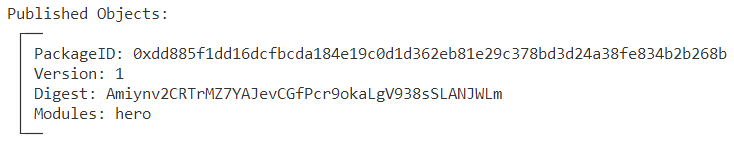

- **将PackageID记录到环境变量，方便后续调用使用**

```bash
export PACKAGE_ID=0xdd885f1dd16dcfbcda184e19c0d1d362eb81e29c378bd3d24a38fe834b2b268b
```

## 4 合约交互

### 4.1 创建游戏

> 切换到Jason

```bash
sui client call --function new_game --package $PACKAGE_ID --module hero --gas-budget 10000000
```

- **创建不可变游戏对象和游戏管理员对象**

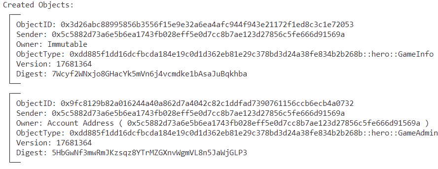


- **记录对象ID到环境变量**

```bash
#PACKAGE_ID::hero::GameInfo
export GAME_INFO=0x3d26abc88995856b3556f15e9e32a6ea4afc944f943e21172f1ed8c3c1e72053

#PACKAGE_ID::hero::GameAdmin
export GAME_ADMIN=0x9fc8129b82a016244a40a862d7a4042c82c1ddfad7390761156ccb6ecb4a0732
```

- **查看游戏信息对象**

```bash
sui client object $GAME_INFO
```

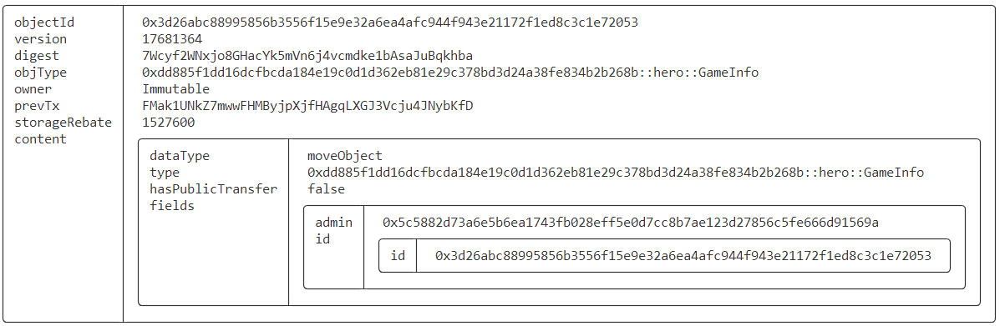

- **查看游戏管理员对象**

```bash
sui client object $GAME_ADMIN
```

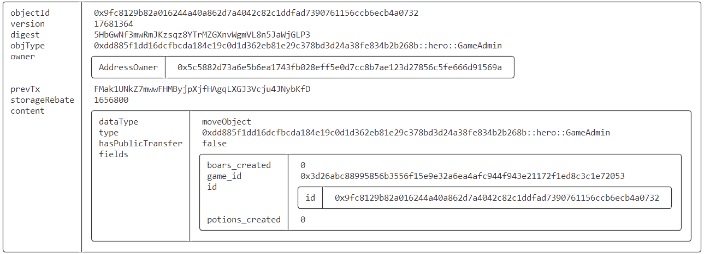

### 4.2 玩家购买英雄

> 切换到Alice，购买的最低金额为100

```bash
export COIN_ALICE=0xed8011355d3ba606f65261d6afa89b432cc26ec3cf7b86839078da05648c9918  # 含有800

sui client call --function acquire_hero --package $PACKAGE_ID --module hero --args $GAME_INFO $COIN_ALICE --gas-budget 10000000
```

- **玩家获得英雄**

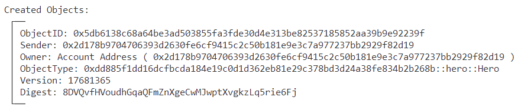

- **记录英雄对象ID**

```bash
# PACKAGE_ID::hero::Hero
export HERO=0x5db6138c68a64be3ad503855fa3fde30d4e313be82537185852aa39b9e92239f
```

- **查看英雄**

```bash
sui client object $HERO
```

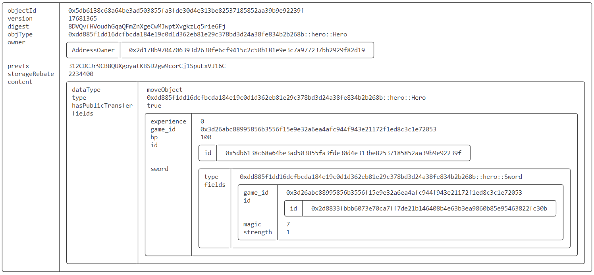

### 4.3 管理员为玩家创建野猪

> 切换到Jason

```bash
export HP=10
export STRENGTH=10
sui client call --function send_boar --package $PACKAGE_ID --module hero --args $GAME_INFO $GAME_ADMIN $HP $STRENGTH $ALICE --gas-budget 10000000
```

- **得到野猪对象**

```bash
export BOAR=0xc8155205f5e598480fc47d3ecb9727a3f00b82a968f6940e2b3cba082501d4f3
```


- **查看野猪对象**

```bash
sui client object $BOAR
```

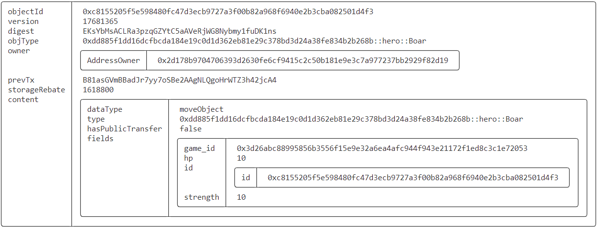

### 4.4 玩家攻击野猪

> 切换到Alice，执行攻击操作，一轮攻击后，野猪战败，英雄收货经验值和剑攻击力的增强。

```bash
sui client call --function slay --package $PACKAGE_ID --module hero --args $GAME_INFO $HERO $BOAR --gas-budget 10000000
```

- **抛出事件**

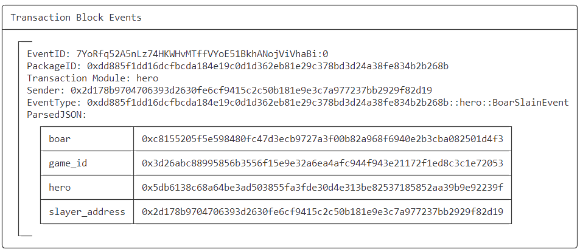

- **查看当前英雄对象**
    - 可见击败野猪后，英雄的经验值得到提升（来自野猪的生命值）：`0->10`
    - 生命值有所下降（战斗了一轮减少的是野猪的攻击力）：100->90
    - 剑的力量得到增强（每战胜一头野猪+1）：`1->2`

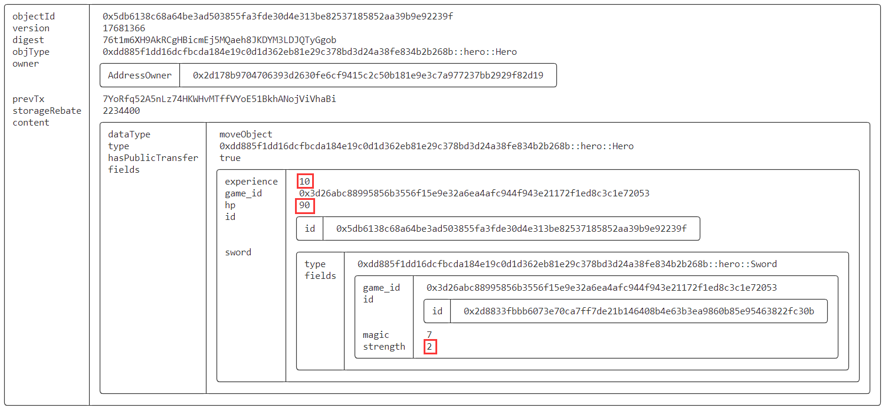

### 4.5 管理员给玩家发血槽

> 切换到Jason

```bash
export POTENCY=50
sui client call --function send_potion --package $PACKAGE_ID --module hero --args $GAME_INFO $POTENCY $ALICE $GAME_ADMIN --gas-budget 10000000
```

- **得到血槽对象**

```rust
export POTION=0x561c37b3d03381d1c0e9c4a5182c32164120c4e4d036e47efce1681282d0d67d
```

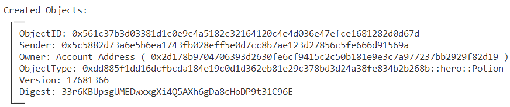

- **查看血槽对象**

```bash
sui client object $POTION
```

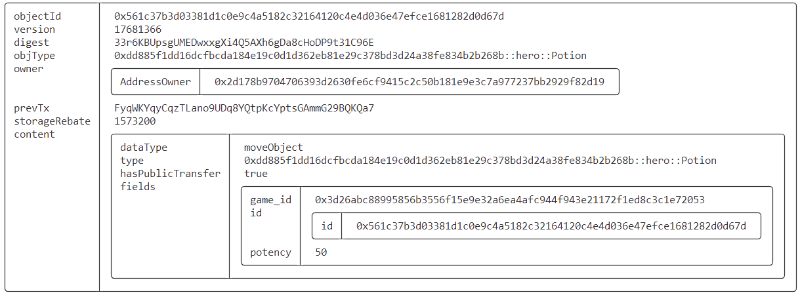

### 4.6 玩家给自己补血

> 切换到Alice

```
sui client call --function heal --package $PACKAGE_ID --module hero --args $HERO $POTION --gas-budget 10000000
```

- **补血后查看玩家对象**

> 可见玩家生命值从90提升到140

```bash
sui client object $HERO
```

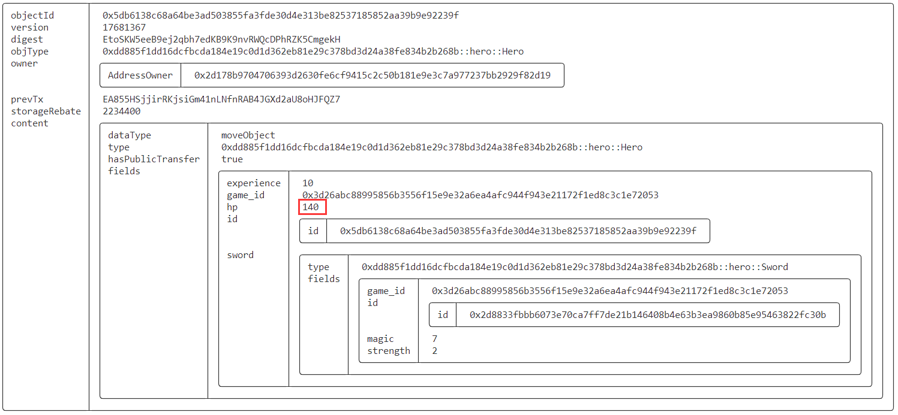

## 5 更多

[第三期报名已经开启 🚀参与星航计划 开启你的 Sui Move 之旅！🚀](https://mp.weixin.qq.com/s/dyaoNPl7gRWoO5i8_wukfQ)


