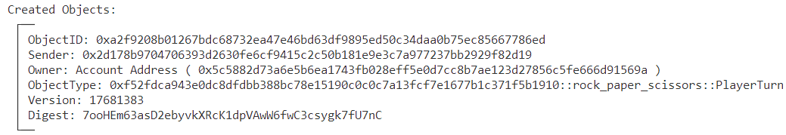

# SUI Move官方示例合约实践——游戏类：剪刀石头布游戏（rock_paper_scissors）

*rzexin 2024.02.03*

## 1 合约说明

### 1.1 功能介绍

- `rock_paper_scissors`是一个剪刀石头布的游戏合约，采用 **提交-披露** 的方式来决定获胜方。
- 由三方构成：裁判方（中立第三方）、玩家A、玩家B
- 具体玩法是：
    - 裁判方调用接口`new_game`创建游戏，指定双方玩家并设置奖励
    - 玩家A、B分别进行出拳，这里**提交**的并不是实际的手势（`gestures`），而是手势加盐后的哈希，通过调用`player_turn`接口传给裁判方
    - 裁判方调用`add_hash`接口，分别将对战玩家双方提交的哈希，添加到游戏`Game`对象中
    - 待`Game`对象中包含对战双方的出拳哈希时，对战双方可以进行手势**披露**，调用`reveal`接口披露盐值给裁判方
    - 裁判方调用`match_secret`接口，通过双方提供的盐值结合之前的哈希推算出对战双发的出拳手势。若经计算玩家给出的盐值和哈希不匹配，则会判定玩家作弊（`CHEAT`）
    - 裁判方调用`select_winner`接口，得到获胜者，获胜者将会得到奖励（`prize`）。若一方作弊一方没有作弊，则作弊者直接输掉比赛。若打成平局，则裁判方将获得奖励

### 1.2 官方合约示例代码

https://github.com/MystenLabs/sui/blob/main/sui_programmability/examples/games/sources/rock_paper_scissors.move

#### （1）创建游戏（`new_game`）

- 裁判方调用接口`new_game`创建游戏，指定双方玩家并设置奖励

```rust
    /// Start a new game at sender address. The only arguments needed are players, the rest
    /// is initiated with default/empty values which will be filled later in the game.
    ///
    /// todo: extend with generics + T as prize
    public entry fun new_game(player_one: address, player_two: address, ctx: &mut TxContext) {
        transfer::transfer(Game {
            id: object::new(ctx),
            prize: ThePrize { id: object::new(ctx) },
            player_one,
            player_two,
            hash_one: vector[],
            hash_two: vector[],
            gesture_one: NONE,
            gesture_two: NONE,
        }, tx_context::sender(ctx));
    }
```

#### （2）玩家出拳（`player_turn`）

- 玩家A、B分别进行出拳，这里**提交**的并不是实际的手势（`gestures`），而是手势加盐后的哈希

```rust
    /// Transfer [`PlayerTurn`] to the game owner. Nobody at this point knows what move
    /// is encoded inside the [`hash`] argument.
    ///
    /// Currently there's no check on whether the game exists.
    public entry fun player_turn(at: address, hash: vector<u8>, ctx: &mut TxContext) {
        transfer::transfer(PlayerTurn {
            hash,
            id: object::new(ctx),
            player: tx_context::sender(ctx),
        }, at);
    }

    /// Internal hashing function to build a [`Secret`] and match it later at the reveal stage.
    ///
    /// - `salt` argument here is a secret that is only known to the sender. That way we ensure
    /// that nobody knows the gesture until the end, but at the same time each player commits
    /// to the result with his hash;
    fun hash(gesture: u8, salt: vector<u8>): vector<u8> {
        vector::push_back(&mut salt, gesture);
        hash::sha2_256(salt)
    }
```

#### （3）裁判添加手势（`add_hash`）

- 裁判方调用`add_hash`接口，分别将对战玩家双方提交的哈希，添加到游戏`Game`对象中

```rust
    /// Add a hashed gesture to the game. Store it as a `hash_one` or `hash_two` depending
    /// on the player number (one or two)
    public entry fun add_hash(game: &mut Game, cap: PlayerTurn) {
        let PlayerTurn { hash, id, player } = cap;
        let status = status(game);

        assert!(status == STATUS_HASH_SUBMISSION || status == STATUS_READY, 0);
        assert!(game.player_one == player || game.player_two == player, 0);

        if (player == game.player_one && vector::length(&game.hash_one) == 0) {
            game.hash_one = hash;
        } else if (player == game.player_two && vector::length(&game.hash_two) == 0) {
            game.hash_two = hash;
        } else {
            abort 0 // unreachable!()
        };

        object::delete(id);
    }
```

#### （4）玩家披露手势（`reveal`）

- 待`Game`对象中包含对战双方的出拳哈希时，对战双方可以进行手势**披露**，调用`reveal`接口披露盐值给裁判方

```rust
    /// Submit a [`Secret`] to the game owner who then matches the hash and saves the
    /// gesture in the [`Game`] object.
    public entry fun reveal(at: address, salt: vector<u8>, ctx: &mut TxContext) {
        transfer::transfer(Secret {
            id: object::new(ctx),
            salt,
            player: tx_context::sender(ctx),
        }, at);
    }
```

#### （5）裁判推算手势（`match_secret`）

- 裁判方调用`match_secret`接口，通过双方提供的盐值结合之前的哈希推算出对战双发的出拳手势。若经计算玩家给出的盐值和哈希不匹配，则会判定玩家作弊（`CHEAT`）

```rust
    /// Use submitted [`Secret`]'s salt to find the gesture played by the player and set it
    /// in the [`Game`] object.
    /// TODO: think of ways to
    public entry fun match_secret(game: &mut Game, secret: Secret) {
        let Secret { salt, player, id } = secret;

        assert!(player == game.player_one || player == game.player_two, 0);

        if (player == game.player_one) {
            game.gesture_one = find_gesture(salt, &game.hash_one);
        } else if (player == game.player_two) {
            game.gesture_two = find_gesture(salt, &game.hash_two);
        };

        object::delete(id);
    }

    /// Hash the salt and the gesture_id and match it against the stored hash. If something
    /// matches, the gesture_id is returned, if nothing - player is considered a cheater, and
    /// he automatically loses the round.
    fun find_gesture(salt: vector<u8>, hash: &vector<u8>): u8 {
        if (hash(ROCK, salt) == *hash) {
            ROCK
        } else if (hash(PAPER, salt) == *hash) {
            PAPER
        } else if (hash(SCISSORS, salt) == *hash) {
            SCISSORS
        } else {
            CHEAT
        }
    }
```

#### （6）裁判裁决评出获胜方（`select_winner`）

- 裁判方调用`select_winner`接口，得到获胜者，获胜者将会得到奖励（`prize`）
    - 若一方作弊一方没有作弊，则作弊者直接输掉比赛
    - 若打成平局，则裁判方将获得奖励

```rust
    /// The final accord to the game logic. After both secrets have been revealed,
    /// the game owner can choose a winner and release the prize.
    public entry fun select_winner(game: Game, ctx: &TxContext) {
        assert!(status(&game) == STATUS_REVEALED, 0);

        let Game {
            id,
            prize,
            player_one,
            player_two,
            hash_one: _,
            hash_two: _,
            gesture_one,
            gesture_two,
        } = game;

        let p1_wins = play(gesture_one, gesture_two);
        let p2_wins = play(gesture_two, gesture_one);

        object::delete(id);

        // If one of the players wins, he takes the prize.
        // If there's a tie, the game owner gets the prize.
        if (p1_wins) {
            transfer::public_transfer(prize, player_one)
        } else if (p2_wins) {
            transfer::public_transfer(prize, player_two)
        } else {
            transfer::public_transfer(prize, tx_context::sender(ctx))
        };
    }

    /// Implement the basic logic of the game.
    fun play(one: u8, two: u8): bool {
        if (one == ROCK && two == SCISSORS) { true }
        else if (one == PAPER && two == ROCK) { true }
        else if (one == SCISSORS && two == PAPER) { true }
        else if (one != CHEAT && two == CHEAT) { true }
        else { false }
    }
```

## 2 前置准备

### 2.1 帐号准备及角色分配

| 别名  | 地址                                                         | 角色   |
| ----- | ------------------------------------------------------------ | ------ |
| Jason | `0x5c5882d73a6e5b6ea1743fb028eff5e0d7cc8b7ae123d27856c5fe666d91569a` | 裁判方 |
| Alice | `0x2d178b9704706393d2630fe6cf9415c2c50b181e9e3c7a977237bb2929f82d19` | 玩家A  |
| Bob   | `0xf2e6ffef7d0543e258d4c47a53d6fa9872de4630cc186950accbd83415b009f0` | 玩家B  |

- **将地址添加到环境变量**

```bash
export JASON=0x5c5882d73a6e5b6ea1743fb028eff5e0d7cc8b7ae123d27856c5fe666d91569a
export ALICE=0x2d178b9704706393d2630fe6cf9415c2c50b181e9e3c7a977237bb2929f82d19
export BOB=0xf2e6ffef7d0543e258d4c47a53d6fa9872de4630cc186950accbd83415b009f0
```

## 3 合约部署

> 切换到Jason账号

```bash
$ sui client publish --gas-budget 100000000
Transaction Digest: 5w5nXZHMynL3Hi5CXwnT1xDPMY4gbJM8QDeisRGeBrJz
```

- **命令输出关键信息截图**


- **将关键的对象ID记录到环境变量，方便后续调用使用**

```bash
export PACKAGE_ID=0xf52fdca943e0dc8dfdbb388bc78e15190c0c0c7a13fcf7e1677b1c371f5b1910
```

## 4 合约交互

### 4.1 创建游戏（`new_game`）

> 切换到Jason

```bash
sui client call --function new_game --package $PACKAGE_ID --module rock_paper_scissors --args $ALICE $BOB --gas-budget 10000000
```

- **获得游戏对象**


- **记录游戏对象ID**

```bash
# PACKAGE_ID::rock_paper_scissors::Game 
export GAME=0xffc5a0ec70b21af054f1eb85d87c1c5dc05e6f79b4e8d8973fd407d483146a76
```

- **查看游戏**

```bash
sui client object $GAME
```


### 4.2 玩家出拳（`player_turn`）

#### （1）玩家A出拳

> 切换Alice
>
> - 手势：石头 
> - 盐值：0x1234

- **获取玩家A出拳哈希**

*（注：该哈希需要链下进行计算，在链上通过交易获得会暴露盐值。这里简单起见，添加了一个方法，用于获得该哈希。）*

```bash
export ROCK=1;
export PAPER=2;
export SCISSORS=3;
export SALT_ALICE=0x1234
sui client call --function get_hash --package $PACKAGE_ID --module rock_paper_scissors --args $ROCK $SALT_ALICE --gas-budget 10000000
```

- **抛出事件**


- **将base64编码哈希转成hex编码格式**

```bash
export HASH_BASE64_ALICE=IWa5AJ+MJXgYWC24nZvQNsvpyZn7SXj9NE/67rqAgK0=

echo -n $HASH_BASE64_ALICE | base64 -d | xxd -p -c 1000

export HASH_HEX_ALICE=0x2166b9009f8c257818582db89d9bd036cbe9c999fb4978fd344ffaeeba8080ad
```

- **玩家A出拳提交手势加盐哈希**

```bash
sui client call --function player_turn --package $PACKAGE_ID --module rock_paper_scissors --args $JASON $HASH_HEX_ALICE --gas-budget 10000000
```

- **玩家A PlayerTurn创建完成**



- **记录玩家A PlayerTurn对象ID**

```bash
# PACKAGE_ID::rock_paper_scissors::PlayerTurn
export PLAYER_TURN_ALICE=0xa2f9208b01267bdc68732ea47e46bd63df9895ed50c34daa0b75ec85667786ed
```

- **查看玩家A PlayerTurn**

```bash
sui client object $PLAYER_TURN_ALICE
```


#### （2）玩家B出拳

> 切换到Bob
>
> - 手势：剪刀 
> - 盐值：0x5678

- **获取玩家A出拳哈希**

```bash
export ROCK=1;
export PAPER=2;
export SCISSORS=3;
export SALT_BOB=0x5678
sui client call --function get_hash --package $PACKAGE_ID --module rock_paper_scissors --args $SCISSORS $SALT_BOB --gas-budget 10000000
```

- **抛出事件**


- **将base64编码哈希转成hex编码格式**

```bash
export HASH_BASE64_BOB=VvHSFtBtV+sBXUmZPk6xc7Twuj71fyBwiWIIxiQzhRA=

echo -n $HASH_BASE64_BOB | base64 -d | xxd -p -c 1000

export HASH_HEX_BOB=0x56f1d216d06d57eb015d49993e4eb173b4f0ba3ef57f2070896208c624338510
```

- **玩家B出拳提交手势加盐哈希**

```bash
sui client call --function player_turn --package $PACKAGE_ID --module rock_paper_scissors --args $JASON $HASH_HEX_BOB --gas-budget 10000000
```

- **玩家B PlayerTurn创建完成**


- **记录玩家B PlayerTurn对象ID**

```bash
# PACKAGE_ID::rock_paper_scissors::PlayerTurn
export PLAYER_TURN_BOB=0x38a032b5d21d8085e020aaadb940da96af3bc15de944bd889d74e81f726f57d1
```

- **查看玩家B PlayerTurn**

```bash
$ sui client object $PLAYER_TURN_BOB
```


### 4.3 裁判添加手势（`add_hash`）

> 切换到Jason

```bash
sui client call --function add_hash --package $PACKAGE_ID --module rock_paper_scissors --args $GAME $PLAYER_TURN_ALICE --gas-budget 10000000

sui client call --function add_hash --package $PACKAGE_ID --module rock_paper_scissors --args $GAME $PLAYER_TURN_BOB --gas-budget 10000000
```

- **查看当前GAME对象**

> 可见玩家A、B的哈希值已经设置。

```bash
$ sui client object $GAME --json
{
  "objectId": "0xffc5a0ec70b21af054f1eb85d87c1c5dc05e6f79b4e8d8973fd407d483146a76",
  "version": "17681390",
  "digest": "9ekRM6dGQGzGbogU9C55MsU2VsWRGnHULzECUf3pDw9Y",
  "type": "0xf52fdca943e0dc8dfdbb388bc78e15190c0c0c7a13fcf7e1677b1c371f5b1910::rock_paper_scissors::Game",
  "owner": {
    "AddressOwner": "0x5c5882d73a6e5b6ea1743fb028eff5e0d7cc8b7ae123d27856c5fe666d91569a"
  },
  "previousTransaction": "ATPpGbszYty3WEYnNJv6GqJic92CXqkpsztUm1SzgLX4",
  "storageRebate": "2614400",
  "content": {
    "dataType": "moveObject",
    "type": "0xf52fdca943e0dc8dfdbb388bc78e15190c0c0c7a13fcf7e1677b1c371f5b1910::rock_paper_scissors::Game",
    "hasPublicTransfer": false,
    "fields": {
      "gesture_one": 0,
      "gesture_two": 0,
      "hash_one": [ 33, 102, 185, 0, 159, 140, 37, 120, 24, 88, 45, 184, 157, 155, 208, 54, 203, 233, 201, 153, 251, 73, 120, 253, 52, 79, 250, 238, 186, 128, 128, 173 ],
      "hash_two": [ 86, 241, 210, 22, 208, 109, 87, 235, 1, 93, 73, 153, 62, 78, 177, 115, 180, 240, 186, 62, 245, 127, 32, 112, 137, 98, 8, 198, 36, 51, 133, 16 ],
      "id": {
        "id": "0xffc5a0ec70b21af054f1eb85d87c1c5dc05e6f79b4e8d8973fd407d483146a76"
      },
      "player_one": "0x2d178b9704706393d2630fe6cf9415c2c50b181e9e3c7a977237bb2929f82d19",
      "player_two": "0xf2e6ffef7d0543e258d4c47a53d6fa9872de4630cc186950accbd83415b009f0",
      "prize": {
        "type": "0xf52fdca943e0dc8dfdbb388bc78e15190c0c0c7a13fcf7e1677b1c371f5b1910::rock_paper_scissors::ThePrize",
        "fields": {
          "id": {
            "id": "0x42e59af9ea254c4568acfff2e0c79f23c6d33759b9e28b044cfbbd17c047732e"
          }
        }
      }
    }
  }
}
```

### 4.4 玩家披露手势（`reveal`）

#### （1）玩家Alice披露手势盐值

> 切换到Alice

```bash
export SALT_ALICE=0x1234
sui client call --function reveal --package $PACKAGE_ID --module rock_paper_scissors --args $JASON $SALT_ALICE --gas-budget 10000000
```

- **得到Secret对象**

```bash
# PACKAGE_ID::rock_paper_scissors::Secret
export SECRET_ALICE=0x05d6f31e60df6ddc6c3229e53fe1529d0fd92f72696fcb4c9907572118876d34
```


- **查看Secret对象**

```bash
$ sui client object $SECRET_ALICE
```


#### （2）玩家Bob披露手势盐值

> 切换到Bob

```bash
export SALT_BOB=0x5678
sui client call --function reveal --package $PACKAGE_ID --module rock_paper_scissors --args $JASON $SALT_BOB --gas-budget 10000000
```

- **得到Secret对象**

```bash
# PACKAGE_ID::rock_paper_scissors::Secret
export SECRET_BOB=0xfd4740f93b13e6dc961e616c59ee20cfb31f33be22e7a4d7878ad6c6a0b56e19
```


- **查看Secret对象**

```bash
$ sui client object $SECRET_BOB
```


### 4.5 裁判推算手势（`match_secret`）

> 切换到Jason

```bash
sui client call --function match_secret --package $PACKAGE_ID --module rock_paper_scissors --args $GAME $SECRET_ALICE --gas-budget 10000000

sui client call --function match_secret --package $PACKAGE_ID --module rock_paper_scissors --args $GAME $SECRET_BOB --gas-budget 10000000
```

- **查看当前GAME对象**

> 可见玩家A和B的手势已经正确获得。


### 4.6 裁判裁决评出获胜方（`select_winner`）

> 切换到Jason

```bash
sui client call --function select_winner --package $PACKAGE_ID --module rock_paper_scissors --args $GAME --gas-budget 10000000
Transaction Digest: FWDgjmpiBUvXmdHPN7LdvjHtEuUDMzwze12eu2AmHArV
```

- **裁决后，查看到奖励对象已经归属获胜方Alice**

```bash
sui client object 0x42e59af9ea254c4568acfff2e0c79f23c6d33759b9e28b044cfbbd17c047732e
```


