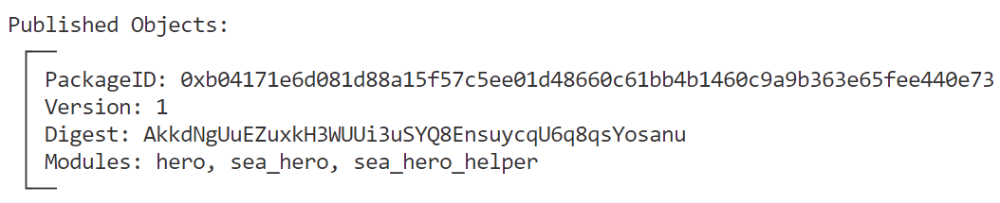
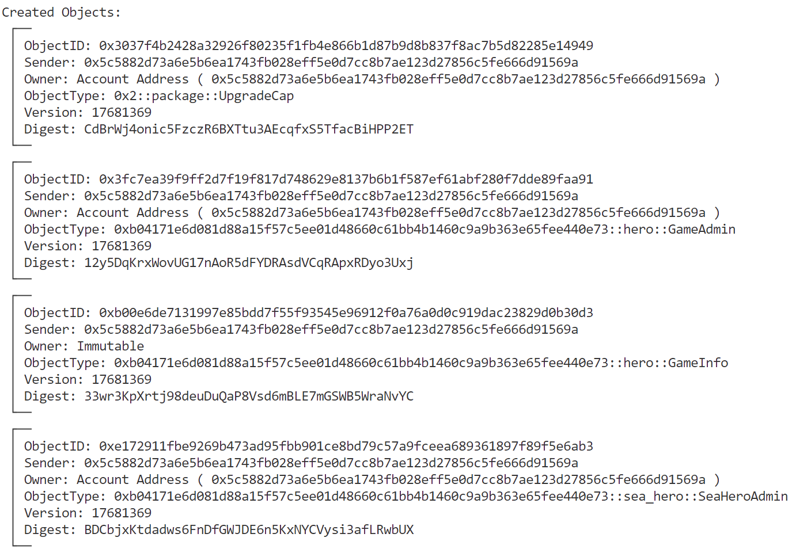

# SUI Move官方示例合约实践——游戏类：海洋英雄游戏（sea hero）

*rzexin 2024.02.02*

## 1 合约说明

### 1.1 功能介绍

- `Sea Hero`合约继承自`Hero`合约，但跟`Hero`合约不一样的地方是： **海洋英雄（`sea hero`） **不是通过消灭 **海怪（`sea monsters`）** 提升经验，而是获得`RUM token`奖励。
- 在海洋英雄自己战斗力不够的情况下，可以邀请战斗力更强的玩家帮助消灭海怪，但是在消灭海怪后，需要支付一定酬劳给帮助者，当然帮助者也可以拒绝协助。

### 1.2 官方合约示例代码

https://github.com/MystenLabs/sui/blob/main/sui_programmability/examples/games/sources/hero.move

https://github.com/MystenLabs/sui/blob/main/sui_programmability/examples/games/sources/sea_hero.move

https://github.com/MystenLabs/sui/blob/main/sui_programmability/examples/games/sources/sea_hero_helper.move

#### （1）合约创建

- 合约创建者即为游戏管理员，拥有`SeaHeroAdmin Cap`
- 该`Cap`里面记录了：
    - 已创建海怪数量（`monsters_created`）
    - 海怪最大数量（`monster_max`）
    - 已发行奖励代币数量（`supply`）
    - 奖励代币最大发行量（`token_supply_max`）

```rust
    #[allow(unused_function)]
    /// Get a treasury cap for the coin and give it to the admin
    // TODO: this leverages Move module initializers
    fun init(ctx: &mut TxContext) {
        transfer::transfer(
            SeaHeroAdmin {
                id: object::new(ctx),
                supply: balance::create_supply<RUM>(RUM {}),
                monsters_created: 0,
                token_supply_max: 1000000,
                monster_max: 10,
            },
            tx_context::sender(ctx)
        )
    }
```

#### （2）游戏管理员可以给玩家创建海怪（`create_monster`）

- 该合约接口会指定奖励代币的数量（`reward_amount`）,一旦玩家战胜了海怪，将会得到该笔奖励。该奖励代币数量和已发行的数量之和需要低于发行上限（`token_supply_max`）
- 海怪数量也不能超过上限

```rust
    /// Game admin can create a monster wrapping a coin worth `reward` and send
    /// it to `recipient`
    public entry fun create_monster(
        admin: &mut SeaHeroAdmin,
        reward_amount: u64,
        recipient: address,
        ctx: &mut TxContext
    ) {
        let current_coin_supply = balance::supply_value(&admin.supply);
        let token_supply_max = admin.token_supply_max;
        // TODO: create error codes
        // ensure token supply cap is respected
        assert!(reward_amount < token_supply_max, 0);
        assert!(token_supply_max - reward_amount >= current_coin_supply, 1);
        // ensure monster supply cap is respected
        assert!(admin.monster_max - 1 >= admin.monsters_created, 2);

        let monster = SeaMonster {
            id: object::new(ctx),
            reward: balance::increase_supply(&mut admin.supply, reward_amount),
        };
        admin.monsters_created = admin.monsters_created + 1;

        transfer::public_transfer(monster, recipient)
    }
```

#### （3）玩家攻击海怪（`slay`）

- 逻辑比较简单，只要玩家的战斗力不小于海怪奖励代币数量，即可战胜海怪，得到奖励
- 反之会报错，提示玩家不够强大

```rust
    /// Slay the `monster` with the `hero`'s sword, earn RUM tokens in
    /// exchange.
    /// Aborts if the hero is not strong enough to slay the monster
    public fun slay(hero: &Hero, monster: SeaMonster): Balance<RUM> {
        let SeaMonster { id, reward } = monster;
        object::delete(id);
        // Hero needs strength greater than the reward value to defeat the
        // monster
        assert!(
            hero::hero_strength(hero) >= balance::value(&reward),
            EHERO_NOT_STRONG_ENOUGH
        );

        reward
    }
```

#### （4）玩家请求其他玩家协助（`create`）

- 若玩家不够强大无法战胜海怪，可以将海怪转移给其他玩家协助攻击海怪
- 玩家需要提供协助奖励（`helper_reward`）,当协助者帮助战胜海怪后，将会得到该笔奖励

```rust
    /// Create an offer for `helper` to slay the monster in exchange for
    /// some of the reward
    public fun create(
        monster: SeaMonster,
        helper_reward: u64,
        helper: address,
        ctx: &mut TxContext,
    ) {
        // make sure the advertised reward is not too large + that the owner
        // gets a nonzero reward
        assert!(
            sea_hero::monster_reward(&monster) > helper_reward,
            EINVALID_HELPER_REWARD
        );
        transfer::transfer(
            HelpMeSlayThisMonster {
                id: object::new(ctx),
                monster,
                monster_owner: tx_context::sender(ctx),
                helper_reward
            },
            helper
        )
    }
```

#### （5）协助者攻击海怪（`slay`）

- 协助者如果成功消灭海怪，将会分的奖励（`helper_reward`）
- 请求者将会获得剩余部分奖励

```rust
    /// Helper should call this if they are willing to help out and slay the
    /// monster.
    public fun slay(
        hero: &Hero, wrapper: HelpMeSlayThisMonster, ctx: &mut TxContext,
    ): Coin<RUM> {
        let HelpMeSlayThisMonster {
            id,
            monster,
            monster_owner,
            helper_reward
        } = wrapper;
        object::delete(id);
        let owner_reward = sea_hero::slay(hero, monster);
        let helper_reward = coin::take(&mut owner_reward, helper_reward, ctx);
        transfer::public_transfer(coin::from_balance(owner_reward, ctx), monster_owner);
        helper_reward
    }
```

- 新增`helper_slay`方法，用于协助者攻击海怪并获得奖励

```rust
    public entry fun helper_slay(hero: &Hero, wrapper: HelpMeSlayThisMonster, ctx: &mut TxContext) {
        let helper_reward= slay(hero, wrapper, ctx);
        let sender = tx_context::sender(ctx);
        transfer::public_transfer(helper_reward, sender);
    }
```

#### （6）协助者退回海怪

- 如果协助者不想帮助攻击海怪，可以将海怪归还请求者

```rust
    /// Helper can call this if they can't help slay the monster or don't want
    /// to, and are willing to kindly return the monster to its owner.
    public fun return_to_owner(wrapper: HelpMeSlayThisMonster) {
        let HelpMeSlayThisMonster {
            id,
            monster,
            monster_owner,
            helper_reward: _
        } = wrapper;
        object::delete(id);
        transfer::public_transfer(monster, monster_owner)
    }
```

## 2 前置准备

### 2.1 帐号准备及角色分配

| 别名  | 地址                                                         | 角色                          |
| ----- | ------------------------------------------------------------ | ----------------------------- |
| Jason | `0x5c5882d73a6e5b6ea1743fb028eff5e0d7cc8b7ae123d27856c5fe666d91569a` | 游戏创建者、管理员            |
| Alice | `0x2d178b9704706393d2630fe6cf9415c2c50b181e9e3c7a977237bb2929f82d19` | 游戏玩家1（低战斗力，请求者） |
| Bob   | `0xf2e6ffef7d0543e258d4c47a53d6fa9872de4630cc186950accbd83415b009f0` | 游戏玩家2（高战斗力，协作者） |

- **将地址添加到环境变量**

```bash
export JASON=0x5c5882d73a6e5b6ea1743fb028eff5e0d7cc8b7ae123d27856c5fe666d91569a
export ALICE=0x2d178b9704706393d2630fe6cf9415c2c50b181e9e3c7a977237bb2929f82d19
export BOB=0xf2e6ffef7d0543e258d4c47a53d6fa9872de4630cc186950accbd83415b009f0
```

## 3 合约部署

> 切换到Jason账号

```bash
$ sui client publish --gas-budget 100000000
Transaction Digest: AUHDntpL4yKbKEzJ9N9Qq1TRuMwx7LgWqwqi5FjaNEi1
```

- **命令输出关键信息截图**





- **将关键的对象ID记录到环境变量，方便后续调用使用**

```bash
export PACKAGE_ID=0xb04171e6d081d88a15f57c5ee01d48660c61bb4b1460c9a9b363e65fee440e73

# PACKAGE_ID::hero::GameInfo
export GAME_INFO=0xb00e6de7131997e85bdd7f55f93545e96912f0a76a0d0c919dac23829d0b30d3

# PACKAGE_ID::hero::GameAdmin
export GAME_ADMIN=0x3fc7ea39f9ff2d7f19f817d748629e8137b6b1f587ef61abf280f7dde89faa91

# PACKAGE_ID::sea_hero::SeaHeroAdmin
export SEA_HERO_ADMIN=0xe172911fbe9269b473ad95fbb901ce8bd79c57a9fceea689361897f89f5e6ab3
```

## 4 合约交互

### 4.1 玩家Alice购买英雄

> 切换到Alice，购买的最低金额为100

```bash
export COIN_ALICE=0xb25963407647eaf4131374904870592c19d5aa6fdde1584dfe61829a9d1ffe6f  # 含有100

sui client call --function acquire_hero --package $PACKAGE_ID --module hero --args $GAME_INFO $COIN_ALICE --gas-budget 10000000
```

- **玩家获得英雄**


- **记录英雄对象ID**

```bash
# PACKAGE_ID::hero::Hero
export HERO_ALICE=0xcfdcfff8d450994b18a17efd7a6a83a482d8bdb7b054b7d199cc86511a9fe4f3
```

- **查看英雄**

```bash
sui client object $HERO_ALICE
```


### 4.2 玩家Bob购买英雄

> 切换到Bob，购买的最低金额为100

```bash
export COIN_BOB=0x9dd8c0daf2bbdcd4efaf179cdef6e9383b80a1de2b7851f6293e8f721037d7cf  # 含有800

sui client call --function acquire_hero --package $PACKAGE_ID --module hero --args $GAME_INFO $COIN_BOB --gas-budget 10000000
```

- **玩家获得英雄**


- **记录英雄对象ID**

```bash
# PACKAGE_ID::hero::Hero
export HERO_BOB=0x6f5998928446974e8b7c8e643248da4a7106fb949fb5fcd91758eb83b9809517
```

- **查看英雄**

```bash
sui client object $HERO_BOB
```


### 4.3 管理员为玩家Alice创建海怪

> 切换到Jason

```bash
export REWARD_AMOUNT=5
sui client call --function create_monster --package $PACKAGE_ID --module sea_hero --args $SEA_HERO_ADMIN $REWARD_AMOUNT $ALICE --gas-budget 10000000
```

- **得到海怪对象**

```bash
# PACKAGE_ID::sea_hero::SeaMonster
export SEA_MONSTER=0x32e3704658fa44b0e7a25395888411495997e335364f6788438a2468dd70612d
```


- **查看海怪对象**

```bash
sui client object $SEA_MONSTER
```


### 4.4 玩家Alice攻击海怪（失败）

> 切换到Alice，执行攻击操作，因为Alice初始战斗力为1，不足以消灭海怪，本地调用会失败

```bash
sui client call --function slay --package $PACKAGE_ID --module sea_hero --args $HERO_ALICE $SEA_MONSTER --gas-budget 10000000

Error executing transaction: Failure {
    error: "MoveAbort(MoveLocation { module: ModuleId { address: b04171e6d081d88a15f57c5ee01d48660c61bb4b1460c9a9b363e65fee440e73, name: Identifier(\"sea_hero\") }, function: 1, instruction: 12, function_name: Some(\"slay\") }, 0) in command 0",
}
```

### 4.5 玩家Alice请求玩家Bob帮助消灭海怪

> 切换到Alice，提供帮助奖励为2

```bash
export HELPER_REWARD=2
sui client call --function create --package $PACKAGE_ID --module sea_hero_helper --args $SEA_MONSTER $HELPER_REWARD $BOB --gas-budget 10000000
```

- **得到帮助杀怪对象**

```rust
# PACKAGE_ID::sea_hero_helper::HelpMeSlayThisMonster
export HELP_ME=0x50150fe807b684659ebd0b91f4124f31d991b54f6176075d12a4f183d8ef063d
```


- **查看帮助杀怪对象**

```bash
sui client object $HELP_ME
```


### 4.6 玩家Bob攻击海怪（胜利）

> 切换到Bob，因Bob初始战斗力为8，可以消灭奖励为5的海怪

```bash
sui client call --function helper_slay --package $PACKAGE_ID --module sea_hero_helper --args $HERO_BOB $HELP_ME --gas-budget 10000000
```

- **成功战胜海怪后，对奖励做了拆分，请求者将获得3枚代币，协助者将获得2枚代币**


- **经查看对象符合预期**


### 4.7 玩家Bob退回海怪

> 切换到Bob

- 如果玩家Bob不愿意协助Alice攻击海怪，可以调用`return_to_owner`接口原路退回海怪。

```bash
sui client call --function return_to_owner --package $PACKAGE_ID --module sea_hero_helper --args $HELP_ME --gas-budget 10000000
```
