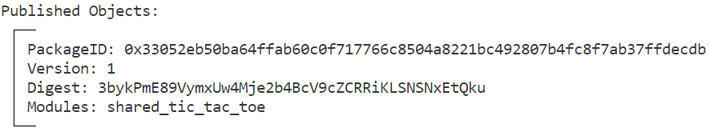
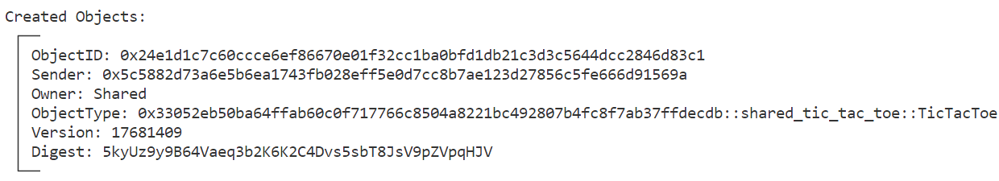
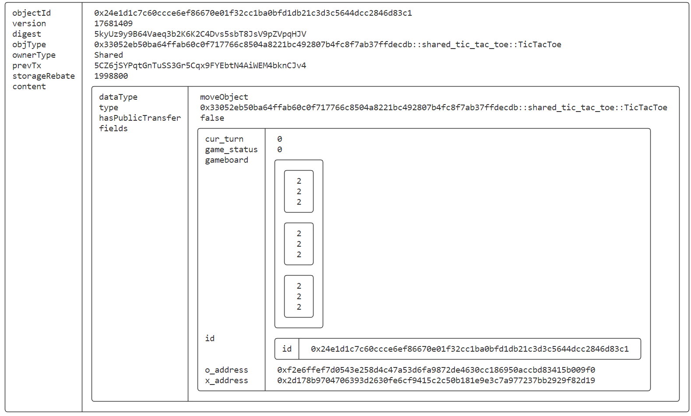
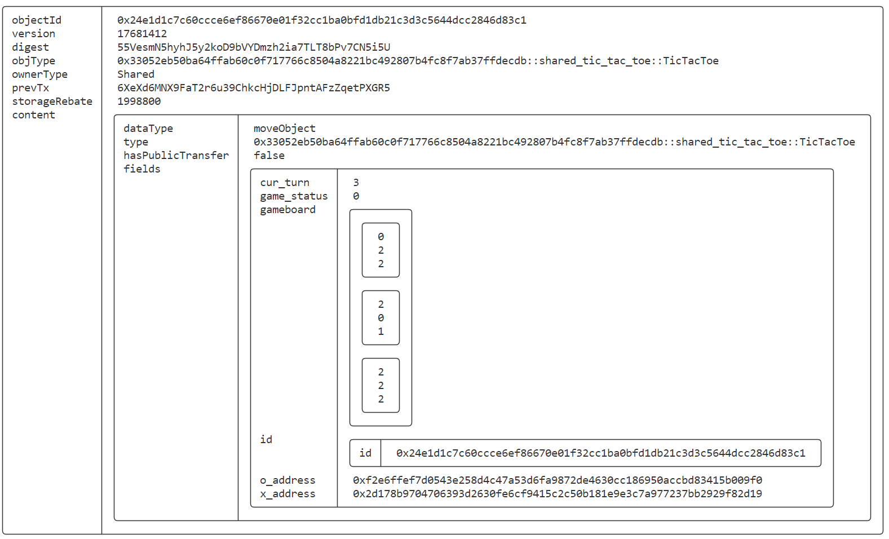
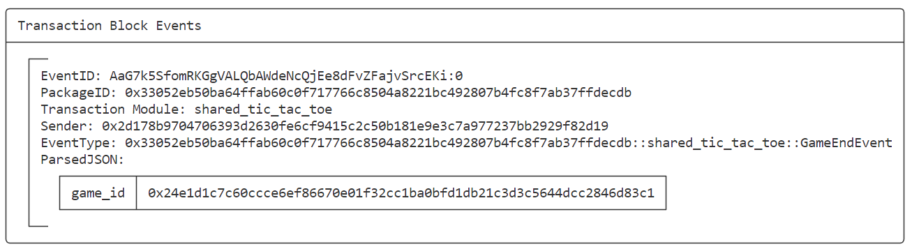
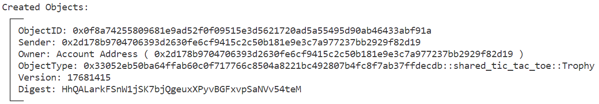
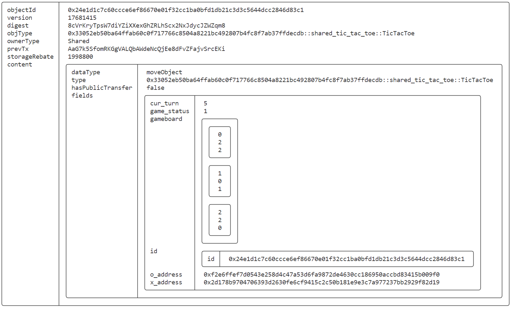

# SUI Move官方示例合约实践——游戏类：共享对象版井字游戏（shared_tic_tac_toe）

*rzexin 2024.02.05*

## 1 合约说明

### 1.1 功能介绍

- 本合约是共享对象版的井字游戏。
- 与中心化版本的井字游戏不同，中心化版的游戏对象归管理员所有，玩家不能够直接更新棋盘，而只能提交标记给管理员，由管理员去更新棋盘标记。因此，每个标记的放置都需要两个交易
- 而共享对象版的井字合约，游戏对象是一个共享对象，两个玩家都可以访问并更改游戏对象，因此他们可以直接在一个事务中放置标记
- 使用共享对象会产生额外的成本，因需要对更改共享对象的操作进行排序。但由于实际玩家会轮流放置标记，在实践中不会有很大的开销。通过使用共享对象，实现比其他实现方式更简单


### 1.2 官方合约示例代码

https://github.com/MystenLabs/sui/blob/main/sui_programmability/examples/games/sources/shared_tic_tac_toe.move

> 合约代码较长，以下仅摘取对外接口代码

#### （1）创建游戏（`create_game`）

- 任意玩家创建游戏，初始化棋盘，创建`TicTacToe`游戏**共享对象**，指定游戏对战双方的地址

```rust
    /// `x_address` and `o_address` are the account address of the two players.
    public entry fun create_game(x_address: address, o_address: address, ctx: &mut TxContext) {
        // TODO: Validate sender address, only GameAdmin can create games.

        let id = object::new(ctx);
        let gameboard = vector[
            vector[MARK_EMPTY, MARK_EMPTY, MARK_EMPTY],
            vector[MARK_EMPTY, MARK_EMPTY, MARK_EMPTY],
            vector[MARK_EMPTY, MARK_EMPTY, MARK_EMPTY],
        ];
        let game = TicTacToe {
            id,
            gameboard,
            cur_turn: 0,
            game_status: IN_PROGRESS,
            x_address: x_address,
            o_address: o_address,
        };
        // Make the game a shared object so that both players can mutate it.
        transfer::share_object(game);
    }
```

#### （2）玩家放置标记（`place_mark`）

- 任意玩家都可以去放置标记，但会校验，如果不是本局玩家地址，就将报错
- 如果游戏结束，便会抛出事件`GameEndEvent`，用于删除游戏
- 若有冠军产生，便会为冠军地址颁发奖杯

```rust
    public entry fun place_mark(game: &mut TicTacToe, row: u8, col: u8, ctx: &mut TxContext) {
        assert!(row < 3 && col < 3, EInvalidLocation);
        assert!(game.game_status == IN_PROGRESS, EGameEnded);
        let addr = get_cur_turn_address(game);
        assert!(addr == tx_context::sender(ctx), EInvalidTurn);

        let cell = vector::borrow_mut(vector::borrow_mut(&mut game.gameboard, (row as u64)), (col as u64));
        assert!(*cell == MARK_EMPTY, ECellOccupied);

        *cell = game.cur_turn % 2;
        update_winner(game);
        game.cur_turn = game.cur_turn + 1;

        if (game.game_status != IN_PROGRESS) {
            // Notify the server that the game ended so that it can delete the game.
            event::emit(GameEndEvent { game_id: object::id(game) });
            if (game.game_status == X_WIN) {
                transfer::transfer(Trophy { id: object::new(ctx) }, game.x_address);
            } else if (game.game_status == O_WIN) {
                transfer::transfer(Trophy { id: object::new(ctx) }, game.o_address);
            }
        }
    }
```

#### （3）删除游戏（`delete_game`）

- 任何人均可删除棋盘，并销毁游戏

```rust
    public entry fun delete_game(game: TicTacToe) {
        let TicTacToe { id, gameboard: _, cur_turn: _, game_status: _, x_address: _, o_address: _ } = game;
        object::delete(id);
    }
```

## 2 前置准备

### 2.1 帐号准备及角色分配

| 别名  | 地址                                                         | 角色                       |
| ----- | ------------------------------------------------------------ | -------------------------- |
| Jason | `0x5c5882d73a6e5b6ea1743fb028eff5e0d7cc8b7ae123d27856c5fe666d91569a` | 游戏创建者（只创建不管事） |
| Alice | `0x2d178b9704706393d2630fe6cf9415c2c50b181e9e3c7a977237bb2929f82d19` | 玩家X                      |
| Bob   | `0xf2e6ffef7d0543e258d4c47a53d6fa9872de4630cc186950accbd83415b009f0` | 玩家O                      |

- **将地址添加到环境变量**

```bash
export JASON=0x5c5882d73a6e5b6ea1743fb028eff5e0d7cc8b7ae123d27856c5fe666d91569a
export ALICE=0x2d178b9704706393d2630fe6cf9415c2c50b181e9e3c7a977237bb2929f82d19
export BOB=0xf2e6ffef7d0543e258d4c47a53d6fa9872de4630cc186950accbd83415b009f0
```

## 3 合约部署

> 切换到Jason账号

```bash
sui client publish --gas-budget 100000000
```

- **命令输出关键信息截图**



- **将关键的对象ID记录到环境变量，方便后续调用使用**

```bash
export PACKAGE_ID=0x33052eb50ba64ffab60c0f717766c8504a8221bc492807b4fc8f7ab37ffdecdb
```

## 4 合约交互

### 4.1 创建游戏（`create_game`）

> 切换到Jason

```bash
sui client call --function create_game --package $PACKAGE_ID --module shared_tic_tac_toe --args $ALICE $BOB --gas-budget 10000000
```

- **获得共享游戏对象**



- **记录游戏对象ID**

```bash
# PACKAGE_ID::shared_tic_tac_toe::TicTacToe
export GAME=0x24e1d1c7c60ccce6ef86670e01f32cc1ba0bfd1db21c3d3c5644dcc2846d83c1
```

- **查看游戏**

```bash
sui client object $GAME
```



### 4.2 玩家X放置标记（`place_mark`）

> 切换到Alice

```bash
sui client call --function place_mark --package $PACKAGE_ID --module shared_tic_tac_toe --args $GAME 0 0 --gas-budget 10000000
```


- **查看当前GAME对象**

```bash
$ sui client object $GAME
```


### 4.3 玩家O放置标记（`place_mark`）

> 切换到Bob

```bash
sui client call --function place_mark --package $PACKAGE_ID --module shared_tic_tac_toe --args $GAME 1 2 --gas-budget 10000000
```


- **查看当前GAME对象**

```bash
$ sui client object $GAME
```


### 4.4 玩家X放置标记（`place_mark`）

> 切换到Alice

```bash
sui client call --function place_mark --package $PACKAGE_ID --module shared_tic_tac_toe --args $GAME 1 1 --gas-budget 10000000
```


- **查看当前GAME对象**

```bash
$ sui client object $GAME
```



### 4.5 玩家O放置标记（`place_mark`）

> 切换到Bob

```bash
sui client call --function place_mark --package $PACKAGE_ID --module shared_tic_tac_toe --args $GAME 1 0 --gas-budget 10000000
```

- **查看当前GAME对象**

```bash
$ sui client object $GAME
```


###  4.6 玩家X放置标记（冠军产生）

> 切换到Alice

```bash
sui client call --function place_mark --package $PACKAGE_ID --module shared_tic_tac_toe --args $GAME 2 2 --gas-budget 10000000
```


- **冠军产生，抛出游戏结束事件**



- **为获胜者Alice颁发奖杯**



- **查看当前GAME对象**

```bash
sui client object $GAME
```



### 4.7 删除游戏（`delete_game`）

> 当前实现没有权限控制，任何人可以删除游戏（可完善）

```bash
sui client call --function delete_game --package $PACKAGE_ID --module shared_tic_tac_toe --args $GAME --gas-budget 10000000
```

