# SUI Move官方示例合约实践——游戏类：井字游戏（tic_tac_toe）

*rzexin 2024.02.04*

## 1 合约说明

### 1.1 功能介绍

- `Tic-Tac-Toe`即井字游戏，又称井字棋。玩法是有两个玩家，一个打圈（◯），一个打叉（✗），轮流在3乘3的格上打自己的符号，最先以横、直、斜连成一线则为胜。


- 该合约是一个中心化的井字游戏游戏合约，游戏对象（`TicTacToe`），包括游戏棋盘、游戏参与双方地址、游戏状态等，都由游戏管理员拥有。 
- 由于玩家没有游戏对象的所有权,因此他们无法直接更改游戏棋盘。游戏玩家只具备打标记的权利（`MarkMintCap`），他们可以调用合约接口`send_mark_to_game`创建一个带有放置信息的标记对象（`Mark`），并将标记发送给管理员来表明他们放置标记的意图。 
- 游戏管理员监听标记放置事件并对其作出响应。收到事件后，管理员将调用`place_mark`尝试在游戏棋盘上放置其标记。每次放心标记后，都会检测（`update_winner`）是否已经产生获胜方。若产生了获胜方便会将“奖杯”转到获胜方的地址。
- 可见每个标记放置操作始终需要两个交易，一个由玩家发起，另一个由管理员发起。 这也意味着我们需要信任中心化管理员服务的可靠性
- 下一篇文章将会展示共享对象版的井字游戏（`shared_tic_tac_toe`），使用共享对象更昂贵， 但它消除了中心化服务的依赖。

### 1.2 官方合约示例代码

https://github.com/MystenLabs/sui/blob/main/sui_programmability/examples/games/sources/tic_tac_toe.move

#### （1）创建游戏（`create_game`）

- 管理员创建游戏，初始化棋盘，创建`TicTacToe`游戏对象，指定游戏对战双方的地址，该游戏对象会转发给管理员
- 为游戏双方创建`MarkMintCap`对象

```rust
	/// `x_address` and `o_address` are the account address of the two players.
    public entry fun create_game(x_address: address, o_address: address, ctx: &mut TxContext) {
        // TODO: Validate sender address, only GameAdmin can create games.

        let id = object::new(ctx);
        let game_id = object::uid_to_inner(&id);
        let gameboard = vector[
            vector[option::none(), option::none(), option::none()],
            vector[option::none(), option::none(), option::none()],
            vector[option::none(), option::none(), option::none()],
        ];
        let game = TicTacToe {
            id,
            gameboard,
            cur_turn: 0,
            game_status: IN_PROGRESS,
            x_address: x_address,
            o_address: o_address,
        };
        transfer::transfer(game, tx_context::sender(ctx));
        let cap = MarkMintCap {
            id: object::new(ctx),
            game_id,
            remaining_supply: 5,
        };
        transfer::transfer(cap, x_address);
        let cap = MarkMintCap {
            id: object::new(ctx),
            game_id,
            remaining_supply: 5,
        };
        transfer::transfer(cap, o_address);
    }
```

#### （2）玩家创建标记对象（`send_mark_to_game`）

- 游戏玩家创建标记对象（`Mark`）给游戏管理员
- 并触发`MarkSentEvent`事件

```rust
    /// Generate a new mark intended for location (row, col).
    /// This new mark is not yet placed, just transferred to the game.
    public entry fun send_mark_to_game(
        cap: &mut MarkMintCap,
        game_address: address,
        row: u64,
        col: u64,
        ctx: &mut TxContext,
    ) {
        if (row > 2 || col > 2) {
            abort EInvalidLocation
        };
        let mark = mint_mark(cap, row, col, ctx);
        // Once an event is emitted, it should be observed by a game server.
        // The game server will then call `place_mark` to place this mark.
        event::emit(MarkSentEvent {
            game_id: *&cap.game_id,
            mark_id: object::id(&mark),
        });
        transfer::public_transfer(mark, game_address);
    }
```

#### （3）管理员放置标记（`place_mark`）

- 游戏管理员监听标记放置事件并对其作出响应
- 收到事件后，管理员将调用`place_mark`尝试在游戏棋盘上放置其标记
- 每次放心标记后，都会检测（`update_winner`）是否已经产生获胜方
- 若产生了获胜方便会将“奖杯”转到获胜方的地址

```rust
    public entry fun place_mark(game: &mut TicTacToe, mark: Mark, ctx: &mut TxContext) {
        // If we are placing the mark at the wrong turn, or if game has ended,
        // destroy the mark.
        let addr = get_cur_turn_address(game);
        if (game.game_status != IN_PROGRESS || &addr != &mark.player) {
            delete_mark(mark);
            return
        };
        let cell = get_cell_mut_ref(game, mark.row, mark.col);
        if (option::is_some(cell)) {
            // There is already a mark in the desired location.
            // Destroy the mark.
            delete_mark(mark);
            return
        };
        option::fill(cell, mark);
        update_winner(game);
        game.cur_turn = game.cur_turn + 1;

        if (game.game_status != IN_PROGRESS) {
            // Notify the server that the game ended so that it can delete the game.
            event::emit(GameEndEvent { game_id: object::id(game) });
            if (game.game_status == X_WIN) {
                transfer::transfer(Trophy { id: object::new(ctx) }, *&game.x_address);
            } else if (game.game_status == O_WIN) {
                transfer::transfer(Trophy { id: object::new(ctx) }, *&game.o_address);
            }
        }
    }
```

#### （4）管理员删除游戏（`delete_game`）

- 游戏管理员可以删除棋盘，并销毁游戏

```rust
    public entry fun delete_game(game: TicTacToe) {
        let TicTacToe { id, gameboard, cur_turn: _, game_status: _, x_address: _, o_address: _ } = game;
        while (vector::length(&gameboard) > 0) {
            let row = vector::pop_back(&mut gameboard);
            while (vector::length(&row) > 0) {
                let element = vector::pop_back(&mut row);
                if (option::is_some(&element)) {
                    let mark = option::extract(&mut element);
                    delete_mark(mark);
                };
                option::destroy_none(element);
            };
            vector::destroy_empty(row);
        };
        vector::destroy_empty(gameboard);
        object::delete(id);
    }
```

## 2 前置准备

### 2.1 帐号准备及角色分配

| 别名  | 地址                                                         | 角色       |
| ----- | ------------------------------------------------------------ | ---------- |
| Jason | `0x5c5882d73a6e5b6ea1743fb028eff5e0d7cc8b7ae123d27856c5fe666d91569a` | 游戏管理员 |
| Alice | `0x2d178b9704706393d2630fe6cf9415c2c50b181e9e3c7a977237bb2929f82d19` | 玩家X      |
| Bob   | `0xf2e6ffef7d0543e258d4c47a53d6fa9872de4630cc186950accbd83415b009f0` | 玩家O      |

- **将地址添加到环境变量**

```bash
export JASON=0x5c5882d73a6e5b6ea1743fb028eff5e0d7cc8b7ae123d27856c5fe666d91569a
export ALICE=0x2d178b9704706393d2630fe6cf9415c2c50b181e9e3c7a977237bb2929f82d19
export BOB=0xf2e6ffef7d0543e258d4c47a53d6fa9872de4630cc186950accbd83415b009f0
```

## 3 合约部署

> 切换到Jason账号

```bash
sui client publish --gas-budget 100000000
```

- **命令输出关键信息截图**

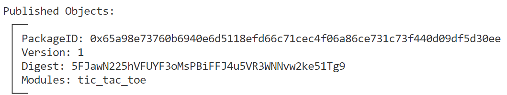

- **将关键的对象ID记录到环境变量，方便后续调用使用**

```bash
export PACKAGE_ID=0x65a98e73760b6940e6d5118efd66c71cec4f06a86ce731c73f440d09df5d30ee
```

## 4 合约交互

### 4.1 创建游戏（`create_game`）

> 切换到Jason

```bash
sui client call --function create_game --package $PACKAGE_ID --module tic_tac_toe --args $ALICE $BOB --gas-budget 10000000
```

- **获得游戏对象**

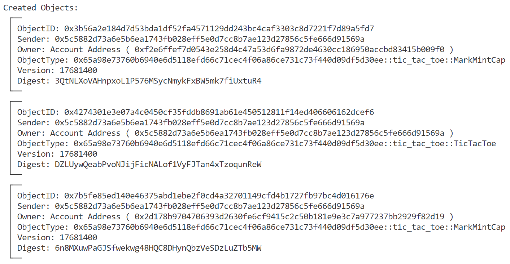

- **记录游戏对象ID**

```bash
# PACKAGE_ID::tic_tac_toe::TicTacToe
export GAME=0x4274301e3e07a4c0450cf35fddb8691ab61e450512811f14ed406606162dcef6

# PACKAGE_ID::tic_tac_toe::MarkMintCap
export MARK_MINT_CAP_ALICE_X=0x7b5fe85ed140e46375abd1ebe2f0cd4a32701149cfd4b1727fb97bc4d016176e
export MARK_MINT_CAP_BOB_O=0x3b56a2e184d7d53bda1df52fa4571129dd243bc4caf3303c8d7221f7d89a5fd7
```

- **查看游戏**

```bash
sui client object $GAME
```

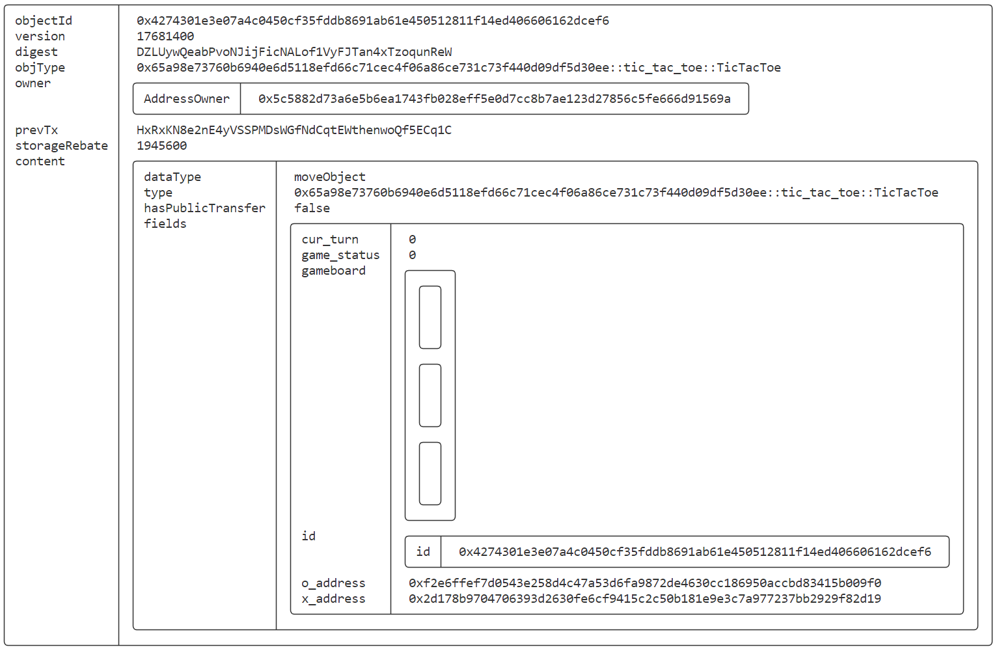

### 4.2 玩家创建标记对象（`send_mark_to_game`）

> 切换Alice

```bash
sui client call --function send_mark_to_game --package $PACKAGE_ID --module tic_tac_toe --args $MARK_MINT_CAP_ALICE_X $JASON 0 0 --gas-budget 10000000
```


- **抛出事件**

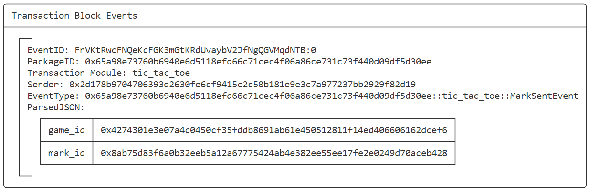

- **玩家X Mark对象创建完成**

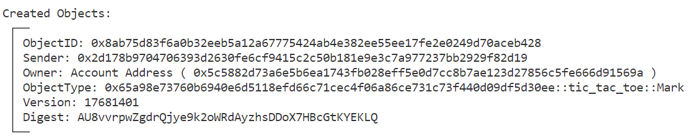

- **记录玩家X Mark对象ID**

```bash
# PACKAGE_ID::tic_tac_toe::Mark
export MARK_ALICE_X=0x8ab75d83f6a0b32eeb5a12a67775424ab4e382ee55ee17fe2e0249d70aceb428
```

- **查看玩家X Mark对象**

```bash
sui client object $MARK_ALICE_X
```

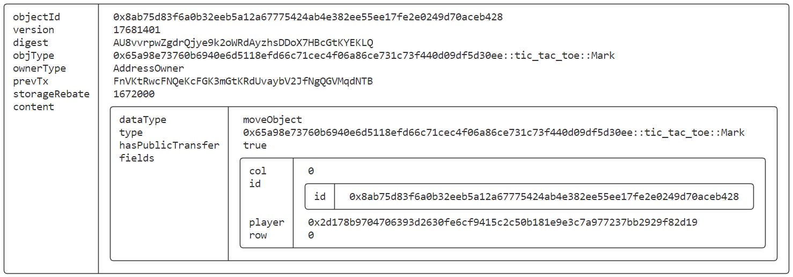

### 4.3 管理员放置标记（`place_mark`）

> 切换到Jason，管理员监听到玩家X创建的Mark对象事件后，根据Mark对象进行棋盘的放置

```bash
sui client call --function place_mark --package $PACKAGE_ID --module tic_tac_toe --args $GAME $MARK_ALICE_X --gas-budget 10000000
```

- **查看当前GAME对象**

```bash
$ sui client object $GAME
```

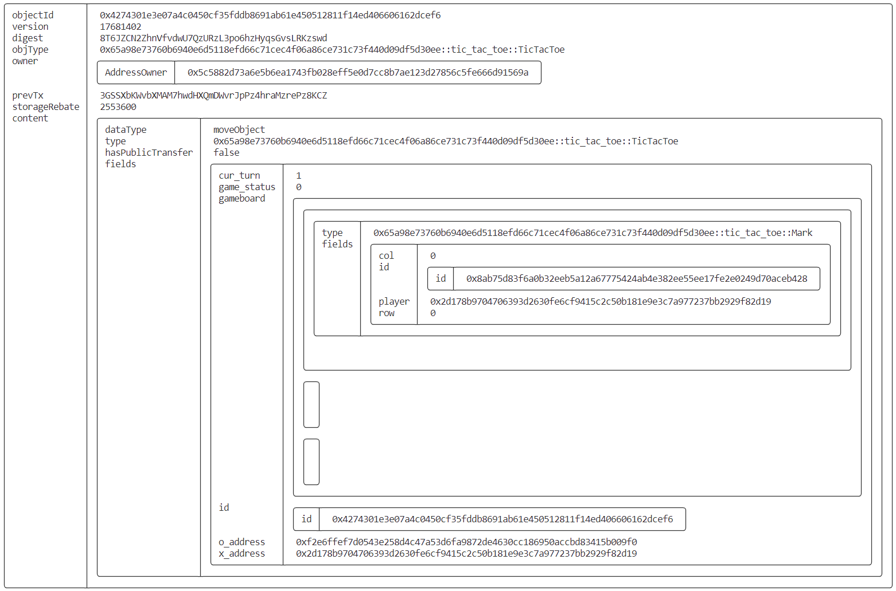

### 4.4 交替出棋中。。。

#### （1）玩家O创建标记对象

> 切换到Bob

```bash
sui client call --function send_mark_to_game --package $PACKAGE_ID --module tic_tac_toe --args $MARK_MINT_CAP_BOB_O $JASON 1 2 --gas-budget 10000000

export MARK_BOB_O=0x2f0d3aad177cbc9189e31ef97d344fb7348b5b082520b7f24e6faee08d6ded1d
```


#### （2）管理员放置标记

> 切换到Jason，管理员监听到玩家O创建的Mark对象事件后，根据Mark对象进行棋盘的放置

```bash
sui client call --function place_mark --package $PACKAGE_ID --module tic_tac_toe --args $GAME $MARK_BOB_O --gas-budget 10000000
```

- **查看当前GAME对象**

```bash
sui client object $GAME
```

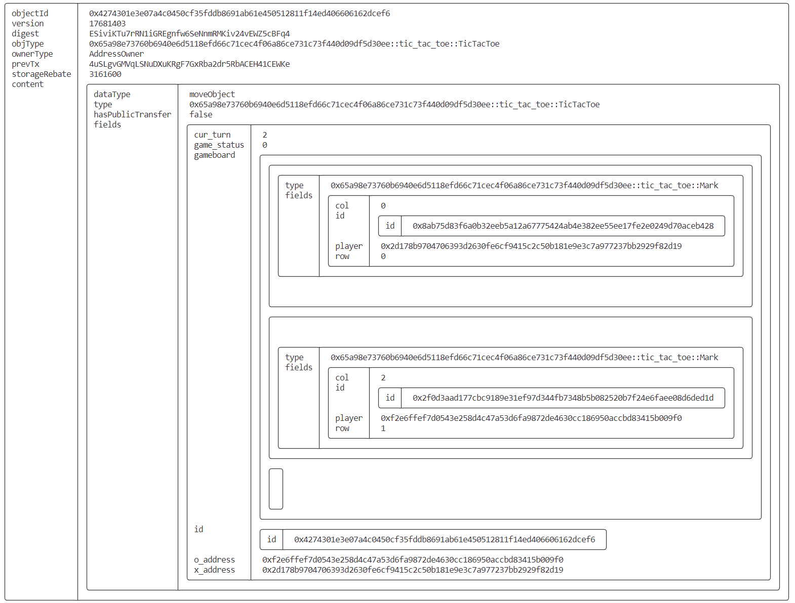

#### （3）玩家X创建标记对象

> 切换到Alice

```bash
sui client call --function send_mark_to_game --package $PACKAGE_ID --module tic_tac_toe --args $MARK_MINT_CAP_ALICE_X $JASON 1 1 --gas-budget 10000000

export MARK_ALICE_X=0xcef6776d2c1a9174bc3f127c8b8a5cc2108ee38fd9d50696479a482ec0aeb14e
```


#### （4）管理员放置标记

> 切换到Jason，管理员监听到玩家X创建的Mark对象事件后，根据Mark对象进行棋盘的放置

```bash
sui client call --function place_mark --package $PACKAGE_ID --module tic_tac_toe --args $GAME $MARK_ALICE_X --gas-budget 10000000
```

- **查看当前GAME对象**

```bash
sui client object $GAME
```

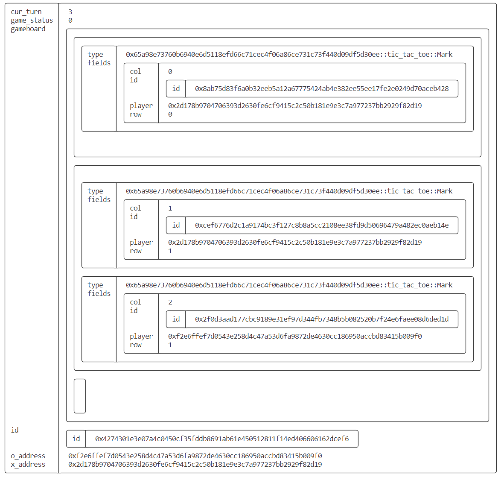

#### （5）玩家O创建标记对象

> 切换到Bob

```bash
sui client call --function send_mark_to_game --package $PACKAGE_ID --module tic_tac_toe --args $MARK_MINT_CAP_BOB_O $JASON 0 1  --gas-budget 10000000

export MARK_BOB_O=0xb5908f9936a0983cec6c1b7f0f388d23a56af78ed183c8a26a9c32301b315b7f
```


#### （6）管理员放置标记

> 切换到Jason，管理员监听到玩家O创建的Mark对象事件后，根据Mark对象进行棋盘的放置

```bash
sui client call --function place_mark --package $PACKAGE_ID --module tic_tac_toe --args $GAME $MARK_BOB_O --gas-budget 10000000
```

- **查看当前GAME对象**

```bash
sui client object $GAME
```

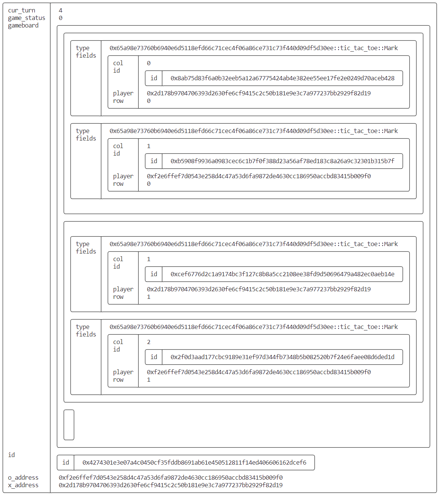

### 4.5 玩家X创建标记对象（最后一把）

> 切换到Alice

```bash
sui client call --function send_mark_to_game --package $PACKAGE_ID --module tic_tac_toe --args $MARK_MINT_CAP_ALICE_X $JASON 2 2 --gas-budget 10000000

export MARK_ALICE_X=0x32d526fd8d33bf282ba5443e350c4c9ad3b981fa37a063296ead3833dfac7f24
```


### 4.6 管理员放置标记（冠军产生）

> 切换到Jason，管理员监听到玩家X创建的Mark对象事件后，根据Mark对象进行棋盘的放置

```bash
sui client call --function place_mark --package $PACKAGE_ID --module tic_tac_toe --args $GAME $MARK_ALICE_X --gas-budget 10000000
```

- **冠军产生，抛出游戏结束事件**

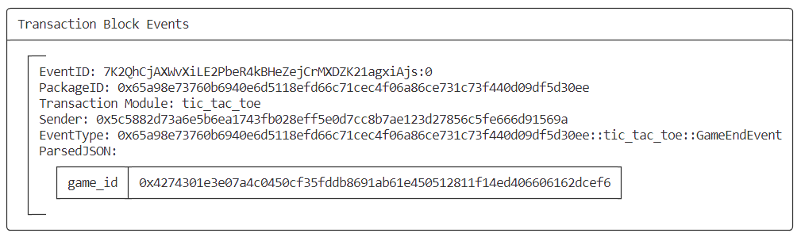

- **为获胜者Alice颁发奖杯**

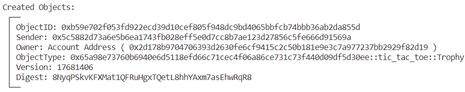


- **查看当前GAME对象**

```bash
sui client object $GAME
```

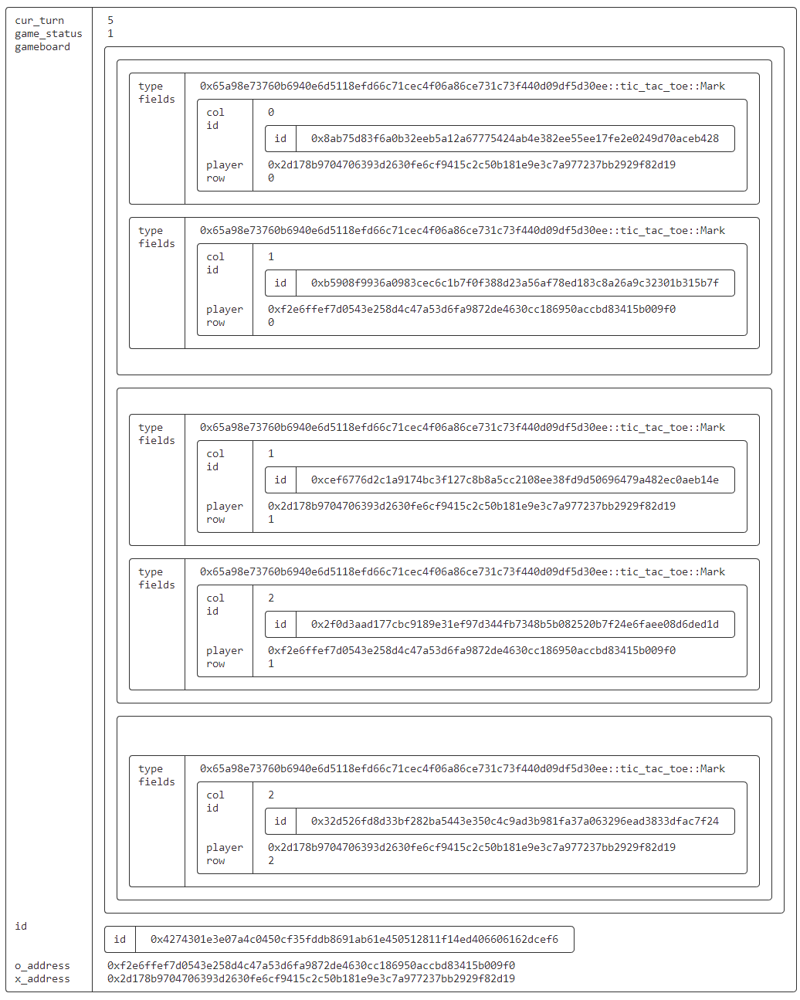

### 4.7 管理员删除游戏（`delete_game`）

> 切换到Jason

```bash
sui client call --function delete_game --package $PACKAGE_ID --module tic_tac_toe --args $GAME --gas-budget 10000000
Transaction Digest: BWZb4FmdgTrt6BrbRYYVgVf7coLgk1HpzuNEZnLBrtFD
```

- **删除GAME后，再次查看将会报错**

```bash
Internal error, cannot read the object: Object has been deleted object_id: 0x4274301e3e07a4c0450cf35fddb8691ab61e450512811f14ed406606162dcef6 at version: SequenceNumber(17681407) in digest o#7gyGAp71YXQRoxmFBaHxofQXAipvgHyBKPyxmdSJxyv
```

