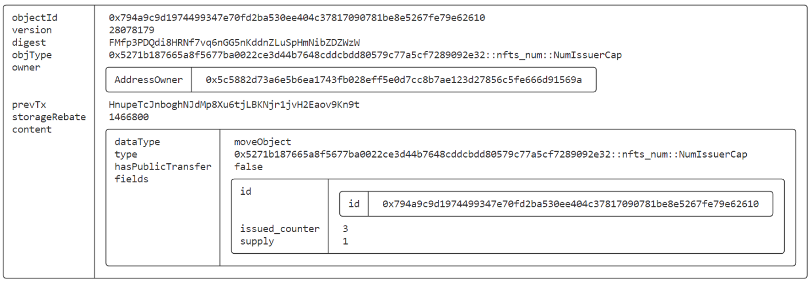

#  SUI Move官方示例合约实践——NFT类：数字（num）

*rzexin 2024.04.03*

## 1 合约说明

### 1.1 功能介绍

本合约是发行十个自然数字作为可收藏的`NFT`，数字依次递增，数字`NFT`可以被销毁，销毁后可以发行更大的数字，最多只允许存在10个数字`NFT`。

### 1.2 合约代码

#### 1.2.1 合约源码地址

https://github.com/MystenLabs/sui/blob/main/sui_programmability/examples/nfts/sources/num.move

#### 1.2.2 数据结构说明

##### （1）数字NFT的结构

成员变量说明：

- `n`：数字NFT的**数字**，递增

```rust
    /// Very silly NFT: a natural number!
    struct Num has key, store {
        id: UID,
        n: u64
    }
```

##### （2）发行人权限Cap结构

- `supply`：已发行总量，铸造会增加，销毁会减少，最大上限为`MAX_SUPPLY`
- `issued_counter`：已发行的数字，一直递增

```rust
    struct NumIssuerCap has key {
        id: UID,
        /// Number of NFT<Num>'s in circulation. Fluctuates with minting and burning.
        /// A maximum of `MAX_SUPPLY` NFT<Num>'s can exist at a given time.
        supply: u64,
        /// Total number of NFT<Num>'s that have been issued. Always <= `supply`.
        /// The next NFT<Num> to be issued will have the value of the counter.
        issued_counter: u64,
    }
```

#### 1.2.3 接口说明

##### （1）初始化（`init`）

- 创建`NumIssuerCap`转发给合约发布者，持有该`CAP`具备数字`NFT`的铸造和销毁权限

```rust
    #[allow(unused_function)]
    /// Create a unique issuer cap and give it to the transaction sender
    fun init(ctx: &mut TxContext) {
        let issuer_cap = NumIssuerCap {
            id: object::new(ctx),
            supply: 0,
            issued_counter: 0,
        };
        transfer::transfer(issuer_cap, tx_context::sender(ctx))
    }
```

##### （2）铸造数字NFT（`mint`）

- 数字`NFT`的数字就是读取`issued_counter`，而后将`issued_counter`自增
- 将已发行总量`+1`，并验证是否超过最大发行量（此处代码有`BUG`,修复之）
- 新增接口`mint_to_recipient`用于转移数字`NFT`到指定用户

```rust
    /// Create a new `Num` NFT. Aborts if `MAX_SUPPLY` NFT's have already been issued
    public fun mint(cap: &mut NumIssuerCap, ctx: &mut TxContext): Num {
        let n = cap.issued_counter;
        cap.issued_counter = n + 1;
        cap.supply = cap.supply + 1;
        // assert!(n <= MAX_SUPPLY, ETooManyNums);   // BUG
        assert!(cap.supply <= MAX_SUPPLY, ETooManyNums);
        Num { id: object::new(ctx), n }
    }

	// === ADD ===
    public fun mint_to_recipient(cap: &mut NumIssuerCap, recipient: address, ctx: &mut TxContext) {
        let num = mint(cap, ctx);
        transfer::public_transfer(num, recipient);
    }
```

##### （3）销毁数字NFT（`burn`）

- 将数字`NFT`进行解构并销毁
- 已发行总量`-1`

```rust
    /// Burn `nft`. This reduces the supply.
    /// Note: if we burn (e.g.) the NFT<Num> for 7, that means
    /// no Num with the value 7 can exist again! But if the supply
    /// is maxed out, burning will allow us to mint new Num's with
    /// higher values.
    public fun burn(cap: &mut NumIssuerCap, nft: Num) {
        let Num { id, n: _ } = nft;
        cap.supply = cap.supply - 1;
        object::delete(id);
    }
```

## 2 前置准备

### 2.1 帐号准备及角色分配

| 别名  | 地址                                                         | 角色          |
| ----- | ------------------------------------------------------------ | ------------- |
| Jason | `0x5c5882d73a6e5b6ea1743fb028eff5e0d7cc8b7ae123d27856c5fe666d91569a` | 数字NFT创建者 |
| Alice | `0x2d178b9704706393d2630fe6cf9415c2c50b181e9e3c7a977237bb2929f82d19` | 数字NFT接收者 |
| Bob   | `0xf2e6ffef7d0543e258d4c47a53d6fa9872de4630cc186950accbd83415b009f0` | 数字NFT接收者 |

- **将地址添加到环境变量**

```bash
export JASON=0x5c5882d73a6e5b6ea1743fb028eff5e0d7cc8b7ae123d27856c5fe666d91569a
export ALICE=0x2d178b9704706393d2630fe6cf9415c2c50b181e9e3c7a977237bb2929f82d19
export BOB=0xf2e6ffef7d0543e258d4c47a53d6fa9872de4630cc186950accbd83415b009f0
```

## 3 合约部署

> 切换到Jason账号

```bash
sui client publish --gas-budget 100000000
```

- **记录PACKAGE_ID**

```bash
export PACKAGE_ID=0x5271b187665a8f5677ba0022ce3d44b7648cddcbdd80579c77a5cf7289092e32
export NUM_ISSUER_CAP=0x794a9c9d1974499347e70fd2ba530ee404c37817090781be8e5267fe79e62610
```

## 4 合约交互

### 4.1 铸造数字NFT（`mint`）

```bash
sui client call --function mint_to_recipient --package $PACKAGE_ID --module nfts_num --args $NUM_ISSUER_CAP $JASON --gas-budget 10000000
sui client call --function mint_to_recipient --package $PACKAGE_ID --module nfts_num --args $NUM_ISSUER_CAP $ALICE --gas-budget 10000000
sui client call --function mint_to_recipient --package $PACKAGE_ID --module nfts_num --args $NUM_ISSUER_CAP $BOB --gas-budget 10000000
```

- **得到数字NFT**

```bash
export NUM_JASON=0x73e8914b73d9a12b034bb1a9f352f182fea21e1bdfc5378f8f109bf598d77ff9
export NUM_ALICE=0x4cbfe7d958694cca0a5594e921fa459ee15bfe974c26805c36343f4b2b705f88
export NUM_BOB=0xf87ddeefe7f009e0c281e6693db95d2d9751262ee3fa720bea9a18459b729517
```

- **查看`NUM_ISSUER_CAP`共享对象**

```bash
sui client object $NUM_ISSUER_CAP
```


### 4.2 销毁数字NFT（`burn`）

#### 4.2.1 销毁发行人的数字NFT

```bash
sui client call --function burn --package $PACKAGE_ID --module nfts_num --args $NUM_ISSUER_CAP $NUM_JASON --gas-budget 10000000
```


#### 4.2.2 销毁其他接收者的数字NFT

```bash
# 将数字NFT所有权转移给发行人
sui client switch --address alice
sui client transfer --object-id $NUM_ALICE --to $JASON --gas-budget 10000000

# 发行人销毁
sui client switch --address jason
sui client call --function burn --package $PACKAGE_ID --module nfts_num --args $NUM_ISSUER_CAP $NUM_ALICE --gas-budget 10000000
```





