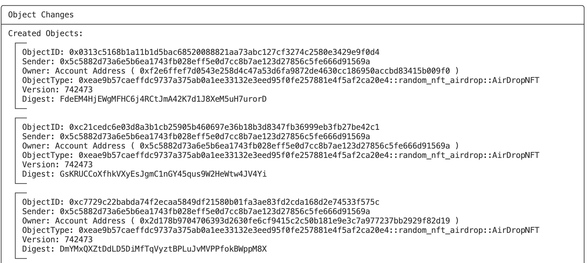
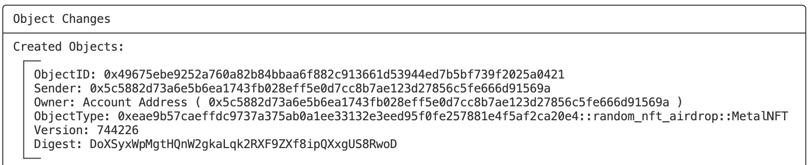
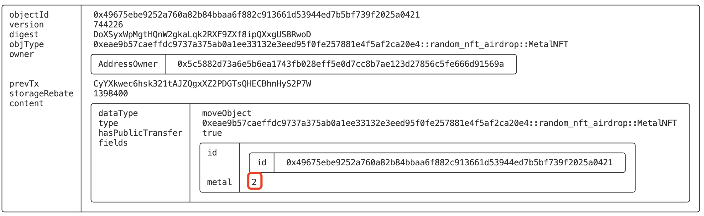
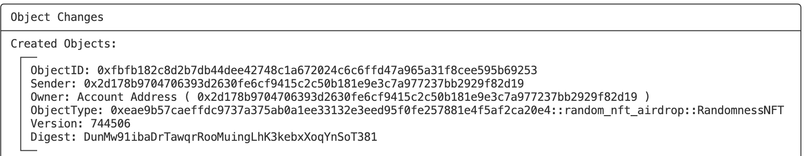
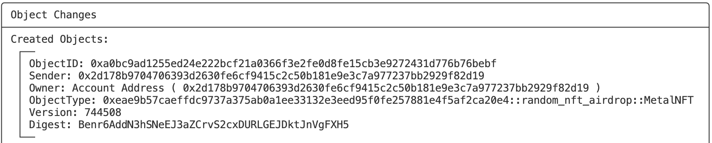
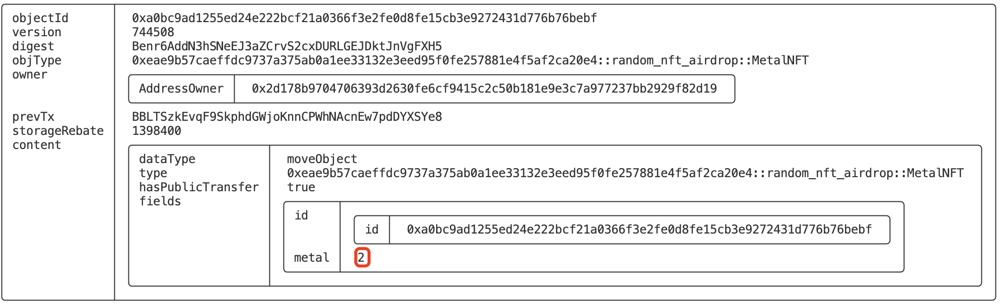
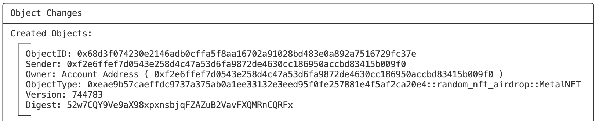
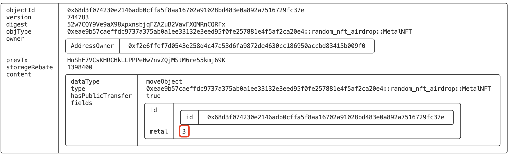

# SUI Move官方示例合约实践——NFT类：盲盒空投NFT（random_nft_airdrop）

*rzexin 2024.05.09*

## 1 合约说明

### 1.1 功能介绍

这个合约可以铸造用于空投的盲盒`NFT`，盲盒`NFT`的持有人可以通过开盲盒的方式获得一个随机金属`NFT`，有金、银、铜三种成色的`NFT`，抽中获得概率分别为10%、30%和60%。

随机数采用的官方提供的链上随机数，但该随机数对象（`0x8`）目前只能在开发网上使用。

### 1.2 合约代码

#### 1.2.1 合约源码地址

https://github.com/MystenLabs/sui/blob/releases/sui-v1.24.0-release/sui_programmability/examples/nfts/sources/random_nft.move

#### 1.2.2 数据结构说明

##### （1）盲盒NFT结构

```rust
    public struct AirDropNFT has key, store {
        id: UID,
    }
```

##### （2）金属NFT结构

成员变量说明：

- `metal`：代表金属属性，定义为：
  
  ```rust
      const GOLD: u8 = 1;
      const SILVER: u8 = 2;
      const BRONZE: u8 = 3;
  ```

```rust
    public struct MetalNFT has key, store {
        id: UID,
        metal: u8,
    }
```

##### （3）盲盒NFT铸造权限结构

```rust
    public struct MintingCapability has key {
        id: UID,
    }
```

#### 1.2.3 接口说明

##### （1）初始化（`init`）

- 创建`MintingCapability`转发给合约发布者，该`Capability`的持有人具备空投盲盒`NFT`的铸造权限

```rust
    #[allow(unused_function)]
    fun init(ctx: &mut TxContext) {
        transfer::transfer(
            MintingCapability { id: object::new(ctx) },
            tx_context::sender(ctx),
        );
    }
```

##### （2）铸造空投盲盒NFT（`mint`）

- `MintingCapability`持有人可以批量铸造空投盲盒NFT

```rust
    public fun mint(_cap: &MintingCapability, n: u16, ctx: &mut TxContext): vector<AirDropNFT> {
        let mut result = vector[];
        let mut i = 0;
        while (i < n) {
            vector::push_back(&mut result, AirDropNFT { id: object::new(ctx) });
            i = i + 1;
        };
        result
    }
```

修改了一下这个接口，可以使用命令行直接空投NFT给用户：

```rust
    entry fun mint_to_address(_cap: &MintingCapability, addresses: vector<address>, ctx: &mut TxContext) {
        let size = addresses.length();
        let mut i = 0;
        while (i < size) {
            transfer::public_transfer(AirDropNFT { id: object::new(ctx) }, addresses[i]);
            i = i + 1;
        };
    }
```

##### （3）开盲盒方式一：条件判断开盲盒（`reveal_alternative1`）

- 销毁空投的盲盒`NFT`
- 通过生成`1-100`之间的一个链上随机数
- 看该随机数落在哪一个比例区间，便构造出哪种金属的`NFT`后，转发给用户
- 这是最简单的实现方式，但因为有`if-else`条件分支存在，`gas`消耗量不恒定

```rust
    /// An alternative implementation of reveal that uses if-else statements to determine the metal of the NFT.
    /// Here the "happier flows" consume more gas than the less happy ones (it assumes that users always prefer the
    /// rarest metals).
    entry fun reveal_alternative1(nft: AirDropNFT, r: &Random, ctx: &mut TxContext) {
        destroy_airdrop_nft(nft);

        let mut generator = new_generator(r, ctx);
        let v = random::generate_u8_in_range(&mut generator, 1, 100);

        if (v <= 60) {
            transfer::public_transfer(
                MetalNFT { id: object::new(ctx), metal: BRONZE, },
                tx_context::sender(ctx),
            );
        } else if (v <= 90) {
            transfer::public_transfer(
                MetalNFT { id: object::new(ctx), metal: SILVER, },
                tx_context::sender(ctx),
            );
        } else if (v <= 100) {
            transfer::public_transfer(
                MetalNFT { id: object::new(ctx), metal: GOLD, },
                tx_context::sender(ctx),
            );
        };
    }

    fun destroy_airdrop_nft(nft: AirDropNFT) {
        let AirDropNFT { id } = nft;
        object::delete(id)
    }
```

##### （4）开盲盒方式二：两步开盲盒（`reveal_alternative2_step1`、`reveal_alternative2_step2`）

- 第一步：通过销毁空投的盲盒`NFT`兑换一个随机数`NFT：RandomnessNFT`，该随机数NFT中会持有一个`1-100`的随机数
- 第二步：通过解构随机数`NFT`得到随机数，同样通过条件判断，看该随机数落在哪一个区间，便构造哪种类型的金属`NFT`

```rust
    /// An alternative implementation of reveal that uses two steps to determine the metal of the NFT.
    /// reveal_alternative2_step1 retrieves the random value, and reveal_alternative2_step2 determines the metal.

    public struct RandomnessNFT has key, store {
        id: UID,
        value: u8,
    }

    entry fun reveal_alternative2_step1(nft: AirDropNFT, r: &Random, ctx: &mut TxContext) {
        destroy_airdrop_nft(nft);

        let mut generator = new_generator(r, ctx);
        let v = random::generate_u8_in_range(&mut generator, 1, 100);

        transfer::public_transfer(
            RandomnessNFT { id: object::new(ctx), value: v, },
            tx_context::sender(ctx),
        );
    }

    public fun reveal_alternative2_step2(nft: RandomnessNFT, ctx: &mut TxContext): MetalNFT {
        let RandomnessNFT { id, value } = nft;
        delete(id);

        let metal =
            if (value <= 10) GOLD
            else if (10 < value && value <= 40) SILVER
            else BRONZE;

        MetalNFT {
            id: object::new(ctx),
            metal,
        }
    }
```

新增一个转移方法，便于命令行调用：

```rust
    entry fun reveal_alternative2_step2_to_sender(nft: RandomnessNFT, ctx: &mut TxContext) {
        let metal_nft = reveal_alternative2_step2(nft, ctx);
        transfer::public_transfer(metal_nft, tx_context::sender(ctx));
    }
```

##### （5）开盲盒方式三：整数运算开盲盒（`reveal`）

- 销毁空投的盲盒`NFT`
- 通过生成`1-100`之间的一个链上随机数
- 调用`arithmetic_is_less_than`方法，直接通过整数算术运算，而非条件判断来确定随机数`v`是否小于区间数`w`
- 该方式可以确保函数在智能合约中消耗的`gas`量是恒定的，避免因条件语句导致的`gas`消耗的不确定性

```rust
    /// Reveal the metal of the airdrop NFT and convert it to a metal NFT.
    /// This function uses arithmetic_is_less_than to determine the metal of the NFT in a way that consumes the same
    /// amount of gas regardless of the value of the random number.
    /// See reveal_alternative1 and reveal_alternative2_step1 for different implementations.
    entry fun reveal(nft: AirDropNFT, r: &Random, ctx: &mut TxContext) {
        destroy_airdrop_nft(nft);

        let mut generator = new_generator(r, ctx);
        let v = random::generate_u8_in_range(&mut generator, 1, 100);

        let is_gold = arithmetic_is_less_than(v, 11, 100); // probability of 10%
        let is_silver = arithmetic_is_less_than(v, 41, 100) * (1 - is_gold); // probability of 30%
        let is_bronze = (1 - is_gold) * (1 - is_silver); // probability of 60%
        let metal = is_gold * GOLD + is_silver * SILVER + is_bronze * BRONZE;

        transfer::public_transfer(
            MetalNFT { id: object::new(ctx), metal, },
            tx_context::sender(ctx)
        );
    }

    // Implements "is v < w? where v <= v_max" using integer arithmetic. Returns 1 if true, 0 otherwise.
    // Safe in case w and v_max are independent of the randomenss (e.g., fixed).
    // Does not check if v <= v_max.
    fun arithmetic_is_less_than(v: u8, w: u8, v_max: u8): u8 {
        assert!(v_max >= w && w > 0, EInvalidParams);
        let v_max_over_w = v_max / w;
        let v_over_w = v / w; // 0 if v < w, [1, v_max_over_w] if above
        (v_max_over_w - v_over_w) / v_max_over_w
    }
```

## 2 前置准备

### 2.1 帐号准备及角色分配

| 别名    | 地址                                                                   | 角色                              |
| ----- | -------------------------------------------------------------------- | ------------------------------- |
| Jason | `0x5c5882d73a6e5b6ea1743fb028eff5e0d7cc8b7ae123d27856c5fe666d91569a` | 合约创建者<br/>盲盒`NFT`铸造者<br/>方式一开盲盒 |
| Alice | `0x2d178b9704706393d2630fe6cf9415c2c50b181e9e3c7a977237bb2929f82d19` | 方式二开盲盒                          |
| Bob   | `0xf2e6ffef7d0543e258d4c47a53d6fa9872de4630cc186950accbd83415b009f0` | 方式三开盲盒                          |

- **将地址添加到环境变量**

```bash
export JASON=0x5c5882d73a6e5b6ea1743fb028eff5e0d7cc8b7ae123d27856c5fe666d91569a
export ALICE=0x2d178b9704706393d2630fe6cf9415c2c50b181e9e3c7a977237bb2929f82d19
export BOB=0xf2e6ffef7d0543e258d4c47a53d6fa9872de4630cc186950accbd83415b009f0
```

## 3 合约部署

> 切换到Jason账号

```bash
sui client publish --gas-budget 100000000
```

- **记录PACKAGE_ID**

```bash
export PACKAGE_ID=0xeae9b57caeffdc9737a375ab0a1ee33132e3eed95f0fe257881e4f5af2ca20e4
export MINT_CAP=0xb8b2da7562402f65def97fa220538288b7254fe60987dcf6bdfe790efd467ca0
```

## 4 合约交互

### 4.1 铸造并空投盲盒NFT（`mint_to_address`）

```bash
sui client call --function mint_to_address --package $PACKAGE_ID --module random_nft_airdrop --args $MINT_CAP "[$JASON, $ALICE, $BOB]" --gas-budget 10000000
```



- **记录空投NFT对象到环境变量**

```bash
export JASON_AIRDROP_NFT=0xc21cedc6e03d8a3b1cb25905b460697e36b18b3d8347fb36999eb3fb27be42c1
export ALICE_AIRDROP_NFT=0xc7729c22babda74f2ecaa5849df21580b01fa3ae83fd2cda168d2e74533f575c
export BOB_AIRDROP_NFT=0x0313c5168b1a11b1d5bac68520088821aa73abc127cf3274c2580e3429e9f0d4
```

### 4.2 开盲盒

#### 4.2.1 方式1：条件判断开盲盒（`reveal_alternative1`）

> 注：官方的链上随机数对象`0x8`目前只有开发网络可以使用，测试网和主网使用会报错：
> 
> ```bash
> Object 0x0000000000000000000000000000000000000000000000000000000000000008 does not exist.
> ```

```bash
$ sui client call --function reveal_alternative1 --package $PACKAGE_ID --module random_nft_airdrop --args $JASON_AIRDROP_NFT 0x8 --gas-budget 10000000
```



- **查看开出的NFT成色**

```bash
$ sui client object 0x49675ebe9252a760a82b84bbaa6f882c913661d53944ed7b5bf739f2025a0421
```



#### 4.2.2 方式2：两步开盲盒（`reveal_alternative2_step1`、`reveal_alternative2_step2`）

>   切换到`Alice`账号

##### （1）获取随机数NFT

```bash
$ sui client call --function reveal_alternative2_step1 --package $PACKAGE_ID --module random_nft_airdrop --args $ALICE_AIRDROP_NFT 0x8 --gas-budget 10000000
```



##### （2）兑换金属NFT

```bash
$ export RANDOMNESS_NFT=0xfbfb182c8d2b7db44dee42748c1a672024c6c6ffd47a965a31f8cee595b69253
$ sui client call --function reveal_alternative2_step2_to_sender --package $PACKAGE_ID --module random_nft_airdrop --args $RANDOMNESS_NFT --gas-budget 10000000
```



- **查看开出的NFT成色**

```bash
$ sui client object 0xa0bc9ad1255ed24e222bcf21a0366f3e2fe0d8fe15cb3e9272431d776b76bebf
```



#### 4.2.3 方式3：整数运算开盲盒（`reveal`）

>   切换到`Bob`账号

```bash
$ sui client call --function reveal --package $PACKAGE_ID --module random_nft_airdrop --args $BOB_AIRDROP_NFT 0x8 --gas-budget 10000000
```



- **查看开出的NFT成色**

```bash
$ sui client object 0x68d3f074230e2146adb0cffa5f8aa16702a91028bd483e0a892a7516729fc37e
```



## 5 更多

欢迎关注微信公众号：**Move中文**，开启你的 **Sui Move** 之旅！

